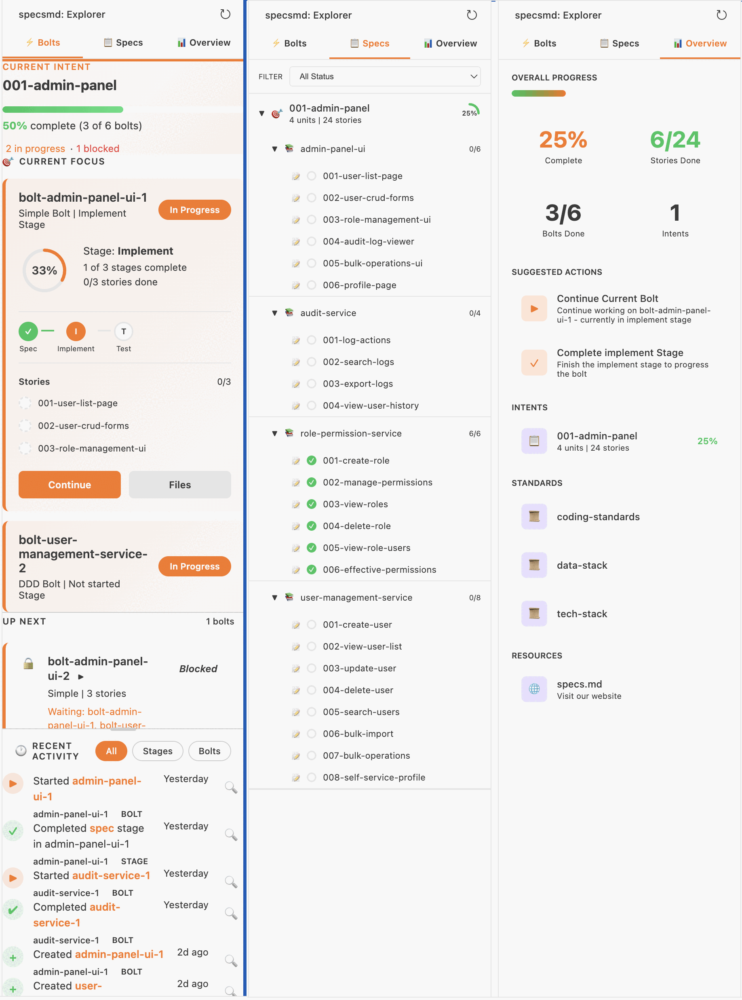
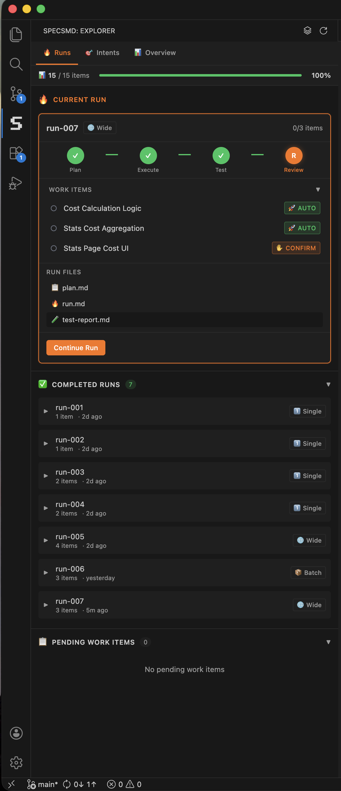
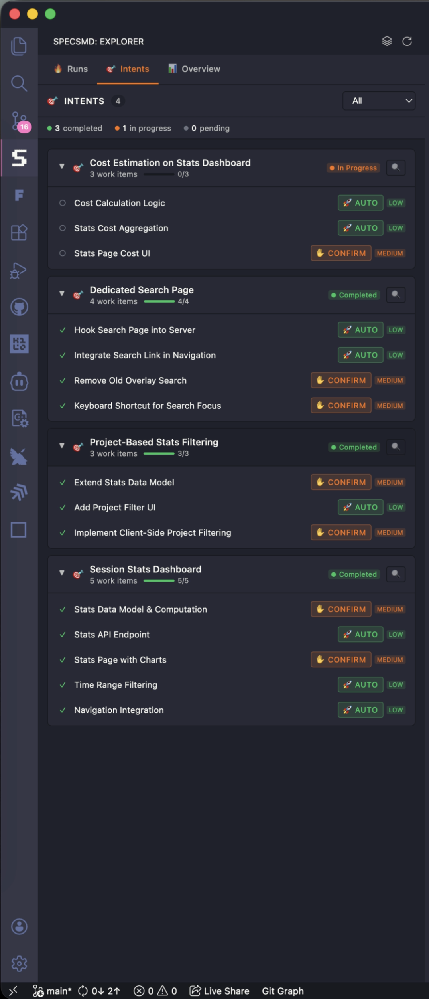

# specs.md

<p align="center">
  
</p>

**AI-native development framework with pluggable flows for every use case.**

Choose the flow that matches your project needs: **Simple** for quick specs, **FIRE** for adaptive execution, or **AI-DLC** for full methodology with DDD.

[](https://www.npmjs.com/package/specsmd)
[](https://opensource.org/licenses/MIT)
[](https://specs.md)

<p align="center">
  
</p>

---

## VS Code Extension

Track your progress with our sidebar extension for VS Code and compatible IDEs.

**AI-DLC Flow:**

<p align="center">
  
</p>

**FIRE Flow:**

<p align="center">
  
  
</p>

> **Note:** Works with any VS Code-based IDE including [Cursor](https://cursor.sh), [Google Antigravity](https://antigravity.google), [Windsurf](https://codeium.com/windsurf), and others.

**Features:**
- Flow switcher for AI-DLC and FIRE views
- Active run/bolt tracking with progress indicators
- Intent and work item visualization
- Click-to-open spec files

**Install from:**
- [VS Code Marketplace](https://marketplace.visualstudio.com/items?itemName=fabriqaai.specsmd) — VS Code, GitHub Codespaces
- [Open VSX Registry](https://open-vsx.org/extension/fabriqaai/specsmd) — Cursor, Windsurf, Amazon Kiro, Google Antigravity, VSCodium, Gitpod, Google IDX
- [GitHub Releases (VSIX)](https://github.com/fabriqaai/specs.md/releases) — Manual installation

---

## Three Flows, Every Use Case

| Flow | Optimized For | Agents | Checkpoints |
|------|---------------|--------|-------------|
| **[Simple](#simple-flow)** | Spec generation, prototypes | 1 | 3 (phase gates) |
| **[FIRE](#fire-flow)** | Adaptive execution, brownfield, monorepos | 3 | Adaptive (0-2) |
| **[AI-DLC](#ai-dlc-flow)** | Full traceability, DDD, regulated environments | 4 | Comprehensive |

> **Not sure which flow?** If you want quick specs without execution tracking, use **Simple**. If you want adaptive execution that right-sizes rigor, use **FIRE**. If you need comprehensive documentation and DDD, use **AI-DLC**.

---

## Quick Start

### Prerequisites

- Node.js 18 or higher
- An AI coding tool (Claude Code, Cursor, GitHub Copilot, or Google Antigravity)

### Installation

> [!NOTE]
> Always use npx to get the latest version. Do not install globally with npm.

```bash
npx specsmd@latest install
```

During installation, select your flow:

```
? Select a development flow:
  Simple - Spec generation only (requirements, design, tasks)
❯ FIRE - Adaptive execution, brownfield & monorepo ready
  AI-DLC - Full methodology with DDD (comprehensive checkpoints)
```

The installer detects your AI coding tools and sets up agent definitions, slash commands, and project structure for your selected flow.

### Install VS Code Extension (Optional)

Track your progress visually with our sidebar extension:
- [VS Code Marketplace](https://marketplace.visualstudio.com/items?itemName=fabriqaai.specsmd) — VS Code, GitHub Codespaces
- [Open VSX Registry](https://open-vsx.org/extension/fabriqaai/specsmd) — Cursor, Windsurf, Amazon Kiro, Google Antigravity

### Verify Installation

```bash
# Check the manifest
cat .specsmd/manifest.yaml

# List installed agents (adjust path for your flow)
ls .specsmd/fire/agents/     # FIRE flow
ls .specsmd/simple/agents/   # Simple flow
ls .specsmd/aidlc/agents/    # AI-DLC flow
```

---

## Simple Flow

**Spec generation only.** Generate requirements, design, and task documents without execution tracking.

```
/specsmd-agent
```

**Three Phases:**
1. **Requirements** → `requirements.md` - User stories, EARS criteria
2. **Design** → `design.md` - Technical design, architecture diagrams
3. **Tasks** → `tasks.md` - Implementation checklist

**Best for:** Prototypes, MVPs, spec handoff, projects that don't need AI-assisted execution.

**Output structure:**
```
specs/
└── {feature-name}/
    ├── requirements.md
    ├── design.md
    └── tasks.md
```

[Simple Flow Documentation →](https://specs.md/simple-flow/overview)

---

## FIRE Flow

**Fast Intent-Run Engineering.** Adaptive execution with brownfield and monorepo support. Ships in hours with 0-2 checkpoints based on task complexity.

```
/fire-orchestrator   # Entry point, routing
/fire-planner        # Intent capture, work item decomposition
/fire-builder        # Run execution, walkthrough generation
```

**Key Features:**
- **Adaptive checkpoints** - Autopilot (0), Confirm (1), or Validate (2) based on complexity
- **First-class brownfield** - Auto-detects existing patterns and conventions
- **Monorepo support** - Hierarchical standards with module-specific overrides
- **Walkthrough generation** - Documents every change automatically

**Best for:** Teams who hate friction, brownfield projects, monorepos.

**Output structure:**
```
.specs-fire/
├── state.yaml           # Central state tracking
├── standards/           # Project standards
├── intents/             # Intent documentation
├── runs/                # Run logs
└── walkthroughs/        # Generated documentation
```

[FIRE Flow Documentation →](https://specs.md/fire-flow/overview)

---

## AI-DLC Flow

**Full methodology.** Implements the [AI-Driven Development Lifecycle](https://aws.amazon.com/blogs/devops/ai-driven-development-life-cycle/) with Domain-Driven Design and comprehensive traceability.

```
/specsmd-master-agent       # Orchestrates & navigates
/specsmd-inception-agent    # Requirements, stories, bolt planning
/specsmd-construction-agent # Execute bolts through DDD stages
/specsmd-operations-agent   # Deploy, verify, monitor
```

**Three Sequential Phases:**
1. **Inception** - Capture intents, elaborate requirements, decompose into units
2. **Construction** - Execute bolts: Model → Design → ADR → Implement → Test
3. **Operations** - Deploy, verify, and monitor

**Best for:** Complex domains, multi-team coordination, regulated environments.

**Output structure:**
```
memory-bank/
├── standards/           # Project standards
├── intents/             # Intent documentation
│   └── {intent-name}/
│       ├── requirements.md
│       ├── system-context.md
│       └── units/
├── bolts/               # Bolt execution records
└── operations/          # Deployment context
```

[AI-DLC Flow Documentation →](https://specs.md/aidlc/overview)

---

## Why specs.md?

### Three Flows for Every Use Case
From quick specs (Simple) to adaptive execution (FIRE) to full methodology (AI-DLC). Choose the flow that matches your project needs.

### Adaptive Checkpoints (FIRE)
Right-sizes the rigor. Simple bug fixes burn through fast. Critical changes get design review. You configure your autonomy preference.

### First-Class Brownfield & Monorepo (FIRE)
Auto-detects existing patterns and respects your conventions. Hierarchical standards with module-specific overrides.

### Full DDD Methodology (AI-DLC)
Domain-Driven Design is integral to Construction, not an optional add-on. Every decision documented with full traceability.

### Tool Agnostic
Works with Claude Code, Cursor, GitHub Copilot, and other AI coding assistants. Markdown-based agents work anywhere—no vendor lock-in.

### Context Engineering
Structured artifacts provide persistent context for AI agents. Agents reload context each session—no more lost knowledge.

---

## Supported Tools

specs.md is **IDE and AI-agnostic**—your specs and agents are portable markdown files that work anywhere.

| Tool | Integration |
|------|-------------|
| **Claude Code** | Slash commands in `.claude/commands/` |
| **Cursor** | Rules in `.cursor/rules/` (`.mdc` format) |
| **GitHub Copilot** | Agents in `.github/agents/` (`.agent.md` format) |
| **Google Antigravity** | Agents in `.agent/agents/` |
| **Windsurf** | Rules in `.windsurf/rules/` |
| **Amazon Kiro** | Steering in `.kiro/steering/` |
| **Gemini CLI** | Commands in `.gemini/commands/` (`.toml` format) |
| **Cline** | Rules in `.clinerules/` |
| **Roo Code** | Commands in `.roo/commands/` |
| **OpenAI Codex** | Config in `.codex/` |
| **OpenCode** | Agents in `.opencode/agent/` |

---

## Troubleshooting

<details>
<summary><strong>Agent commands not recognized</strong></summary>

Ensure specs.md is installed correctly:
```bash
# Check for your flow
ls .specsmd/fire/agents/     # FIRE
ls .specsmd/simple/agents/   # Simple
ls .specsmd/aidlc/agents/    # AI-DLC
```

If the directory is empty or missing, reinstall:
```bash
npx specsmd@latest install
```
</details>

<details>
<summary><strong>Project artifacts missing</strong></summary>

Check if the artifacts directory exists for your flow:
```bash
ls .specs-fire/    # FIRE flow
ls specs/          # Simple flow
ls memory-bank/    # AI-DLC flow
```

If missing, initialize your project using the appropriate agent.
</details>

<details>
<summary><strong>Standards not being followed in generated code</strong></summary>

Ensure standards are defined in your flow's standards directory:
- FIRE: `.specs-fire/standards/`
- AI-DLC: `memory-bank/standards/`

Run project initialization if missing.
</details>

---

<details>
<summary><h2>FAQ</h2></summary>

**Q: Which flow should I choose?**
- **Simple**: Spec generation only, no execution tracking
- **FIRE**: Adaptive execution, brownfield/monorepo support
- **AI-DLC**: Full methodology with DDD and comprehensive traceability

**Q: Can I switch flows after installation?**
Flows are independent—they're not an upgrade path. Each is designed for different use cases. You can reinstall to change flows, but artifacts are structured differently.

**Q: Agents don't seem to remember previous context?**
Each agent invocation starts fresh. Agents read context from artifacts at startup. Ensure artifacts are saved after each step.

**Q: How do I reset project state?**
Delete the artifacts directory for your flow:
- FIRE: `.specs-fire/`
- Simple: `specs/`
- AI-DLC: `memory-bank/`

To remove specsmd entirely, also delete `.specsmd/` and tool-specific command files.

**Q: What project types is this suited for?**
specs.md supports everything from quick prototypes (Simple) to complex enterprise systems (AI-DLC). Choose the flow that matches your project needs.

</details>

---

## Resources

- [Documentation](https://specs.md)
- [Choose Your Flow Guide](https://specs.md/architecture/choose-flow)
- [AI-DLC Specification (AWS)](https://aws.amazon.com/blogs/devops/ai-driven-development-life-cycle/)
- [npm Package](https://www.npmjs.com/package/specsmd)
- [GitHub Issues](https://github.com/fabriqaai/specs.md/issues)
- [Discord Community](http://discord.specs.md/)

---

## License

MIT License - see [LICENSE](LICENSE) for details.

---

<p align="center">
  Built by the <a href="https://specs.md">specs.md</a> team.
</p>
