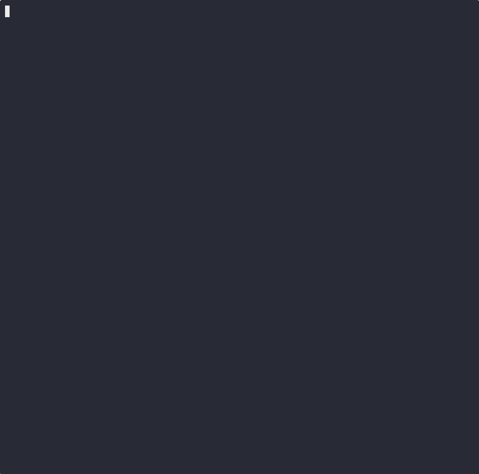
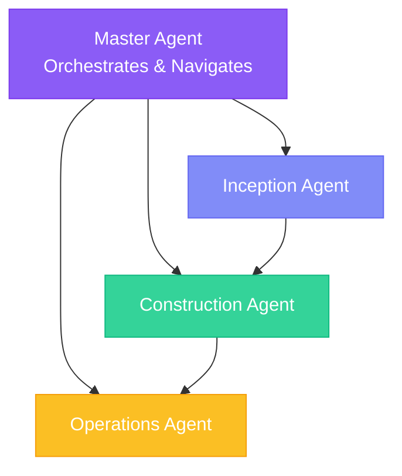

# specs.md

**AI-native software development with multi-agent orchestration.**

specsmd implements the [AI-Driven Development Lifecycle (AI-DLC)](https://aws.amazon.com/blogs/devops/ai-driven-development-life-cycle/) methodology as a set of markdown-based agents that work with your favorite AI coding tools.

[](https://www.npmjs.com/package/specsmd)
[](https://opensource.org/licenses/MIT)
[](https://specs.md)

<p align="center">
  
</p>

---

## Quick Start

### Prerequisites

- Node.js 18 or higher
- An AI coding tool (Claude Code, Cursor, GitHub Copilot, or Google Antigravity)

### Installation

> [!NOTE]
> Do not use npm if you want to always get the latest version. Use the npx command below.

```bash
npx specsmd@latest install
```

The installer detects your AI coding tools (Claude Code, Cursor, GitHub Copilot) and sets up:
- Agent definitions and skills
- Memory bank structure for context persistence
- Slash commands for easy agent invocation

### Verify Installation

```bash
# Check the manifest
cat .specsmd/manifest.yaml

# List installed agents
ls .specsmd/aidlc/agents/
```

### Initialize Your Project
Open your AI Assisted Tool (Claude Code, Cursor, GitHub Copilot) and run the following commands:

```bash
# Start the Master Agent
/specsmd-master-agent

# Then type:
project-init
```

This guides you through establishing:
- **Tech Stack** - Languages, frameworks, databases, infrastructure
- **Coding Standards** - Formatting, linting, naming, testing strategy
- **System Architecture** - Architecture style, API design, state management
- **UX Guide** - Design system, styling, accessibility (optional)
- **API Conventions** - API style, versioning, response formats (optional)

### Create Your First Intent

```bash
/specsmd-inception-agent intent-create
```

An **Intent** is your high-level goal:
- "User authentication system"
- "Product catalog with search"
- "Payment processing integration"

The agent will:
1. Ask clarifying questions to minimize ambiguity
2. Elaborate into user stories and NFRs
3. Define system context
4. Decompose into loosely-coupled units

### Plan and Execute Bolts

```bash
# Plan bolts for your stories
/specsmd-inception-agent bolt-plan

# Execute a bolt
/specsmd-construction-agent bolt-start
```

Each bolt goes through validated stages:
1. **Domain Model** - Model business logic using DDD principles
2. **Technical Design** - Apply patterns and make architecture decisions
3. **ADR Analysis** - Document significant decisions (optional)
4. **Implement** - Generate production code
5. **Test** - Verify correctness with automated tests

**Human validation happens at each stage gate.**

---

## What is AI-DLC?

AI-DLC is a reimagined software development methodology where **AI drives the conversation** and humans validate. Unlike traditional Agile where iterations span weeks, AI-DLC operates in **Bolts** - rapid iterations measured in hours or days.

> "Traditional development methods were built for human-driven, long-running processes. AI-DLC reimagines the development lifecycle with AI as a central collaborator, enabling rapid cycles measured in hours or days rather than weeks."

### AI-DLC vs Traditional Methods

| Aspect | Agile/Scrum | AI-DLC |
|--------|-------------|--------|
| Iteration duration | Weeks (Sprints) | Hours/days (Bolts) |
| Who drives | Human-driven, AI assists | AI-driven, human-validated |
| Design techniques | Out of scope | Integrated (DDD, TDD, BDD) |
| Task decomposition | Manual | AI-powered |
| Phases | Repeating sprints | Rapid three-phase cycles (Inception → Construction → Operations) |
| Rituals | Daily standups, retrospectives | Mob Elaboration, Mob Construction |

---

## How It Works

specsmd provides four specialized agents that guide you through the entire development lifecycle:



### The Three Phases

| Phase | Agent | Purpose | Key Outputs |
|-------|-------|---------|-------------|
| **Inception** | Inception Agent | Capture intents, elaborate requirements, decompose into units | User stories, NFRs, Unit definitions, Bolt plans |
| **Construction** | Construction Agent | Execute bolts through domain design → logical design → code → test | Domain models, Technical designs, Code, Tests |
| **Operations** | Operations Agent | Deploy, verify, and monitor | Deployment units, Monitoring, Runbooks |

---

## Key Concepts

### Intent
A high-level statement of purpose that encapsulates what needs to be achieved - whether a business goal, feature, or technical outcome. It serves as the starting point for AI-driven decomposition.

### Unit
A cohesive, self-contained work element derived from an Intent. Units are loosely coupled and can be developed independently. Analogous to a Subdomain (DDD) or Epic (Scrum).

### Bolt
The smallest iteration in AI-DLC, designed for rapid implementation. Unlike Sprints (weeks), Bolts are **hours to days**. Each bolt encapsulates a well-defined scope of work.

| Type | Best For | Stages |
|------|----------|--------|
| **DDD Construction** | Complex business logic, domain modeling | Model → Design → ADR → Implement → Test |
| **Simple Construction** | UI, integrations, utilities | Plan → Implement → Test |

### Memory Bank
File-based storage for all project artifacts. Maintains context across agent sessions and provides traceability between artifacts.

### Standards
Project decisions that inform AI code generation. Standards ensure consistency across all generated code and documentation.

---

<details>
<summary><h2>Project Structure</h2></summary>

After installation:

```
.specsmd/
├── manifest.yaml              # Installation manifest
└── aidlc/                     # AI-DLC flow
    ├── agents/                # Agent definitions
    ├── skills/                # Agent capabilities
    ├── templates/             # Artifact templates
    │   └── standards/         # Standards facilitation guides
    └── memory-bank.yaml       # Memory bank schema

memory-bank/                   # Created after project-init
├── intents/                   # Your captured intents
│   └── {intent-name}/
│       ├── requirements.md
│       ├── system-context.md
│       └── units/
├── bolts/                     # Bolt execution records
├── standards/                 # Project standards
│   ├── tech-stack.md
│   ├── coding-standards.md
│   └── ...
└── operations/                # Deployment context
```

</details>

<details>
<summary><h2>Agent Commands</h2></summary>

### Master Agent
```bash
/specsmd-master-agent
```
| Command | Purpose |
|---------|---------|
| `project-init` | Initialize project with standards |
| `analyze-context` | View current project state |
| `route-request` | Get directed to the right agent |
| `explain-flow` | Learn about AI-DLC methodology |
| `answer-question` | Get help with any specsmd question |

### Inception Agent
```bash
/specsmd-inception-agent
```
| Command | Purpose |
|---------|---------|
| `intent-create` | Create a new intent |
| `intent-list` | List all intents |
| `requirements` | Elaborate intent requirements |
| `context` | Define system context |
| `units` | Decompose into units |
| `story-create` | Create stories for a unit |
| `bolt-plan` | Plan bolts for stories |
| `review` | Review inception artifacts |

### Construction Agent
```bash
/specsmd-construction-agent
```
| Command | Purpose |
|---------|---------|
| `bolt-start` | Start/continue executing a bolt |
| `bolt-status` | Check bolt progress |
| `bolt-list` | List all bolts |
| `bolt-replan` | Replan bolts if needed |

### Operations Agent
```bash
/specsmd-operations-agent
```
| Command | Purpose |
|---------|---------|
| `build` | Build the project |
| `deploy` | Deploy to environment |
| `verify` | Verify deployment |
| `monitor` | Set up monitoring |

</details>

---

## Why specsmd?

### AI-Native, Not AI-Retrofitted
Built from the ground up for AI-driven development. AI-DLC is a reimagination based on first principles, not a retrofit of existing methods.

### Human Oversight as Loss Function
Validation at each stage catches errors early before they cascade downstream. Each validation transforms artifacts into rich context for subsequent stages.

### Design Techniques Built-In
DDD, TDD, and BDD are integral to the methodology - not optional add-ons. This addresses the "whitespace" in Agile that has led to quality issues.

### Tool Agnostic
Works with Claude Code, Cursor, GitHub Copilot, and other AI coding assistants. Markdown-based agents work anywhere.

### Context Engineering
Specs and Memory Bank provide structured context for AI agents. Agents reload context each session - no more lost knowledge.

---

## Supported Tools

| Tool | Status | Installation |
|------|--------|--------------|
| **Claude Code** | Full support | Slash commands in `.claude/commands/` |
| **Cursor** | Full support | Rules in `.cursor/rules/` (`.mdc` format) |
| **GitHub Copilot** | Full support | Agents in `.github/agents/` (`.agent.md` format) |
| **Google Antigravity** | Full support | Agents in `.agent/agents/` |

---

## Troubleshooting

<details>
<summary><strong>Agent commands not recognized</strong></summary>

Ensure specs.md is installed correctly:
```bash
ls .specsmd/aidlc/agents/
```

If the directory is empty or missing, reinstall:
```bash
npx specsmd@latest install
```
</details>

<details>
<summary><strong>Memory Bank artifacts missing</strong></summary>

Check if the memory-bank directory exists:
```bash
ls memory-bank/
```

If missing, run project initialization:
```
/specsmd-master-agent
> project-init
```
</details>

<details>
<summary><strong>Standards not being followed in generated code</strong></summary>

Ensure standards are defined in `memory-bank/standards/`:
- `tech-stack.md`
- `coding-standards.md`
- `architecture.md`

If missing or incomplete, use the Master Agent to define them:
```
/specsmd-master-agent
> project-init
```
</details>

---

<details>
<summary><h2>FAQ</h2></summary>

**Q: Agents don't seem to remember previous context?**
Each agent invocation starts fresh. Agents read context from the Memory Bank at startup. Ensure artifacts are saved after each step.

**Q: How do I reset project state?**
Clear the `memory-bank/` directory to reset all artifacts. To remove specsmd entirely, delete the `.specsmd/` directory and tool-specific command files.

**Q: Can I use specsmd with existing Agile workflows?**
AI-DLC is designed as a reimagination, not a retrofit. However, familiar concepts (user stories, acceptance criteria) are retained to ease transition.

**Q: What project types is this suited for?**
specsmd is designed for building complex systems that demand architectural complexity, trade-off management, and scalability. Simpler systems may be better suited for low-code/no-code approaches.

</details>

---

## Resources

- [Documentation](https://specs.md)
- [AI-DLC Specification (AWS)](https://aws.amazon.com/blogs/devops/ai-driven-development-life-cycle/)
- [npm Package](https://www.npmjs.com/package/specsmd)
- [GitHub Issues](https://github.com/fabriqaai/specsmd/issues)


---

## License

MIT License - see [LICENSE](LICENSE) for details.

---

<p align="center">
  Built with AWS' AI-DLC methodology by the <a href="https://specs.md">specs.md</a> team.
</p>
