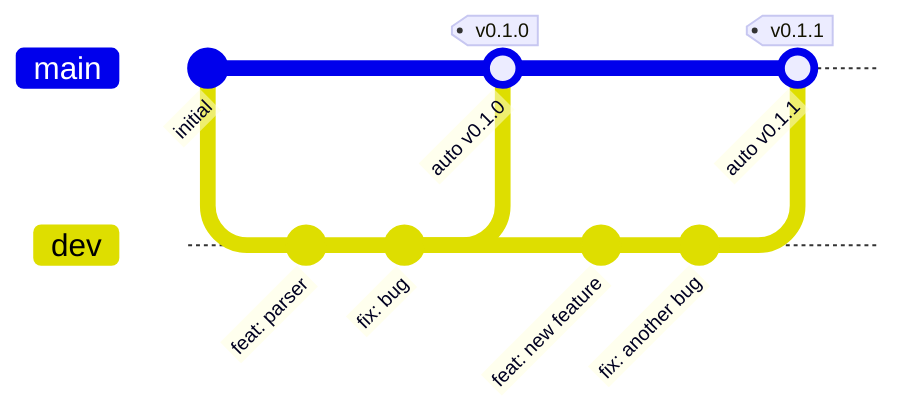
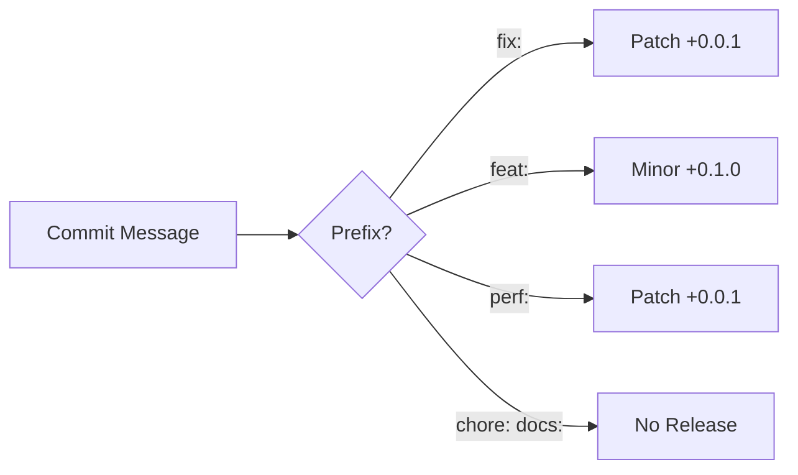
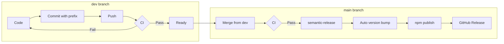
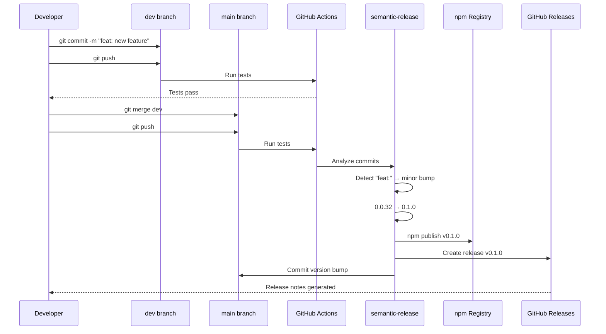
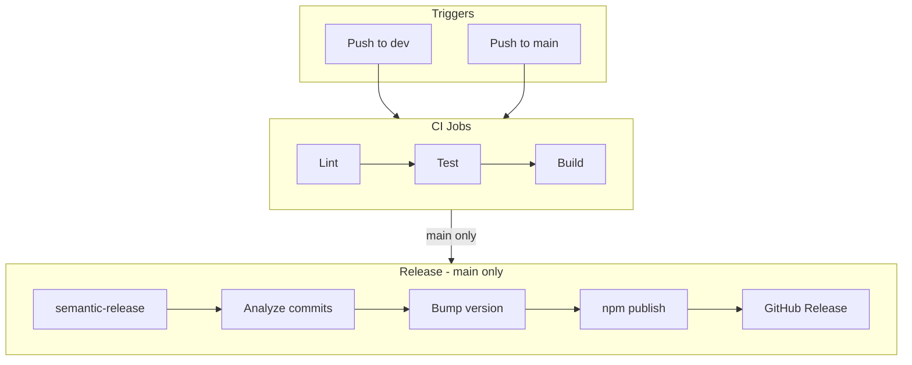
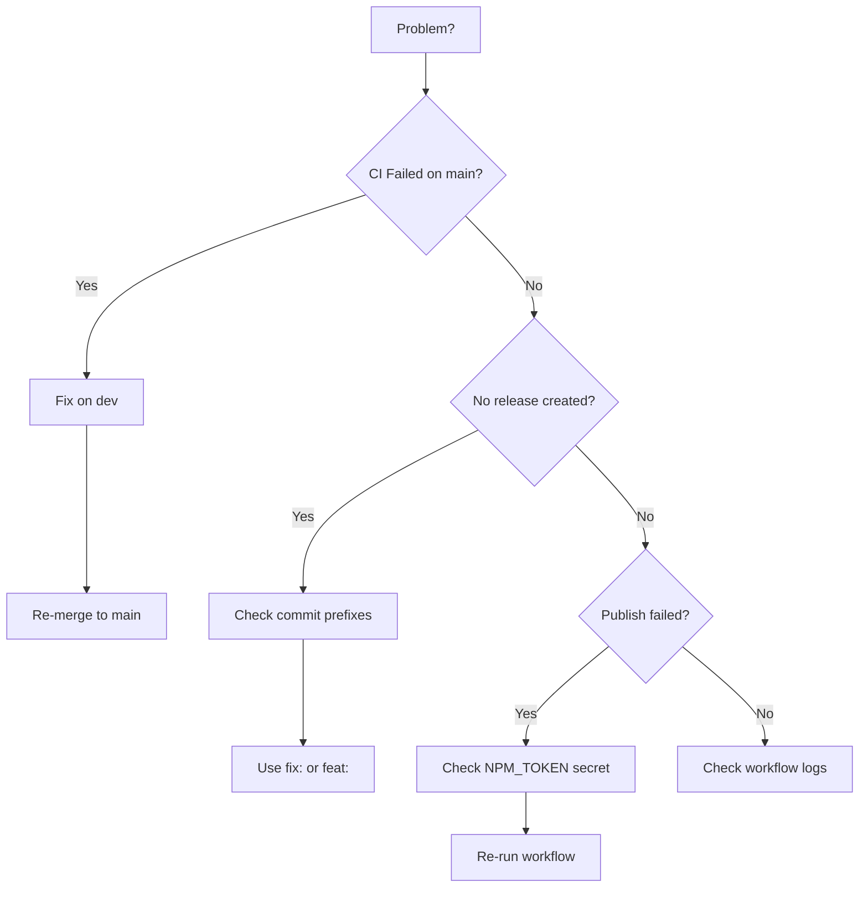

# Development & Release Guide

## Branch Structure



## Branches

| Branch | Purpose |
|--------|---------|
| `dev` | Active development. Push freely. CI validates every push. |
| `main` | Production. Merge here to deploy. Version auto-bumped from commits. |

---

## How Auto-Versioning Works

Semantic-release reads your commit messages and determines the version:

| Commit Prefix | Version Bump | Example |
|---------------|--------------|---------|
| `fix:` | Patch | 0.0.34 → 0.0.35 |
| `feat:` | Minor | 0.0.34 → 0.1.0 |
| `perf:` | Patch | 0.0.34 → 0.0.35 |
| `chore:`, `docs:`, `style:` | No release | - |

**Note:** Major versions (1.0.0, 2.0.0) are NOT auto-bumped. Edit `package.json` manually.



---

## Workflow Overview



---

## Daily Workflow

### 1. Start New Work (Sync with main)

```bash
git checkout dev
git fetch origin
git rebase origin/main
```

This ensures dev has all changes from main before starting new work.

### 2. Development

```bash
git checkout dev
# ... make changes ...
git add .
git commit -m "feat: add new parser feature"
git push
```

**Use these commit prefixes:**

- `feat:` - New feature (bumps minor)
- `fix:` - Bug fix (bumps patch)
- `perf:` - Performance improvement (bumps patch)
- `docs:` - Documentation only (no release)
- `chore:` - Maintenance (no release)
- `refactor:` - Code refactor (no release)

**Major versions** require manual edit of `package.json`.

CI runs automatically on push.

### 3. Deploy

```bash
git checkout main
git merge dev
git push
```

This triggers:

1. CI runs (lint, test, build)
2. semantic-release analyzes commits
3. Auto-bumps version based on commit prefixes
4. Publishes to npm
5. Creates GitHub release with changelog

---

## Release Flow



---

## Quick Reference

### Start New Work (Always Do This First)

```bash
git checkout dev
git fetch origin
git rebase origin/main
```

### Commit Examples

```bash
# Bug fix → patch release (0.0.34 → 0.0.35)
git commit -m "fix: resolve memory leak in watcher"

# New feature → minor release (0.0.34 → 0.1.0)
git commit -m "feat: add YAML validation support"

# Performance → patch release (0.0.34 → 0.0.35)
git commit -m "perf: optimize file parsing"

# No release
git commit -m "docs: update README"
git commit -m "chore: update dependencies"
```

**For major releases:** Manually edit `version` in `package.json` then push.

### Deploy to Production

```bash
git checkout main
git merge dev
git push
# → Auto version, publish, release
```

### Check CI Status

```bash
gh run list
gh run watch
```

### View Published Version

```bash
npm view specsmd version
```

---

## CI/CD Pipeline



### On Push to `dev`

- Lint check
- Run tests
- Build validation

### On Push to `main`

- Lint check
- Run tests
- Build validation
- **semantic-release:**
  - Analyze commit messages since last release
  - Determine version bump (patch/minor/major)
  - Update package.json
  - Publish to npm
  - Create GitHub release with auto-generated changelog

---

## Secrets Required

| Secret | Purpose | Where to Set |
|--------|---------|--------------|
| `NPM_TOKEN` | Publish to npm registry | GitHub → Settings → Secrets → Actions |

### Generate NPM Token

```bash
npm login
npm token create --read-only=false
```

Copy token to GitHub repository secrets.

---

## Troubleshooting



### No Release Created

- Commits need `fix:` or `feat:` prefix
- `chore:`, `docs:`, `style:` don't trigger releases
- Check if commits are reachable from main

### CI Failed on Main

- Fix issues on dev, re-merge

### Check Workflow Logs

```bash
gh run list --branch main
gh run view <run-id> --log
```

---

## Setup Checklist

- [ ] Create `dev` branch: `git checkout -b dev`
- [ ] Add `NPM_TOKEN` secret in GitHub repo settings
- [ ] Run `npm install` in `src/` to install semantic-release
- [ ] Push both branches
- [ ] Start committing with `fix:` and `feat:` prefixes
