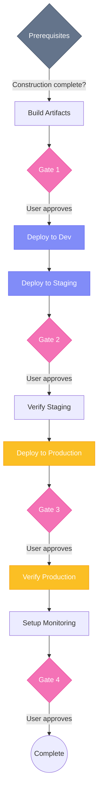

## Overview

<Warning>
  The Operations Agent is in alpha and has known issues that are currently being fixed. Some commands may not work as expected. We're actively looking for feedback - if you encounter an error, please [report it here](https://github.com/fabriqaai/specsmd/issues).
</Warning>

The **Operations Agent** handles the third phase of AI-DLC. It takes constructed features to production, verifies they work correctly, and sets up monitoring.

## Invocation

<Tabs>
  <Tab title="Claude Code">
    ```bash
    /specsmd-operations-agent
    ```
  </Tab>
  <Tab title="Cursor">
    ```
    /specsmd-operations-agent
    ```
    Or use the `@` prefix:
    ```
    @specsmd-operations-agent
    ```
  </Tab>
  <Tab title="GitHub Copilot">
    ```
    /specsmd-operations-agent
    ```
  </Tab>
</Tabs>

## Commands

| Command | Purpose |
|---------|---------|
| `build` | Build the project |
| `deploy` | Deploy to environment |
| `verify` | Verify deployment |
| `monitor` | Set up monitoring |

## build

Builds the project for deployment:

```
> build
```

The agent will:

<Steps>
  <Step title="Check Prerequisites">
    Verify all construction bolts are complete
  </Step>
  <Step title="Run Build">
    Execute build commands from tech stack
  </Step>
  <Step title="Run Tests">
    Execute full test suite
  </Step>
  <Step title="Create Artifacts">
    Package for deployment
  </Step>
</Steps>

### Example Session

```
User: build

Operations Agent: Starting build process...

## Prerequisites Check
✓ All construction bolts complete
✓ No uncommitted changes
✓ On main branch

## Build
Running: npm run build
✓ TypeScript compilation successful
✓ Bundle created (245KB gzipped)

## Tests
Running: npm test
✓ 47 unit tests passed
✓ 12 integration tests passed
✓ 5 e2e tests passed

## Artifacts
✓ Docker image built: myapp:1.2.0
✓ Image pushed to registry

Build complete. Ready for deployment.
```

## deploy

Deploys to a target environment:

```
> deploy staging
```

Or for production:

```
> deploy production
```

The agent will:

<Steps>
  <Step title="Environment Check">
    Verify target environment configuration
  </Step>
  <Step title="Pre-deployment">
    Run database migrations, cache warming
  </Step>
  <Step title="Deploy">
    Deploy using configured strategy
  </Step>
  <Step title="Health Check">
    Verify services are healthy
  </Step>
</Steps>

### Deployment Strategies

The agent supports common strategies based on your infrastructure:

| Strategy | Description |
|----------|-------------|
| **Rolling** | Replace instances gradually |
| **Blue-Green** | Switch between two environments |
| **Canary** | Route percentage of traffic to new version |

<Warning>
  Production deployments require explicit confirmation. The agent will show you exactly what will happen before proceeding.
</Warning>

## verify

Runs verification after deployment:

```
> verify staging
```

The agent will:

<Steps>
  <Step title="Smoke Tests">
    Run quick sanity checks
  </Step>
  <Step title="Health Endpoints">
    Check all service health endpoints
  </Step>
  <Step title="Integration Check">
    Verify integrations are working
  </Step>
  <Step title="Performance Baseline">
    Ensure response times are acceptable
  </Step>
</Steps>

### Example Output

```
User: verify staging

Operations Agent: Running verification for staging...

## Smoke Tests
✓ Homepage loads (234ms)
✓ API responds (45ms)
✓ Authentication works

## Health Endpoints
✓ /health - OK (12ms)
✓ /health/db - OK (23ms)
✓ /health/cache - OK (8ms)

## Integration Check
✓ Database connection
✓ Redis connection
✓ Email service

## Performance
✓ p50 latency: 45ms (target: <100ms)
✓ p95 latency: 123ms (target: <500ms)
✓ p99 latency: 234ms (target: <1000ms)

Verification passed. Staging is healthy.
```

## monitor

Sets up or checks monitoring:

```
> monitor setup
```

Or check current status:

```
> monitor status
```

The agent helps with:

<CardGroup cols={2}>
  <Card title="Logging" icon="file-lines">
    Structured logging configuration
  </Card>
  <Card title="Metrics" icon="chart-line">
    Key performance indicators
  </Card>
  <Card title="Alerts" icon="bell">
    Alert rules and thresholds
  </Card>
  <Card title="Dashboards" icon="gauge">
    Visualization of system health
  </Card>
</CardGroup>

### Key Metrics

The agent suggests monitoring:

| Category | Metrics |
|----------|---------|
| **Availability** | Uptime, error rate, success rate |
| **Performance** | Latency (p50, p95, p99), throughput |
| **Resources** | CPU, memory, disk, connections |
| **Business** | Active users, transactions, conversions |

## Human Gates

The Operations Agent has **4 checkpoints** aligned with environment progression:



| Gate | Location | Purpose |
|------|----------|---------|
| **Gate 1** | After build | Approve build artifacts before deployment |
| **Gate 2** | Before staging deploy | Confirm ready for staging environment |
| **Gate 3** | Before production deploy | Critical approval for production |
| **Gate 4** | After monitoring setup | Confirm operations complete |

<Warning>
  Production deployment (Gate 3) requires explicit confirmation. The agent will show exactly what will happen before proceeding.
</Warning>

## Artifacts

Operations artifacts are stored in:

```
memory-bank/operations/
├── environments.md      # Environment configurations
├── runbooks/           # Operational procedures
│   ├── deployment.md
│   ├── rollback.md
│   └── incident.md
└── monitoring/
    ├── alerts.md
    └── dashboards.md
```

## Runbooks

The agent generates runbooks for common operations:

<AccordionGroup>
  <Accordion title="Deployment Runbook">
    Step-by-step deployment procedure:
    1. Pre-deployment checklist
    2. Deployment commands
    3. Verification steps
    4. Rollback procedure
  </Accordion>
  <Accordion title="Incident Response">
    What to do when things go wrong:
    1. Detection and triage
    2. Escalation matrix
    3. Communication template
    4. Post-mortem process
  </Accordion>
  <Accordion title="Scaling Runbook">
    How to handle increased load:
    1. Signs of scaling needs
    2. Horizontal vs vertical
    3. Scaling commands
    4. Verification
  </Accordion>
</AccordionGroup>

## Best Practices

<AccordionGroup>
  <Accordion title="Always Verify">
    Never skip verification after deployment. Automated checks catch issues humans miss.
  </Accordion>
  <Accordion title="Stage Environments">
    Deploy to staging before production. Test the deployment process itself.
  </Accordion>
  <Accordion title="Monitor Proactively">
    Set up alerts before you need them. Don't wait for production issues.
  </Accordion>
  <Accordion title="Document Runbooks">
    Keep runbooks updated. They're essential during incidents.
  </Accordion>
</AccordionGroup>
