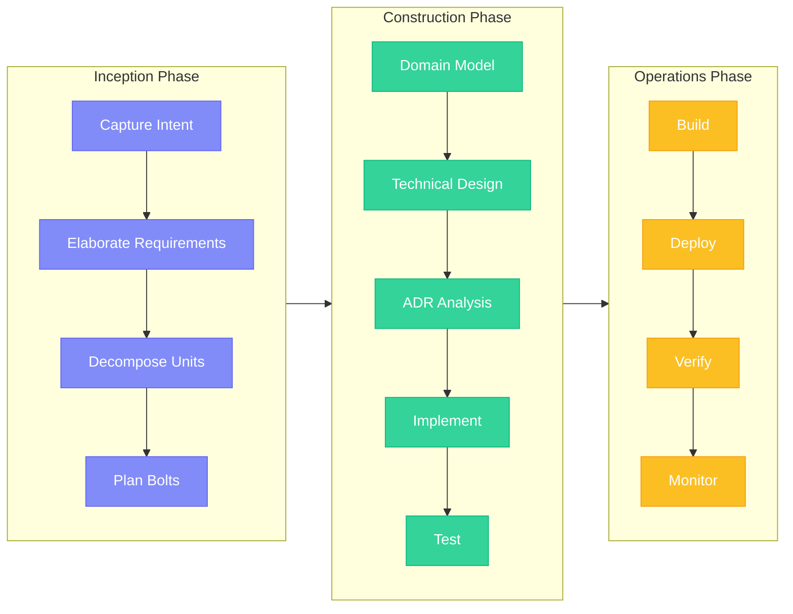

## What is AI-DLC?

**AI-DLC (AI-Driven Development Lifecycle)** is a complete methodology for AI-native software development, originally defined by AWS. It provides comprehensive traceability, DDD integration, and structured phases for complex projects.

<Info>
  **AI proposes, human validates.** Like Google Maps—humans set the destination, AI provides step-by-step directions, humans maintain oversight at every checkpoint.
</Info>


## Key Differentiators

<CardGroup cols={2}>
  <Card title="Complete Methodology" icon="book">
    Not just a tool—a full SDLC with defined phases, rituals, and artifacts based on AWS research.
  </Card>
  <Card title="DDD Integration" icon="diagram-project">
    Domain-Driven Design is core, not optional. Model business logic before writing code.
  </Card>
  <Card title="Comprehensive Checkpoints" icon="shield-check">
    10-26 human validation points per bolt. Every decision is reviewed.
  </Card>
  <Card title="Four Specialized Agents" icon="robot">
    Master, Inception, Construction, and Operations agents with clear responsibilities.
  </Card>
</CardGroup>

## AI-DLC vs Other Flows

| Aspect | AI-DLC | FIRE | Simple |
|--------|--------|------|--------|
| **Philosophy** | Full methodology | Adaptive execution | Spec generation |
| **Hierarchy** | Intent → Unit → Story → Bolt → Stages | Intent → Work Item → Run | Feature → Phases |
| **Checkpoints** | Comprehensive (10-26 per bolt) | Adaptive (0-2) | 3 phase gates |
| **Agents** | 4 (Master, Inception, Construction, Operations) | 3 (Orchestrator, Planner, Builder) | 1 |
| **Design Approach** | DDD or Simple bolt types | Adaptive | Basic |
| **Phases** | Inception → Construction → Operations | Plan → Execute | Req → Design → Tasks |
| **Artifacts** | memory-bank/ | .specs-fire/ | specs/ |
| **Optimized For** | Full traceability, complex domains | Teams who hate friction | Quick prototypes |

<Info>
  **Shared philosophy**: All flows use intents, structured artifacts, and human validation. They differ in ceremony level and traceability depth.
</Info>

## When to Use AI-DLC

<AccordionGroup>
  <Accordion title="You need comprehensive traceability">
    Every decision, every change, every artifact is tracked. Perfect for regulated environments or audit requirements.
  </Accordion>
  <Accordion title="You're building complex domain logic">
    AI-DLC integrates DDD from the start. Model your business domain before writing code.
  </Accordion>
  <Accordion title="You have multi-team coordination">
    Clear phases and artifacts make handoffs explicit. Teams know exactly what's expected.
  </Accordion>
  <Accordion title="You want predictable ceremony">
    Unlike adaptive flows, AI-DLC has fixed checkpoints. You always know what's coming next.
  </Accordion>
  <Accordion title="You're in a regulated environment">
    Healthcare, finance, government—where documentation requirements are strict.
  </Accordion>
</AccordionGroup>

## When to Consider Other Flows

<Info>
  **Consider FIRE if:**
  - You want adaptive checkpoints based on complexity
  - You're working on brownfield projects
  - You have a monorepo with multiple tech stacks
  - You prefer less ceremony for simple changes

  **Consider Simple if:**
  - You just need specs, not execution tracking
  - You're prototyping or creating handoff documents
  - You want minimal overhead
</Info>

## Three Phases

AI-DLC follows three sequential phases:



| Phase | Agent | Ritual | Output |
|-------|-------|--------|--------|
| **Inception** | Inception Agent | Mob Elaboration | Intents, Units, Stories, Bolt Plans |
| **Construction** | Construction Agent | Mob Construction | Domain Models, Code, Tests |
| **Operations** | Operations Agent | Continuous | Deployments, Monitoring |

## Core Concepts

### Intent

A high-level business objective. The starting point for all work.

```yaml
intent:
  id: 001-user-authentication
  title: User Authentication System
  status: in_progress
```

### Unit

A loosely-coupled module that can be developed independently.

### Story

A user story within a unit, with acceptance criteria.

### Bolt

A time-boxed execution cycle (hours or days) that implements stories through validated stages.

<Info>
  Learn more in [Core Concepts](/core-concepts/intents).
</Info>

## Four-Agent Architecture

| Agent | Phase | Responsibility |
|-------|-------|----------------|
| **Master** | All | Orchestrates flow, routes requests, maintains awareness |
| **Inception** | Inception | Captures intents, elaborates requirements, plans bolts |
| **Construction** | Construction | Executes bolts through DDD stages |
| **Operations** | Operations | Builds, deploys, verifies, monitors |

<Info>
  Learn more in [Agents Overview](/agents/overview).
</Info>

## Project Structure

```
memory-bank/                   # AI-DLC artifacts
├── intents/                   # Captured intents
│   └── {intent-id}/
│       ├── requirements.md
│       ├── system-context.md
│       └── units/
│           └── {unit-id}/
│               ├── unit-brief.md
│               └── stories/
├── bolts/                     # Bolt execution records
├── standards/                 # Project standards
│   ├── tech-stack.md
│   ├── coding-standards.md
│   ├── system-architecture.md
│   └── ...
└── operations/                # Deployment context
```

## Get Started

<Steps>
  <Step title="Install specs.md">
    ```bash
    npx specsmd@latest install
    ```
  </Step>
  <Step title="Select AI-DLC during init">
    Choose "AI-DLC" when prompted for flow selection
  </Step>
  <Step title="Initialize project standards">
    ```
    /specsmd-master-agent project-init
    ```
  </Step>
  <Step title="Create your first intent">
    ```
    /specsmd-inception-agent intent-create
    ```
  </Step>
</Steps>

<Card title="Quick Start Guide" icon="rocket" href="/agents/quick-start">
  Step-by-step guide to building with AI-DLC
</Card>
