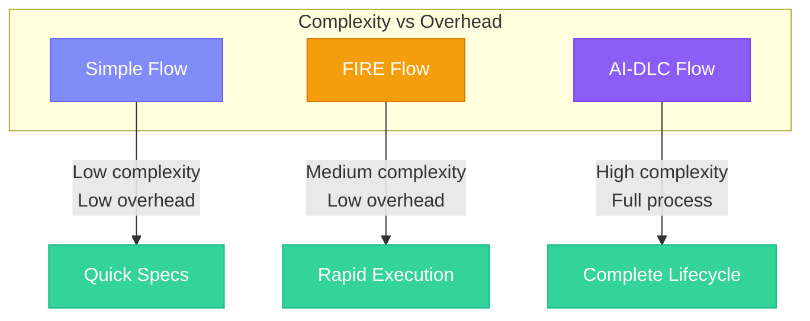

## Three Flows, Every Use Case

specs.md offers three development flows, each designed for different project needs and team sizes. Choose the one that matches your context.

<CardGroup cols={3}>
  <Card title="Simple Flow" icon="feather" href="/simple-flow/overview">
    **Spec generation only**

    Quick requirements, design, and task documents without execution tracking.
  </Card>
  <Card title="FIRE Flow" icon="bolt" href="/fire-flow/overview">
    **Rapid execution**

    Ship in hours with adaptive checkpoints and first-class brownfield support.
  </Card>
  <Card title="AI-DLC Flow" icon="building" href="/core-concepts/intents">
    **Full methodology**

    Complete lifecycle with DDD, 4 agents, and comprehensive traceability.
  </Card>
</CardGroup>

## Quick Decision Guide

<Steps>
  <Step title="Do you need execution tracking?">
    - **No** → Use **Simple Flow** (spec generation only, like Kiro)
    - **Yes** → Continue to Step 2
  </Step>
  <Step title="What's your team size?">
    - **Solo developer or small team (1-3)** → Consider **FIRE Flow**
    - **Larger team or multiple stakeholders** → Consider **AI-DLC Flow**
  </Step>
  <Step title="How complex is your domain?">
    - **Standard features, known patterns** → Use **FIRE Flow**
    - **Complex domain logic, needs DDD** → Use **AI-DLC Flow**
  </Step>
  <Step title="How much process overhead can you accept?">
    - **Minimal (0-2 checkpoints per feature)** → Use **FIRE Flow**
    - **Full traceability (10-26 checkpoints)** → Use **AI-DLC Flow**
  </Step>
</Steps>

## Detailed Comparison

| Aspect | Simple | FIRE | AI-DLC |
|--------|--------|------|--------|
| **Best For** | Spec generation, prototypes | Solo/small teams, brownfield | Teams, complex domains |
| **Checkpoints** | 3 (phase gates) | 0-2 (adaptive) | 10-26 per feature |
| **Agents** | 1 | 3 | 4 |
| **Execution Tracking** | No | Yes (runs, walkthroughs) | Yes (bolts, stages) |
| **DDD Integration** | No | No | Yes (full stages) |
| **Monorepo Support** | No | First-class | Limited |
| **Brownfield Support** | Basic | First-class | Alpha |
| **Output Structure** | `specs/{feature}/` | `.specs-fire/` | `memory-bank/` |
| **Time to Ship** | N/A (spec only) | Hours | Days to weeks |

## When to Use Each Flow

### Simple Flow

<Info>
  **Choose Simple when**: You need quick specs without the overhead of execution tracking.
</Info>

- Building prototypes or MVPs
- Generating specs for handoff to another team
- Small features in established projects
- Solo developers wanting structured documentation
- Projects that don't need AI-assisted execution

**Output**: `requirements.md`, `design.md`, `tasks.md`

### FIRE Flow

<Info>
  **Choose FIRE when**: You want AI-DLC principles with minimal ceremony.
</Info>

FIRE is **AI-DLC simplified**—same intent-driven philosophy, adaptive checkpoints instead of comprehensive gates.

- Solo developers or small teams (1-3 people)
- Brownfield projects with existing code
- Monorepo architectures
- Standard features without complex domain logic
- Teams wanting to ship in hours, not days

**Key Features**:
- **Adaptive checkpoints**: Autopilot (0), Confirm (1), or Validate (2) based on complexity
- **Walkthrough generation**: AI documents every change for review
- **Hierarchical standards**: Module-specific overrides in monorepos
- **Brownfield-first**: Auto-detects existing patterns and conventions

### AI-DLC Flow

<Info>
  **Choose AI-DLC when**: You need full traceability, DDD, and multi-team coordination.
</Info>

- Teams with multiple developers
- Complex domain logic requiring DDD
- Projects needing comprehensive documentation
- Regulated environments requiring audit trails
- Multi-stakeholder initiatives

**Key Features**:
- **Four specialized agents**: Master, Inception, Construction, Operations
- **Domain-Driven Design**: Full DDD stages in Construction
- **Complete traceability**: Every decision documented
- **Mob rituals**: Mob Elaboration, Mob Construction

## Flow Comparison Matrix

## Switching Between Flows

Flows are independent—they're not an upgrade path. Choose based on your project needs:

<Warning>
  **Flows are not progressive**: Simple doesn't upgrade to FIRE, FIRE doesn't upgrade to AI-DLC. Each flow is designed for different use cases. Choose the right flow upfront.
</Warning>

However, you can:
- Use **Simple Flow** to generate initial specs, then implement manually
- Use **FIRE Flow** for rapid feature development within a project
- Use **AI-DLC Flow** for major initiatives requiring full planning

## Getting Started

<CardGroup cols={3}>
  <Card title="Start with Simple" icon="play" href="/simple-flow/quick-start">
    Generate specs in minutes
  </Card>
  <Card title="Start with FIRE" icon="play" href="/fire-flow/quick-start">
    Ship your first feature fast
  </Card>
  <Card title="Start with AI-DLC" icon="play" href="/getting-started/quick-start">
    Full methodology walkthrough
  </Card>
</CardGroup>
