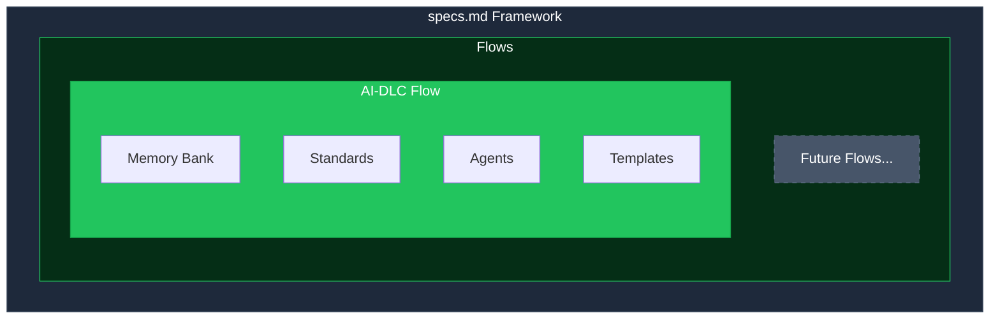
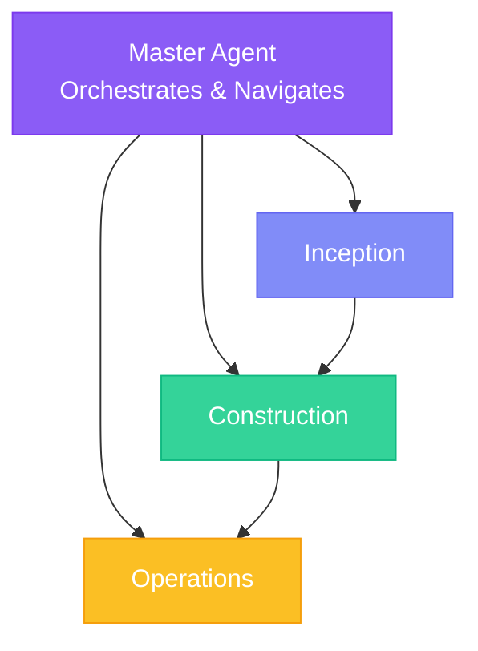

## Framework Architecture

specs.md is built as a **pluggable framework** where development methodologies are implemented as **flows**. This architecture allows different teams to use different development approaches.

## What is a Flow?

A **flow** is a complete development methodology implementation that includes:

<CardGroup cols={2}>
  <Card title="Phases" icon="diagram-project">
    Sequential stages of development (e.g., Inception, Construction, Operations)
  </Card>
  <Card title="Agents" icon="robot">
    Specialized AI agents for each phase
  </Card>
  <Card title="Templates" icon="file-code">
    Structured artifacts and outputs
  </Card>
  <Card title="Bolt Types" icon="bolt">
    Execution patterns for different work types
  </Card>
</CardGroup>

## Available Flows

Each flow implements a specific development approach with its own components:

| Flow | Status | Description |
|------|--------|-------------|
| **AI-DLC** | Implemented | AI-Driven Development Lifecycle from AWS |
| *(Future)* | Planned | Additional methodologies can be added |

## AI-DLC Flow

AI-DLC (AI-Driven Development Lifecycle) is the first flow implemented in specs.md. It implements the methodology developed by AWS.

### Three Phases

| Phase | Agent | Purpose |
|-------|-------|---------|
| **Inception** | Inception Agent | Capture intents, elaborate requirements, decompose into units |
| **Construction** | Construction Agent | Execute bolts through validated stages |
| **Operations** | Operations Agent | Deploy, verify, and monitor |

### Bolt Types

The AI-DLC flow supports two bolt types:

| Type | Best For | Stages |
|------|----------|--------|
| **DDD Construction** | Complex domain logic, business rules | Model → Design → ADR → Code → Test |
| **Simple Construction** | UI, integrations, utilities | Plan → Implement → Test |

## Creating Custom Flows

<Info>
  Custom flow creation is a planned feature. The architecture is designed to support multiple flows, with AI-DLC as the reference implementation.
</Info>

A custom flow would include:

1. **Flow Definition** - Metadata, phases, and configuration
2. **Phase Agents** - Specialized agents for each phase
3. **Bolt Types** - Custom execution patterns
4. **Templates** - Artifacts specific to the methodology

## Tool Integration

Flows integrate with AI coding tools through the shared core:

| Tool | Integration Method |
|------|-------------------|
| **Claude Code** | Slash commands in `.claude/commands/` |
| **Cursor** | Rules in `.cursor/rules/` |
| **GitHub Copilot** | Agents in `.github/agents/` |
| **Google Antigravity** | Agents in `.agent/agents/` |

All tools share the same Memory Bank and can work with any installed flow.

## Next Steps

<CardGroup cols={2}>
  <Card
    title="AI-DLC Methodology"
    icon="arrow-right"
    href="/methodology/what-is-ai-dlc"
  >
    Deep dive into the AI-DLC flow
  </Card>
  <Card
    title="Memory Bank"
    icon="database"
    href="/core-concepts/memory-bank"
  >
    Learn about the shared artifact storage
  </Card>
</CardGroup>
