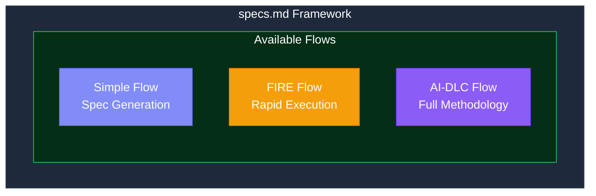
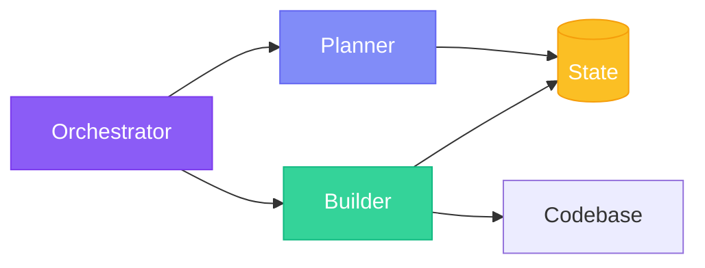
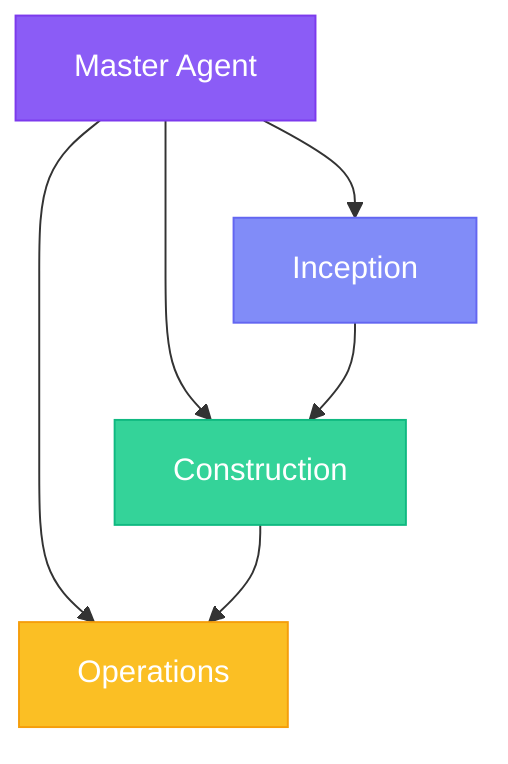

## Framework Architecture

specs.md is built as a **pluggable framework** where development methodologies are implemented as **flows**. Choose the flow that matches your project needs.

## What is a Flow?

A **flow** is a complete development methodology implementation that includes:

<CardGroup cols={2}>
  <Card title="Agents" icon="robot">
    Specialized AI agents that guide development
  </Card>
  <Card title="Artifacts" icon="file-code">
    Structured outputs for each phase
  </Card>
  <Card title="State Management" icon="database">
    Tracking progress and context
  </Card>
  <Card title="Standards" icon="ruler">
    Project guidelines and conventions
  </Card>
</CardGroup>

## Available Flows

| Flow | Checkpoints | Agents | Best For |
|------|-------------|--------|----------|
| **[Simple](/simple-flow/overview)** | 3 (phase gates) | 1 | Spec generation only |
| **[FIRE](/fire-flow/overview)** | 0-2 (adaptive) | 3 | Solo/small teams, brownfield |
| **[AI-DLC](/core-concepts/intents)** | 10-26 | 4 | Teams, complex domains |

<Info>
  **Not sure which flow?** Check out our [Choose Your Flow](/architecture/choose-flow) guide.
</Info>

## Simple Flow

**Simple Flow** generates structured specs without execution tracking—perfect for quick feature planning.

| Aspect | Details |
|--------|---------|
| **Agent** | 1 (specsmd-agent) |
| **Output** | `requirements.md`, `design.md`, `tasks.md` |
| **Phases** | Requirements → Design → Tasks |
| **Best For** | Prototypes, MVPs, spec handoff |

<Card title="Simple Flow Documentation" icon="feather" href="/simple-flow/overview">
  Learn more about Simple Flow
</Card>

## FIRE Flow

**FIRE (Fast Intent-Run Engineering)** is AI-DLC simplified—same intent-driven philosophy with adaptive checkpoints instead of comprehensive gates.

| Aspect | Details |
|--------|---------|
| **Agents** | 3 (Orchestrator, Planner, Builder) |
| **Checkpoints** | 0-2 adaptive (Autopilot, Confirm, Validate) |
| **Best For** | Solo/small teams, brownfield, monorepos |
| **Key Features** | Walkthrough generation, hierarchical standards |

<Card title="FIRE Flow Documentation" icon="bolt" href="/fire-flow/overview">
  Learn more about FIRE Flow
</Card>

## AI-DLC Flow

**AI-DLC (AI-Driven Development Lifecycle)** is the full methodology with DDD and comprehensive traceability.

| Aspect | Details |
|--------|---------|
| **Agents** | 4 (Master, Inception, Construction, Operations) |
| **Phases** | Inception → Construction → Operations |
| **Best For** | Teams, complex domains, regulated environments |
| **Key Features** | DDD integration, Mob rituals, full traceability |

### Bolt Types (AI-DLC)

| Type | Best For | Stages |
|------|----------|--------|
| **DDD Construction** | Complex domain logic | Model → Design → ADR → Code → Test |
| **Simple Construction** | UI, integrations | Plan → Implement → Test |

<Card title="AI-DLC Documentation" icon="building" href="/methodology/what-is-ai-dlc">
  Learn more about AI-DLC Flow
</Card>

## Tool Integration

All flows integrate with AI coding tools:

| Tool | Integration Method |
|------|-------------------|
| **Claude Code** | Slash commands in `.claude/commands/` |
| **Cursor** | Rules in `.cursor/rules/` |
| **GitHub Copilot** | Agents in `.github/agents/` |
| **Google Antigravity** | Agents in `.agent/agents/` |

## Next Steps

<CardGroup cols={3}>
  <Card
    title="Choose Your Flow"
    icon="compass"
    href="/architecture/choose-flow"
  >
    Detailed comparison guide
  </Card>
  <Card
    title="Installation"
    icon="download"
    href="/getting-started/installation"
  >
    Install and select your flow
  </Card>
  <Card
    title="VS Code Extension"
    icon="puzzle-piece"
    href="/getting-started/ide-extension"
  >
    Track progress visually
  </Card>
</CardGroup>
