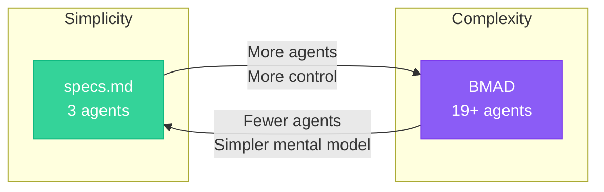

## Overview

Both **specs.md** and **BMAD-Method** target complex systems and enterprise-scale development. The key difference is their approach to agent organization.

**BMAD-Method** uses 19+ role-based agents that simulate a full development team (Analyst, PM, Architect, Developer, QA, etc.).

**specs.md** uses 3 phase-based agents aligned to AI-DLC's methodology (Master, Inception, Construction, Operations).

---

## Side-by-Side Comparison

| Aspect | specs.md | BMAD |
|--------|-------------------|------|
| **Target Complexity** | Complex systems (same tier) | Complex/Enterprise systems (same tier) |
| **Origin** | AWS formal methodology | Community-driven framework |
| **Agent Philosophy** | 3 phase-based agents | 19+ role-based agents |
| **Agents** | Master, Inception, Construction, Operations | Analyst, PM, Architect, Dev, QA, UX, etc. |
| **Methodology** | AI-DLC (AWS standard) | Agentic Agile (proprietary) |
| **Design Technique** | DDD integrated as core | Optional, team choice |
| **Rituals** | Mob Elaboration, Mob Construction (collocated) | Agent handoffs (async) |
| **Iteration** | Bolts ("hours or days") | Epics/Stories |
| **Conversation** | AI proposes, human validates | Agent-driven |
| **Complexity** | Moderate | High |
| **Customization** | Skills + Templates | Full persona customization via YAML |
| **Community** | Growing | 19k+ GitHub stars |

---

## When to Choose Each

<CardGroup cols={2}>
  <Card title="Choose specs.md if:" icon="check">
    - You want a formal AWS methodology
    - You prefer fewer, phase-aligned agents
    - You want DDD as an integral part (not optional)
    - You value collocated Mob rituals
    - You want to avoid managing 19 agents
    - You're in a regulated environment
  </Card>
  <Card title="Choose BMAD if:" icon="check">
    - You want maximum agent customization
    - You prefer role-based agent simulation
    - You're comfortable with higher complexity
    - You want 19+ specialized personas
    - You prefer async agent handoffs
    - You have time to invest in learning
  </Card>
</CardGroup>

---

## Key Differences

### 1. Agent Organization

**BMAD**: 19+ role-based agents mimicking a full development team

```
Analyst Agent → PM Agent → Architect Agent →
Product Owner Agent → Scrum Master Agent →
Developer Agent → QA Agent → ...
```

**specs.md**: 3 phase-based agents aligned to methodology

```
Master Agent → Inception Agent → Construction Agent → Operations Agent
```

### 2. Methodology Foundation

**BMAD**: "Agentic Agile" - a proprietary framework built on agile principles with AI agents replacing human roles.

**specs.md**: AWS's formally defined AI-DLC methodology with specific phases, rituals, and artifacts documented in a whitepaper.

### 3. Design Technique Integration

**BMAD**: Design techniques are optional. Teams can choose their own approach.

**specs.md**: DDD is integrated as core. AI applies domain-driven design principles during decomposition—it's not optional.

### 4. Rituals and Collaboration

**BMAD**: Agents hand off documents to each other asynchronously.

**specs.md**: Mob Elaboration and Mob Construction are collocated rituals where teams work together with AI in real-time.

---

## Agent Mapping

If you're familiar with BMAD agents, here's how they map to AI-DLC:

| BMAD Agents | specs.md Phase |
|-------------|------------------------|
| Analyst, PM | **Inception Agent** - requirements elaboration |
| Architect | **Inception Agent** + **Construction Agent** - domain modeling |
| Product Owner, Scrum Master | **Master Agent** - orchestration |
| Developer | **Construction Agent** - code generation |
| QA, DevOps | **Operations Agent** - testing, deployment |

---

## Complexity vs Control Trade-off



---

## Migration Path

If you're currently using BMAD and want to try AI-DLC:

<Steps>
  <Step title="Map Your Agents">
    Understand how your 19 agents map to 3 AI-DLC phases
  </Step>
  <Step title="Adopt Mob Rituals">
    Replace async handoffs with collocated Mob Elaboration and Mob Construction
  </Step>
  <Step title="Integrate DDD">
    Move from optional design techniques to DDD as core
  </Step>
  <Step title="Use Phase-Based Thinking">
    Organize work by phase (Inception → Construction → Operations) rather than role
  </Step>
</Steps>

---

## Summary

| For This Need | Use This |
|---------------|----------|
| Formal AWS methodology | specs.md |
| Maximum agent customization | BMAD |
| Simpler mental model (3 agents) | specs.md |
| Role-based simulation (19+ agents) | BMAD |
| DDD as core requirement | specs.md |
| Collocated Mob rituals | specs.md |
| Async agent handoffs | BMAD |

<Info>
**Bottom Line**: Both target complex systems. specs.md offers a formal methodology with 3 phase-based agents. BMAD offers maximum customization with 19+ role-based agents.

*Choose based on whether you prefer methodology-driven simplicity or agent-driven flexibility.*
</Info>
