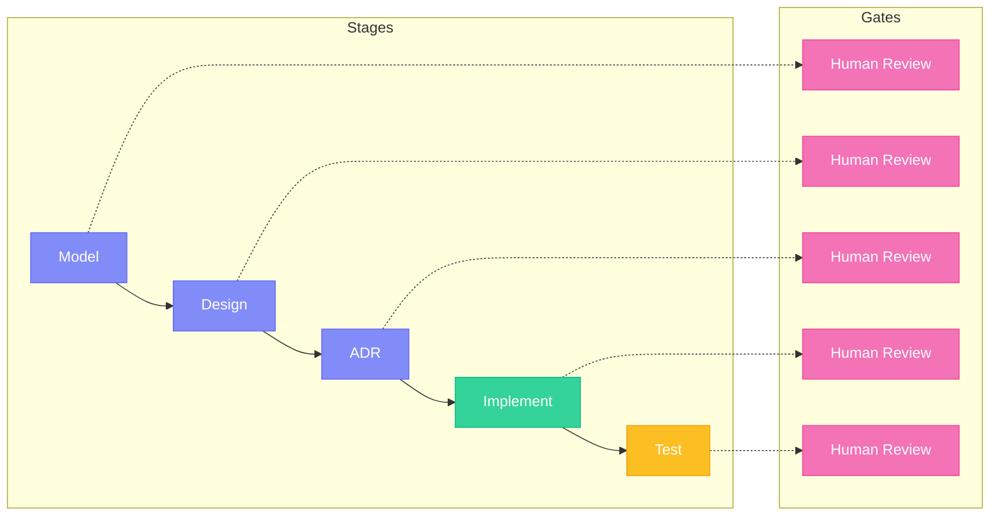
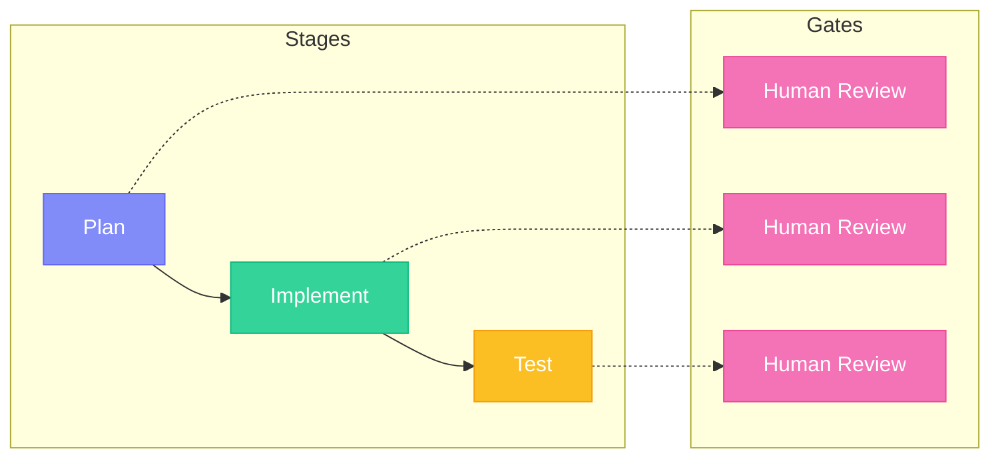

## What is a Bolt?

A **Bolt** is a time-boxed execution session in AI-DLC, designed for rapid implementation. Unlike Sprints (weeks), Bolts are completed in **hours to days**. Each bolt encapsulates a well-defined scope of work scoped to a Unit.

<Info>
  The term "Bolt" emphasizes speed and precision - like a bolt of lightning, work happens fast but with focused energy. Bolts are analogous to Sprints in Scrum, but optimized for AI-driven development.
</Info>

## Bolt Characteristics

<CardGroup cols={2}>
  <Card title="Rapid" icon="bolt">
    Hours to days, not weeks
  </Card>
  <Card title="Focused" icon="bullseye">
    One story or small set of related stories
  </Card>
  <Card title="Stage-Gated" icon="door-open">
    Validated checkpoints prevent errors
  </Card>
  <Card title="Complete" icon="check-double">
    Produces working, tested code
  </Card>
</CardGroup>

## Bolt Types

specs.md currently supports two bolt types:

| Type | Best For | Stages |
|------|----------|--------|
| **DDD Construction** | Complex business logic, domain modeling | Model → Design → ADR → Implement → Test |
| **Simple Construction** | UI, integrations, utilities | Plan → Implement → Test |

### Choosing a Bolt Type

<AccordionGroup>
  <Accordion title="Use DDD Construction Bolt when...">
    - Building complex domain logic with business rules
    - Creating bounded contexts with rich domain models
    - Implementing services that require domain expertise
    - Working on core business functionality
  </Accordion>
  <Accordion title="Use Simple Construction Bolt when...">
    - Building frontend pages and components
    - Creating simple CRUD endpoints
    - Integrating with external APIs
    - Writing utilities and helper modules
    - Building CLI commands or scripts
  </Accordion>
  </AccordionGroup>

## DDD Construction Bolt

The most comprehensive bolt type, used for complex domain logic:

<Steps>
  <Step title="Domain Model">
    Model business logic using DDD principles:
    - Identify aggregates, entities, value objects
    - Define domain events and commands
    - Establish ubiquitous language
  </Step>
  <Step title="Technical Design">
    Apply patterns and make architecture decisions:
    - Choose implementation patterns
    - Define interfaces and contracts
    - Plan data structures and APIs
  </Step>
  <Step title="ADR Analysis">
    Document significant decisions:
    - Context and problem
    - Options considered
    - Decision and rationale
  </Step>
  <Step title="Implement">
    Generate production code:
    - Follow coding standards
    - Apply design patterns
    - Write clean, documented code
  </Step>
  <Step title="Test">
    Verify correctness:
    - Unit tests
    - Integration tests
    - Acceptance tests
  </Step>
</Steps>

## Simple Construction Bolt

A lightweight bolt for UI, integrations, and utilities:

<Steps>
  <Step title="Plan">
    Define what to build:
    - Review stories and requirements
    - List specific deliverables
    - Identify dependencies
    - Define acceptance criteria
  </Step>
  <Step title="Implement">
    Write the code:
    - Setup file structure
    - Implement core functionality
    - Handle edge cases
    - Add documentation
  </Step>
  <Step title="Test">
    Verify the implementation:
    - Write unit tests
    - Run test suite
    - Verify acceptance criteria
    - Document results
  </Step>
</Steps>

## Human Checkpoints

<Warning>
  Human validation happens at each checkpoint. You cannot proceed to the next stage without approval. This is the "Human Oversight as Loss Function" principle - catching errors early before they cascade.
</Warning>

### DDD Construction Checkpoints



### Simple Construction Checkpoints



## Executing Bolts

Start a bolt with the Construction Agent:

```bash
/specsmd-construction-agent --unit="my-unit"
```

The agent will:

1. Show available bolts for the unit
2. Ask which bolt to work on
3. Guide you through each stage
4. Generate artifacts at each step
5. Wait for your approval at gates
6. Record progress in the Memory Bank

## Bolt Artifacts

Each bolt produces artifacts stored in the Memory Bank:

<Tabs>
  <Tab title="DDD Construction">
    ```
    memory-bank/bolts/{bolt-id}/
    ├── bolt.md                    # Bolt metadata and state
    ├── ddd-01-domain-model.md     # Domain model
    ├── ddd-02-technical-design.md # Technical design
    ├── adr-*.md                   # Architecture Decision Records (optional)
    └── ddd-03-test-report.md      # Test results
    ```
  </Tab>
  <Tab title="Simple Construction">
    ```
    memory-bank/bolts/{bolt-id}/
    ├── bolt.md                    # Bolt metadata and state
    ├── implementation-plan.md     # Plan from Stage 1
    ├── implementation-walkthrough.md # Developer notes from Stage 2
    └── test-walkthrough.md        # Test results from Stage 3
    ```
  </Tab>
</Tabs>

## Bolt Commands

| Command | Purpose |
|---------|---------|
| `bolt-list` | List all bolts in unit |
| `bolt-start` | Start or continue a bolt |
| `bolt-status` | Check current progress |
| `bolt-replan` | Replan if scope changed |

## Best Practices

<AccordionGroup>
  <Accordion title="Keep Bolts Small">
    A bolt should complete in hours to a few days. If it's taking longer, the scope is too big - split it into multiple bolts.
  </Accordion>
  <Accordion title="Choose the Right Bolt Type">
    Use DDD for complex domain logic, Simple for UI/utilities. Don't over-engineer simple tasks.
  </Accordion>
  <Accordion title="Don't Skip Stages">
    Each stage builds on the previous. Skipping creates technical debt and increases risk.
  </Accordion>
  <Accordion title="Validate Thoroughly">
    Use gate reviews to catch issues early. It's cheaper to fix problems in design than in code.
  </Accordion>
  <Accordion title="Document Decisions">
    ADRs capture the "why" behind decisions. Future you will thank present you.
  </Accordion>
</AccordionGroup>

## Next Steps

<CardGroup cols={2}>
  <Card
    title="Memory Bank"
    icon="arrow-right"
    href="/core-concepts/memory-bank"
  >
    Learn how artifacts are persisted and connected
  </Card>
  <Card
    title="Bolt Types Guide"
    icon="book"
    href="/guides/bolt-types"
  >
    Detailed guide on choosing and using bolt types
  </Card>
</CardGroup>
