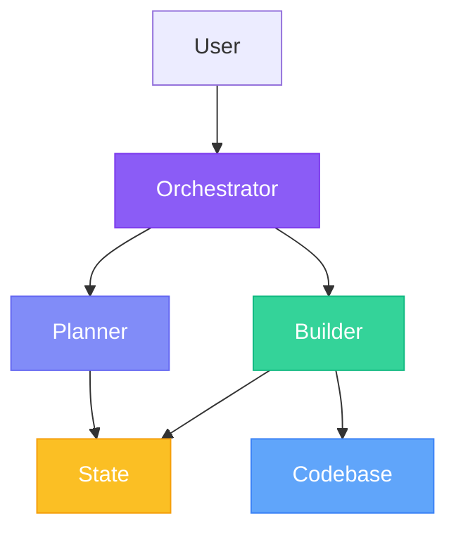
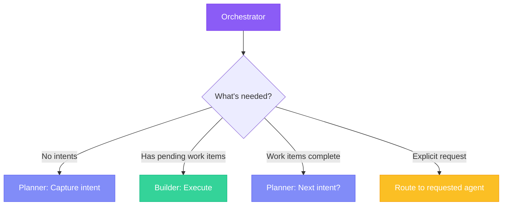
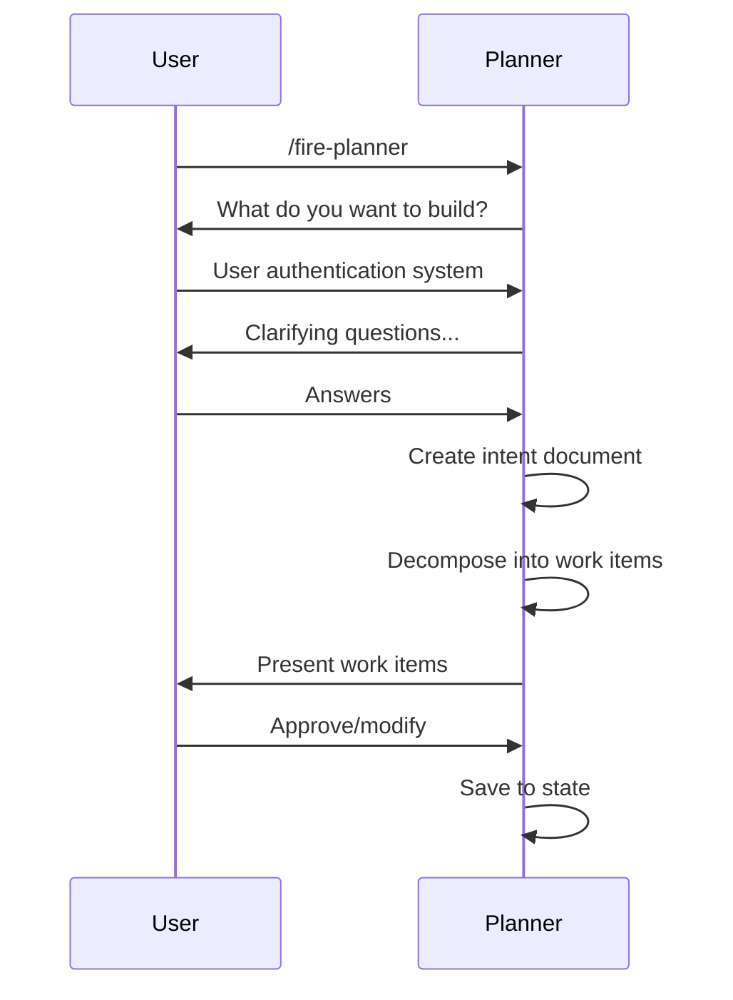
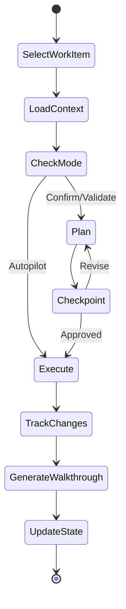
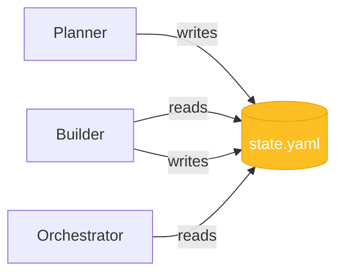

## Three-Agent Architecture

FIRE uses three specialized agents, each with a focused responsibility:



| Agent | Role | Invocation |
|-------|------|------------|
| **Orchestrator** | Entry point, routing, session management | `/fire-orchestrator` |
| **Planner** | Intent capture, work item decomposition | `/fire-planner` |
| **Builder** | Run execution, walkthrough generation | `/fire-builder` |

## Orchestrator Agent

The **Orchestrator** is the entry point for all FIRE interactions.

### Responsibilities

- Read `state.yaml` to understand current phase
- Route to appropriate agent based on context
- Handle session resume and continuity
- Suggest next actions based on state

### When Orchestrator Routes



### Usage

```
/fire-orchestrator

---
Reading project state...

Current State:
- Intent: User Authentication (in_progress)
- Work Items: 1/3 complete
- Next: login-endpoint (mode: Confirm)

Routing to Builder for next work item execution.
```

### Session Resume

Orchestrator maintains context across sessions:

```
/fire-orchestrator

---
Resuming previous session...

Last session ended with:
- Run 2 in progress: login-endpoint
- Status: Awaiting confirmation

Would you like to:
[c] Continue with login-endpoint
[s] Skip to next work item
[p] Return to Planner
```

## Planner Agent

The **Planner** handles all planning activities.

### Responsibilities

- Capture intents through guided conversation
- Decompose intents into work items
- Assign complexity and execution modes
- Generate design documents (Validate mode)
- Initialize and update project standards

### Skills

| Skill | Purpose |
|-------|---------|
| `intent-capture` | Guide user through intent definition |
| `work-item-decompose` | Break intents into executable work items |
| `design-doc-generate` | Create design documents for Validate mode |
| `standards-init` | Initialize or update project standards |
| `workspace-detect` | Analyze project structure (shared) |

### Intent Capture Flow



### Example Session

```
/fire-planner

---
What would you like to build?

> User authentication with email/password login

Got it. A few questions:

1. Do you need password reset functionality?
> Yes

2. Session management (JWT, sessions, or both)?
> JWT

3. Any social login requirements?
> Not for MVP

---

Intent captured: User Authentication System

Work Items:
1. user-schema (Low, Autopilot)
   - Create users table with auth fields

2. login-endpoint (Medium, Confirm)
   - POST /auth/login with JWT generation

3. password-reset (Medium, Confirm)
   - Reset flow with email tokens

4. session-middleware (High, Validate)
   - JWT validation middleware

[Approve work items? y/n]
```

### Design Document Generation

For Validate mode work items, Planner generates design docs:

```
Generating design document for: session-middleware

---
# Session Middleware Design

## Overview
JWT-based session validation middleware for protected routes.

## Architecture
- Middleware extracts JWT from Authorization header
- Validates signature and expiration
- Attaches user context to request
- Handles token refresh for near-expiry tokens

## Security Considerations
- Tokens signed with RS256
- 15-minute access token expiry
- Refresh tokens stored in httpOnly cookies

## Error Handling
- 401 for missing/invalid tokens
- 403 for expired tokens (with refresh hint)

---
[Save design document? y/n]
```

## Builder Agent

The **Builder** executes work items and generates walkthroughs.

### Responsibilities

- Select next work item based on dependencies
- Execute runs with appropriate mode (Autopilot/Confirm/Validate)
- Track file changes during execution
- Generate walkthroughs after completion
- Update state via scripts

### Skills

| Skill | Purpose |
|-------|---------|
| `run-execute` | Execute work items with mode-specific flow |
| `walkthrough-generate` | Document changes after completion |
| `state-management` | Update state.yaml via scripts (shared) |

### Execution Flow



### Brownfield Rules

Builder follows strict brownfield rules:

<CardGroup cols={2}>
  <Card title="Search Before Create" icon="magnifying-glass">
    Check for existing similar code. Extend rather than duplicate.
  </Card>
  <Card title="Respect Patterns" icon="ruler-combined">
    Follow existing naming, structure, and conventions.
  </Card>
  <Card title="Minimal Changes" icon="scalpel">
    Targeted edits only. Don't rewrite files unnecessarily.
  </Card>
  <Card title="Preserve Tests" icon="vial">
    Never delete tests without explicit approval.
  </Card>
</CardGroup>

### Example Session

```
/fire-builder

---
Selecting next work item...

Work Item: login-endpoint
Mode: Confirm
Dependencies: ✓ user-schema (complete)

---
## Plan

1. Create POST /auth/login endpoint
2. Validate email/password against users table
3. Generate JWT on successful auth
4. Return token with user profile
5. Add rate limiting (5 attempts/minute)
6. Add unit tests

Files to create/modify:
- src/routes/auth.ts (create)
- src/middleware/rateLimit.ts (create)
- tests/routes/auth.test.ts (create)
- src/routes/index.ts (modify)

[Confirm to proceed? y/n]
> y

Executing...

✓ Created src/routes/auth.ts
✓ Created src/middleware/rateLimit.ts
✓ Created tests/routes/auth.test.ts
✓ Modified src/routes/index.ts

Walkthrough generated: walkthroughs/run-002-login-endpoint.md

---
Work item complete. Next: password-reset
```

## Agent Interaction Patterns

### Direct Invocation

Call agents directly when you know what you need:

```
/fire-planner     # Capture new intent
/fire-builder     # Execute work items
```

### Orchestrator Routing

Let Orchestrator decide based on state:

```
/fire-orchestrator   # Routes to appropriate agent
```

### Mid-Session Switching

You can switch agents mid-session:

```
/fire-builder

---
Executing login-endpoint...

> Actually, I want to add another work item first

Switching to Planner...

/fire-planner
```

## Agent Communication

Agents communicate through **state.yaml**, not directly:



### Why File-Based State?

- **Deterministic**: Scripts ensure consistent updates
- **Auditable**: Git tracks all state changes
- **Resumable**: State persists across sessions
- **Debuggable**: Human-readable YAML

## Command Reference

| Command | Agent | Purpose |
|---------|-------|---------|
| `/fire-orchestrator` | Orchestrator | Entry point, routing |
| `/fire-planner` | Planner | Intent capture, planning |
| `/fire-builder` | Builder | Execution, walkthroughs |

<Info>
  For most workflows, start with `/fire-orchestrator` and let it route you.
</Info>
