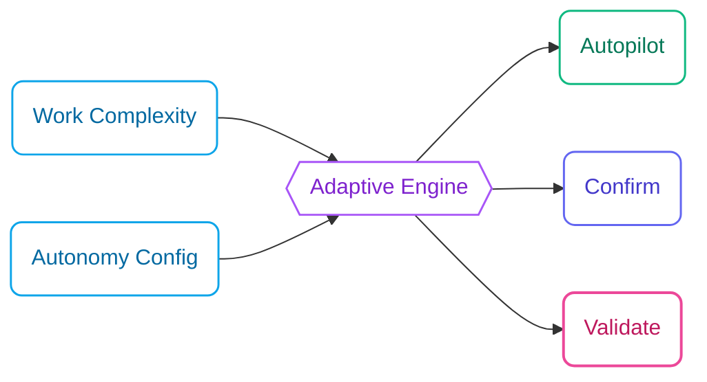

## Adaptive Checkpoints

FIRE's breakthrough is **adaptive checkpoints** that scale with complexity. Instead of a fixed number of gates, FIRE adjusts oversight based on two inputs:

1. **Work Complexity**: Low, Medium, or High
2. **Your Autonomy Config**: Set during project initialization

<Frame>
  
</Frame>

These combine to determine the execution mode:



### Mode Comparison

<CardGroup cols={3}>
  <Card title="Autopilot" icon="bolt">
    ```mermaid actions={false}
    flowchart TB
        A1(Plan):::build --> A2(Execute):::build --> A3(Walkthrough):::build --> A4(Done):::done
        classDef build fill:#fff,stroke:#0EA5E9,color:#0369A1,stroke-width:1.5px,rx:8,ry:8
        classDef done fill:#fff,stroke:#10B981,color:#047857,stroke-width:1.5px,rx:8,ry:8
    ```
    **0 checkpoints** - AI executes directly
  </Card>
  <Card title="Confirm" icon="circle-check">
    ```mermaid actions={false}
    flowchart TB
        C1(Plan):::plan --> C2{{"✋ Confirm"}}:::check --> C3(Execute):::build --> C4(Done):::done
        classDef plan fill:#fff,stroke:#6366F1,color:#4338CA,stroke-width:1.5px,rx:8,ry:8
        classDef build fill:#fff,stroke:#0EA5E9,color:#0369A1,stroke-width:1.5px,rx:8,ry:8
        classDef done fill:#fff,stroke:#10B981,color:#047857,stroke-width:1.5px,rx:8,ry:8
        classDef check fill:#fff,stroke:#EC4899,color:#BE185D,stroke-width:2px,rx:8,ry:8
    ```
    **1 checkpoint** - Human confirms plan
  </Card>
  <Card title="Validate" icon="shield-check">
    ```mermaid actions={false}
    flowchart TB
        V1(Design):::design --> V2{{"✋ Review"}}:::check --> V3(Plan):::plan --> V4{{"✋ Approve"}}:::check --> V5(Execute):::build --> V6(Done):::done
        classDef design fill:#fff,stroke:#A855F7,color:#7E22CE,stroke-width:1.5px,rx:8,ry:8
        classDef plan fill:#fff,stroke:#6366F1,color:#4338CA,stroke-width:1.5px,rx:8,ry:8
        classDef build fill:#fff,stroke:#0EA5E9,color:#0369A1,stroke-width:1.5px,rx:8,ry:8
        classDef done fill:#fff,stroke:#10B981,color:#047857,stroke-width:1.5px,rx:8,ry:8
        classDef check fill:#fff,stroke:#EC4899,color:#BE185D,stroke-width:2px,rx:8,ry:8
    ```
    **2 checkpoints** - Design + plan review
  </Card>
</CardGroup>

## Autopilot Mode (0 Checkpoints)

**AI executes directly, generates walkthrough for review.**

### When to Use

- Bug fixes with clear reproduction steps
- Minor updates (text changes, config tweaks)
- Well-defined CRUD operations
- Adding tests for existing code
- Documentation updates

### Flow

**Start → AI Plans → AI Executes → Walkthrough**

No human checkpoints. AI loads context, executes changes directly, and generates a walkthrough for post-review.

### Example

```
Work Item: Fix typo in error message
Mode: Autopilot

Builder executing...
✓ Updated src/errors.ts line 42
✓ Walkthrough generated

---
# Walkthrough: fix-error-typo

## Summary
Fixed typo "recieved" → "received" in authentication error message.

## Files Changed
- src/errors.ts (1 line)

## Verification
Error message now displays correctly on failed login.
```

### Best Practices

<Info>
  Use Autopilot for **reversible** changes where the cost of a mistake is low.
</Info>

- Keep Autopilot tasks small and focused
- Always review walkthroughs after completion
- Upgrade to Confirm if you're unsure

## Confirm Mode (1 Checkpoint)

**AI presents plan, human confirms, AI executes.**

### When to Use

- Standard feature implementation
- API endpoint creation
- Component development
- Database queries (non-schema)
- Integration with external services

### Flow

**Start → AI Plans → ✋ Human Confirms → AI Executes → Walkthrough**

One checkpoint: you review the AI's plan before execution. Reject to provide feedback and get a revised plan.

### Example

```
Work Item: Add user profile endpoint
Mode: Confirm

---
## Plan

1. Create GET /api/users/:id endpoint
2. Add UserProfile response schema
3. Implement authorization check (user can only view own profile)
4. Add unit tests for endpoint
5. Update API documentation

**Estimated changes**: 4 files, ~80 lines

[Confirm to proceed? y/n]
```

### Providing Feedback

If the plan isn't right, reject and provide feedback:

```
[Confirm? n]

Feedback: Also include the user's recent activity in the response
```

The Builder will revise and present an updated plan.

## Validate Mode (2 Checkpoints)

**AI generates design doc, human reviews design, human approves implementation.**

### When to Use

- Security-sensitive features (auth, permissions)
- Payment and billing logic
- Core architecture changes
- Database schema modifications
- External API integrations with side effects
- Features affecting multiple modules

### Flow

**Start → AI Designs → ✋ Human Reviews → AI Plans → ✋ Human Approves → AI Executes → Walkthrough**

Two checkpoints: first review the design approach, then approve the implementation plan. This separates "is this the right approach?" from "is the plan complete?"

### Example

```
Work Item: Implement password reset flow
Mode: Validate

---
## Design Document

### Overview
Secure password reset using time-limited tokens sent via email.

### Security Considerations
- Tokens expire after 1 hour
- Tokens are single-use
- Rate limited to 3 requests per hour per email
- Token hashed in database (not stored plaintext)

### Architecture
```
User Request → Rate Limiter → Token Generator → Email Service
                                    ↓
Token Verification ← User Click ← Email
        ↓
Password Update → Session Invalidation
```

### Database Changes
- New table: password_reset_tokens
- Columns: id, user_id, token_hash, expires_at, used_at

[Design review complete? y/n]

---

## Implementation Plan

1. Create password_reset_tokens migration
2. Add PasswordResetService with generate/verify methods
3. Create POST /auth/forgot-password endpoint
4. Create POST /auth/reset-password endpoint
5. Add email template for reset link
6. Implement rate limiting middleware
7. Add comprehensive tests

**Estimated changes**: 8 files, ~200 lines

[Approve implementation? y/n]
```

### Two-Stage Review

<Info>
  Validate mode separates **design review** (is this the right approach?) from **implementation approval** (is this plan complete?).
</Info>

This prevents:
- Starting implementation on a flawed design
- Missing edge cases caught during design review
- Scope creep during implementation

## Choosing the Right Mode

### Decision Matrix

| Factor | Autopilot | Confirm | Validate |
|--------|-----------|---------|----------|
| **Complexity** | Low | Medium | High |
| **Reversibility** | Easy | Moderate | Difficult |
| **Security Impact** | None | Low | High |
| **User Data** | No | Read | Write |
| **External Services** | No | Read | Write |
| **Schema Changes** | No | No | Yes |

### Quick Guide

<AccordionGroup>
  <Accordion title="Autopilot - Trust the AI">
    - Typo fixes
    - Log statement additions
    - Test additions for existing code
    - Config value changes
    - Comment updates
  </Accordion>
  <Accordion title="Confirm - Verify the Plan">
    - New API endpoints (GET, non-sensitive)
    - UI components
    - Utility functions
    - Query optimizations
    - Refactoring (behavior-preserving)
  </Accordion>
  <Accordion title="Validate - Full Review">
    - Authentication/authorization
    - Payment processing
    - Data migrations
    - Third-party integrations (with side effects)
    - Schema changes
    - Security-sensitive features
  </Accordion>
</AccordionGroup>

## Run Scope

Run scope determines how many work items execute in a single run. This is separate from execution mode—you can batch multiple Autopilot items together, or run Validate items one at a time.

### Scope Options

<CardGroup cols={3}>
  <Card title="Single" icon="circle-1">
    **One work item per run**

    Most controlled. Each item gets its own run with dedicated walkthrough.

    Best for: Learning the codebase, high-stakes changes, detailed review needs
  </Card>
  <Card title="Batch" icon="layer-group">
    **Group by execution mode**

    Respects dependencies. Groups Autopilot items together, Confirm items together, etc.

    Best for: Balanced workflow, mixed complexity work
  </Card>
  <Card title="Wide" icon="arrows-maximize">
    **Maximum items per run**

    Minimal interruption. All compatible items execute together.

    Best for: Experienced users, rapid iteration, well-understood changes
  </Card>
</CardGroup>

### Scope Comparison

| Scope | Items per Run | Grouping Strategy | Interruptions |
|-------|---------------|-------------------|---------------|
| **Single** | 1 | Each item isolated | Per item |
| **Batch** | By mode | Autopilot, Confirm, Validate grouped | Per mode group |
| **Wide** | All compatible | Maximum batching | Minimal |

### How FIRE Learns Your Preference

FIRE tracks your scope choices and suggests your preferred pattern:

```yaml
# In state.yaml
workspace:
  run_scope_preference: batch  # Learned from history
  run_scope_history:
    - choice: batch
      items_count: 3
      timestamp: 2024-01-15T10:30:00Z
    - choice: single
      items_count: 1
      timestamp: 2024-01-14T15:45:00Z
```

You can always override the suggestion for any individual run.

