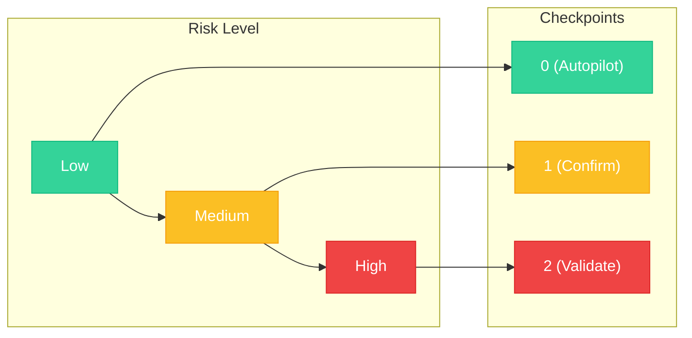
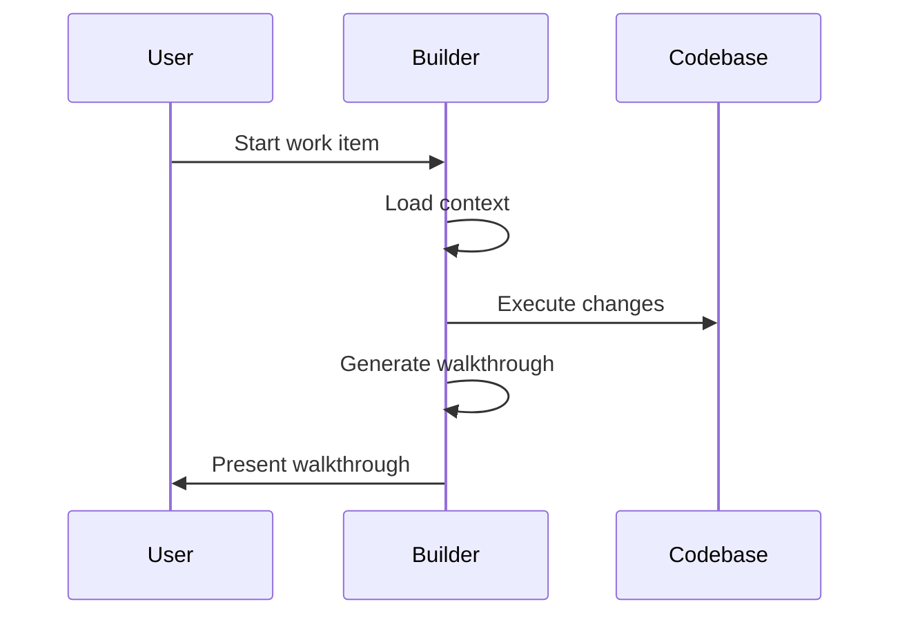
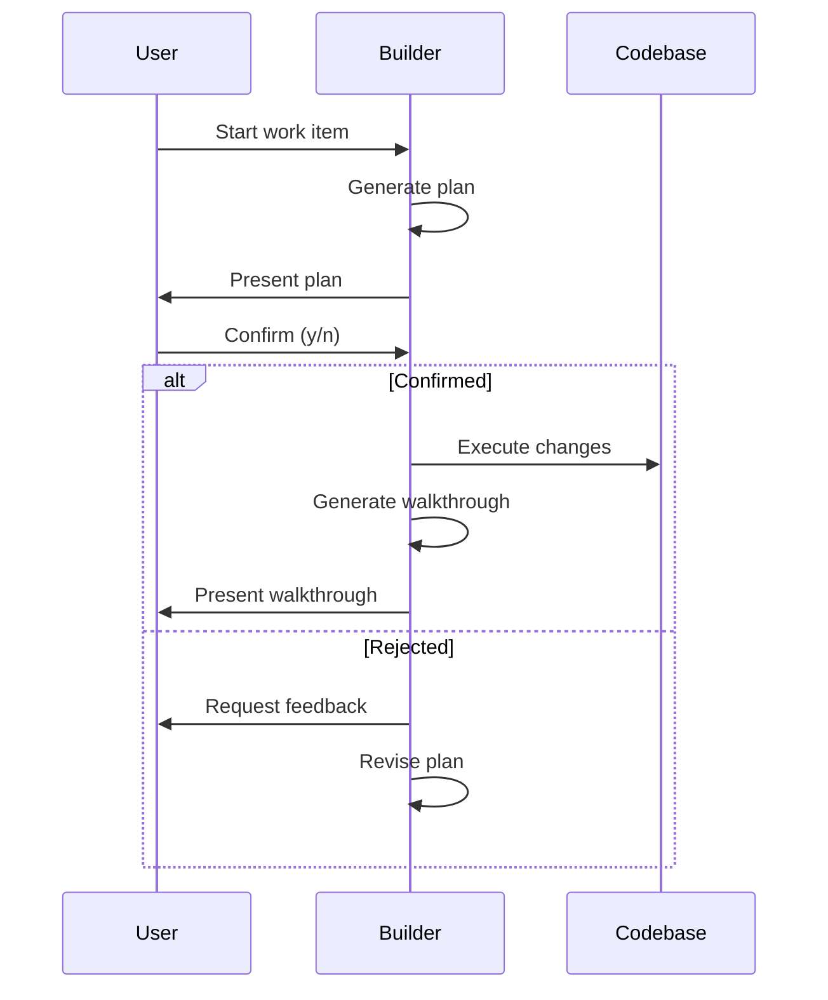
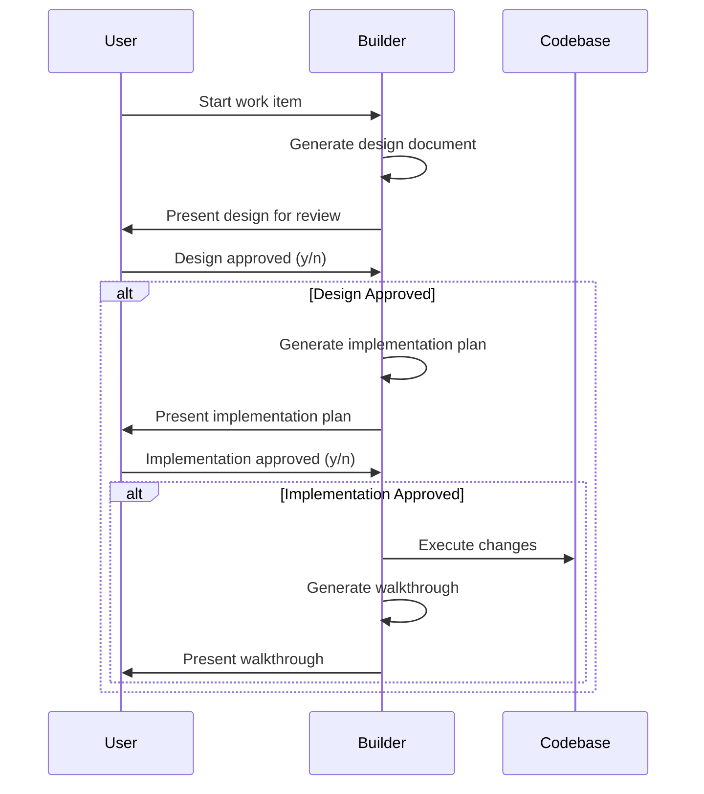

## Adaptive Checkpoints

FIRE's breakthrough is **adaptive checkpoints** that scale with complexity. Instead of a fixed number of gates, FIRE adjusts oversight based on risk.



## Autopilot Mode (0 Checkpoints)

**AI executes directly, generates walkthrough for review.**

### When to Use

- Bug fixes with clear reproduction steps
- Minor updates (text changes, config tweaks)
- Well-defined CRUD operations
- Adding tests for existing code
- Documentation updates

### Flow



### Example

```
Work Item: Fix typo in error message
Mode: Autopilot

Builder executing...
✓ Updated src/errors.ts line 42
✓ Walkthrough generated

---
# Walkthrough: fix-error-typo

## Summary
Fixed typo "recieved" → "received" in authentication error message.

## Files Changed
- src/errors.ts (1 line)

## Verification
Error message now displays correctly on failed login.
```

### Best Practices

<Info>
  Use Autopilot for **reversible** changes where the cost of a mistake is low.
</Info>

- Keep Autopilot tasks small and focused
- Always review walkthroughs after completion
- Upgrade to Confirm if you're unsure

## Confirm Mode (1 Checkpoint)

**AI presents plan, human confirms, AI executes.**

### When to Use

- Standard feature implementation
- API endpoint creation
- Component development
- Database queries (non-schema)
- Integration with external services

### Flow



### Example

```
Work Item: Add user profile endpoint
Mode: Confirm

---
## Plan

1. Create GET /api/users/:id endpoint
2. Add UserProfile response schema
3. Implement authorization check (user can only view own profile)
4. Add unit tests for endpoint
5. Update API documentation

**Estimated changes**: 4 files, ~80 lines

[Confirm to proceed? y/n]
```

### Providing Feedback

If the plan isn't right, reject and provide feedback:

```
[Confirm? n]

Feedback: Also include the user's recent activity in the response
```

The Builder will revise and present an updated plan.

## Validate Mode (2 Checkpoints)

**AI generates design doc, human reviews design, human approves implementation.**

### When to Use

- Security-sensitive features (auth, permissions)
- Payment and billing logic
- Core architecture changes
- Database schema modifications
- External API integrations with side effects
- Features affecting multiple modules

### Flow



### Example

```
Work Item: Implement password reset flow
Mode: Validate

---
## Design Document

### Overview
Secure password reset using time-limited tokens sent via email.

### Security Considerations
- Tokens expire after 1 hour
- Tokens are single-use
- Rate limited to 3 requests per hour per email
- Token hashed in database (not stored plaintext)

### Architecture
```
User Request → Rate Limiter → Token Generator → Email Service
                                    ↓
Token Verification ← User Click ← Email
        ↓
Password Update → Session Invalidation
```

### Database Changes
- New table: password_reset_tokens
- Columns: id, user_id, token_hash, expires_at, used_at

[Design review complete? y/n]

---

## Implementation Plan

1. Create password_reset_tokens migration
2. Add PasswordResetService with generate/verify methods
3. Create POST /auth/forgot-password endpoint
4. Create POST /auth/reset-password endpoint
5. Add email template for reset link
6. Implement rate limiting middleware
7. Add comprehensive tests

**Estimated changes**: 8 files, ~200 lines

[Approve implementation? y/n]
```

### Two-Stage Review

<Info>
  Validate mode separates **design review** (is this the right approach?) from **implementation approval** (is this plan complete?).
</Info>

This prevents:
- Starting implementation on a flawed design
- Missing edge cases caught during design review
- Scope creep during implementation

## Choosing the Right Mode

### Decision Matrix

| Factor | Autopilot | Confirm | Validate |
|--------|-----------|---------|----------|
| **Complexity** | Low | Medium | High |
| **Reversibility** | Easy | Moderate | Difficult |
| **Security Impact** | None | Low | High |
| **User Data** | No | Read | Write |
| **External Services** | No | Read | Write |
| **Schema Changes** | No | No | Yes |

### Quick Guide

<AccordionGroup>
  <Accordion title="Autopilot - Trust the AI">
    - Typo fixes
    - Log statement additions
    - Test additions for existing code
    - Config value changes
    - Comment updates
  </Accordion>
  <Accordion title="Confirm - Verify the Plan">
    - New API endpoints (GET, non-sensitive)
    - UI components
    - Utility functions
    - Query optimizations
    - Refactoring (behavior-preserving)
  </Accordion>
  <Accordion title="Validate - Full Review">
    - Authentication/authorization
    - Payment processing
    - Data migrations
    - Third-party integrations (with side effects)
    - Schema changes
    - Security-sensitive features
  </Accordion>
</AccordionGroup>

## Mode Override

You can override the suggested mode:

```
Work Item: Add logging to payment service
Suggested Mode: Autopilot

> Override to Confirm

Mode updated to Confirm.
```

<Warning>
  **Never downgrade** security-sensitive work items. If FIRE suggests Validate, there's a reason.
</Warning>

## Default Mode by Project Type

FIRE sets a default mode based on your project:

| Project Type | Default Mode | Rationale |
|--------------|--------------|-----------|
| **Greenfield** | Confirm | New code, want to verify approach |
| **Brownfield** | Confirm | Existing patterns to respect |
| **Monorepo** | Confirm | Multiple modules, need coordination |
| **Security-focused** | Validate | Higher stakes require more review |

You can change the default in `state.yaml`:

```yaml
workspace:
  default_mode: confirm  # autopilot, confirm, or validate
```

## Metrics

FIRE tracks execution mode metrics:

```yaml
metrics:
  runs_by_mode:
    autopilot: 15
    confirm: 8
    validate: 3
  first_run_success:
    autopilot: 93%
    confirm: 87%
    validate: 95%
```

<Info>
  High Validate success rates indicate the two-stage review catches issues before execution.
</Info>
