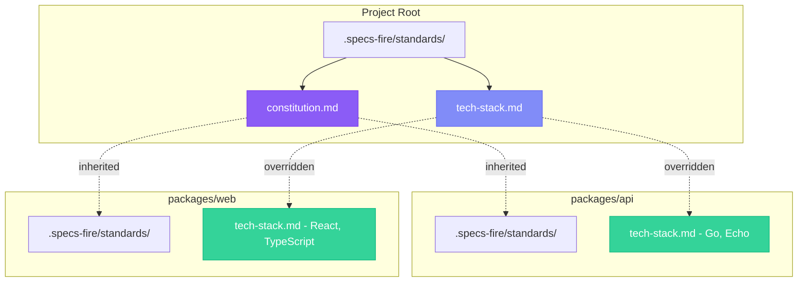
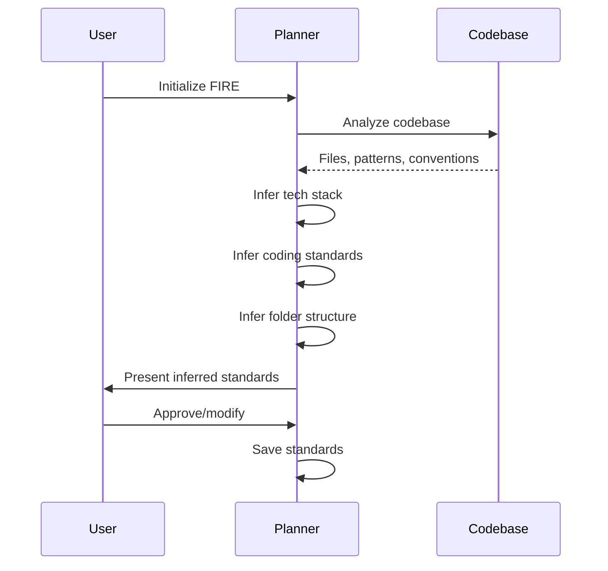

## First-Class Monorepo Support

FIRE is designed from the ground up for real-world projects, including complex monorepo architectures with multiple tech stacks.



## Hierarchical Standards

### How It Works

Standards follow a **hierarchical inheritance** model:

1. **Root standards** define project-wide defaults
2. **Module standards** override specific files when needed
3. **Constitution** is special—always inherited, never overridden

### Project Structure

```
project/
├── .specs-fire/
│   ├── state.yaml                 # Single source of truth
│   └── standards/
│       ├── constitution.md        # Universal policies (ALWAYS inherited)
│       ├── tech-stack.md          # Default: Node.js, TypeScript
│       ├── coding-standards.md    # Default coding conventions
│       └── testing-standards.md   # Default test patterns
│
├── packages/api/
│   └── .specs-fire/
│       └── standards/
│           └── tech-stack.md      # Override: Go, Echo, golangci-lint
│
├── packages/web/
│   └── .specs-fire/
│       └── standards/
│           └── tech-stack.md      # Override: React, Vite, Tailwind
│
└── services/ml/
    └── .specs-fire/
        └── standards/
            └── tech-stack.md      # Override: Python, FastAPI, ruff
```

### Resolution Rules

<Steps>
  <Step title="Check Module">
    Does the target module have this standard file?
  </Step>
  <Step title="If Yes: Use Module">
    Use the module's version (override)
  </Step>
  <Step title="If No: Inherit">
    Walk up to parent, use ancestor's version
  </Step>
  <Step title="Exception: Constitution">
    Constitution is ALWAYS inherited from root, never overridden
  </Step>
</Steps>

## The Constitution

The **constitution** contains universal policies that apply everywhere:

```markdown
# Project Constitution

## Git Workflow
- All changes via pull request
- Require 1 approval before merge
- Squash merge to main

## Security
- No secrets in code
- Environment variables for configuration
- Dependency scanning enabled

## CI/CD
- All PRs must pass CI
- Deploy to staging on merge to main
- Manual promotion to production

## Quality
- All new code must have tests
- Maintain >80% coverage on critical paths
```

<Info>
  Constitution is **always inherited**. If a module tries to have its own constitution.md, it's ignored.
</Info>

### Why Constitution is Special

- Ensures consistent policies across all modules
- Prevents "rogue" modules with different rules
- Simplifies onboarding—one place for universal rules
- AI always knows where to find project-wide policies

## Tech Stack Detection

FIRE doesn't hardcode tech stacks—it **detects** them:

### Quick Scan (2-5 minutes)

Pattern-based detection:
- Package files: `package.json`, `go.mod`, `requirements.txt`, `Cargo.toml`
- Lock files: `package-lock.json`, `yarn.lock`, `pnpm-lock.yaml`
- Config files: `tsconfig.json`, `.eslintrc`, `pyproject.toml`
- Framework markers: `next.config.js`, `vite.config.ts`, `main.go`

### Deep Scan (10-30 minutes)

Code analysis:
- Import patterns and dependencies
- Folder structure conventions
- Test framework usage
- Build tool configuration
- Integration patterns (APIs, databases)

### Generated Tech Stack

After scanning, FIRE generates a `tech-stack.md`:

```markdown
# Tech Stack

## Language
- TypeScript 5.x
- Node.js 20 LTS

## Framework
- Express.js for API
- React 18 for frontend

## Database
- PostgreSQL 15
- Prisma ORM

## Testing
- Vitest for unit tests
- Playwright for E2E

## Tooling
- ESLint + Prettier
- pnpm workspaces
- Turborepo for builds
```

## Brownfield Support

FIRE treats existing codebases as **first-class citizens**.

### Brownfield Rules

<CardGroup cols={2}>
  <Card title="Search Before Create" icon="magnifying-glass">
    Always check if similar code exists before creating new modules.
  </Card>
  <Card title="Respect Patterns" icon="ruler-combined">
    Follow existing naming, folder structures, and conventions.
  </Card>
  <Card title="Minimal Changes" icon="scalpel">
    Make targeted edits. Don't rewrite files unnecessarily.
  </Card>
  <Card title="Preserve Tests" icon="vial">
    Never delete existing tests without explicit approval.
  </Card>
</CardGroup>

### Standards Inference

For brownfield projects, FIRE infers standards from existing code:



### Inferred vs Prescribed

| Aspect | Greenfield | Brownfield |
|--------|------------|------------|
| **Tech Stack** | AI suggests or user specifies | Detected from code |
| **Coding Standards** | AI suggests or user specifies | Inferred from patterns |
| **Folder Structure** | AI suggests or user specifies | Matches existing layout |
| **Testing** | AI suggests | Follows existing test setup |

## Monorepo Detection

FIRE automatically detects monorepo structures:

### Detection Signals

| Signal | Indicator |
|--------|-----------|
| **pnpm** | `pnpm-workspace.yaml` |
| **Yarn** | `package.json` with `workspaces` |
| **Lerna** | `lerna.json` |
| **Nx** | `nx.json` |
| **Turborepo** | `turbo.json` |
| **Directory Structure** | `packages/` or `apps/` directories |

### Workspace Analysis

After detection, FIRE maps the workspace:

```yaml
workspace:
  type: brownfield
  structure: monorepo
  parts:
    - name: packages/api
      tech: go
      framework: echo
    - name: packages/web
      tech: typescript
      framework: react
    - name: services/ml
      tech: python
      framework: fastapi
  integrations:
    - type: database
      provider: postgresql
    - type: cache
      provider: redis
  key_files:
    - packages/api/main.go
    - packages/web/src/App.tsx
    - services/ml/main.py
```

## Working with Modules

### Targeting a Module

When creating work items, specify the target module:

```yaml
work_item:
  id: add-user-endpoint
  module: packages/api  # Target specific module
  title: Add user CRUD endpoint
```

FIRE will:
1. Load module-specific standards
2. Respect module's tech stack
3. Follow module's conventions

### Cross-Module Work

For work spanning multiple modules:

```yaml
work_item:
  id: user-feature
  modules:
    - packages/api      # Backend changes
    - packages/web      # Frontend changes
  title: Add user management feature
  complexity: high      # Cross-module = higher complexity
  mode: validate        # Recommend Validate mode
```

<Warning>
  Cross-module work items are **automatically** set to higher complexity and typically use Validate mode.
</Warning>

## Best Practices

### When to Override Standards

<AccordionGroup>
  <Accordion title="Override tech-stack.md">
    - Module uses different language
    - Module has specific framework requirements
    - Module has unique tooling needs
  </Accordion>
  <Accordion title="Override coding-standards.md">
    - Module follows different conventions (e.g., Go vs TypeScript)
    - Module has special formatting rules
    - Module has unique linting configuration
  </Accordion>
  <Accordion title="Never Override constitution.md">
    - Constitution is always inherited
    - Project-wide policies must be consistent
    - Modify root constitution for changes
  </Accordion>
</AccordionGroup>

### Keeping Standards in Sync

- Review root standards periodically
- Update constitution when policies change
- Keep module overrides minimal
- Document why overrides exist

### Module-Specific Conventions

Add context to module standards:

```markdown
# Tech Stack - packages/api

## Why Go?
Selected for API module due to:
- High performance requirements
- Strong typing for data validation
- Excellent concurrency support

## Migration from Node
Originally Node.js, migrated in Q3 2024 for performance.
Some utility code still in TypeScript during transition.
```

## Initialization Workflow

<Steps>
  <Step title="Run FIRE init">
    ```bash
    npx specsmd@latest install
    ```
    Select FIRE flow
  </Step>
  <Step title="Monorepo Detection">
    FIRE detects monorepo structure and maps modules
  </Step>
  <Step title="Per-Module Scan">
    Each module analyzed for tech stack and patterns
  </Step>
  <Step title="Standards Generation">
    - Root standards created with defaults
    - Module standards created with overrides
    - Constitution created with universal policies
  </Step>
  <Step title="Review and Confirm">
    Review generated standards, adjust as needed
  </Step>
</Steps>
