## What is FIRE?

**FIRE (Fast Intent-Run Engineering)** is an AI-native development flow inspired by AI-DLC but simplified for rapid feature delivery. It takes the core concepts of AI-DLC—intents, structured execution, human checkpoints—and streamlines them for solo developers and small teams.

<Info>
  **AI-DLC principles, simplified execution.** FIRE keeps intent-driven development and traceability while reducing ceremony from 10-26 checkpoints to just 0-2.
</Info>


## Key Differentiators

<CardGroup cols={2}>
  <Card title="Adaptive Checkpoints" icon="sliders">
    **0-2 checkpoints per work item** based on complexity. Autopilot for simple tasks, Validate for critical changes.
  </Card>
  <Card title="First-Class Brownfield" icon="building">
    Auto-detects existing patterns, respects conventions, and extends rather than rewrites your codebase.
  </Card>
  <Card title="Monorepo Support" icon="folder-tree">
    Hierarchical standards with module-specific overrides. One project, multiple tech stacks.
  </Card>
  <Card title="Walkthrough Generation" icon="file-lines">
    Every change documented automatically. Review what AI did without digging through code.
  </Card>
</CardGroup>

## FIRE vs AI-DLC

FIRE is **AI-DLC simplified**—same philosophy, less ceremony.

| Aspect | FIRE | AI-DLC |
|--------|------|--------|
| **Philosophy** | Intent-driven, AI proposes, human validates | Same |
| **Hierarchy** | Intent → Work Item → Run | Intent → Unit → Story → Bolt → Stages |
| **Checkpoints** | 0-2 per work item (adaptive) | 10-26 per feature (comprehensive) |
| **Agents** | 3 (Orchestrator, Planner, Builder) | 4 (Master, Inception, Construction, Operations) |
| **Artifacts** | 3-5 per feature | 15-20 per feature |
| **Phases** | Plan → Execute (continuous) | Inception → Construction → Operations (sequential) |
| **DDD** | Not required | Integral |
| **Best For** | Solo/small teams, rapid features | Teams, complex domains |

<Info>
  **Same DNA**: Both flows use intents, structured artifacts, and human validation. FIRE just flattens the hierarchy and makes checkpoints adaptive.
</Info>

## When to Use FIRE

<AccordionGroup>
  <Accordion title="You're a solo developer or small team">
    FIRE is optimized for 1-3 person teams where extensive ceremony adds overhead without benefit.
  </Accordion>
  <Accordion title="You're working in a brownfield codebase">
    FIRE auto-detects existing patterns, tech stack, and conventions. It extends your code rather than fighting it.
  </Accordion>
  <Accordion title="You have a monorepo">
    Hierarchical standards support different tech stacks per module while sharing common policies.
  </Accordion>
  <Accordion title="You want to ship fast">
    Adaptive checkpoints let you skip ceremony for simple tasks while maintaining rigor for critical changes.
  </Accordion>
  <Accordion title="You don't need full DDD">
    Standard CRUD, integrations, and utilities don't require domain modeling. FIRE skips what you don't need.
  </Accordion>
</AccordionGroup>

## When NOT to Use FIRE

<Warning>
  **Consider AI-DLC instead if:**
  - You have a large team requiring coordination
  - Your domain logic is complex and needs DDD
  - You're in a regulated environment requiring extensive documentation
  - Multiple stakeholders need to review and approve changes
</Warning>

## Core Concepts

### Intent

A high-level objective that delivers user value. Captured through guided conversation, not lengthy specs.

```yaml
intent:
  id: auth-system
  title: User Authentication System
  status: in_progress
  priority: high
```

### Work Item

A discrete, executable unit of work derived from an Intent. Each work item completes in a single Run.

```yaml
work_item:
  id: create-user-schema
  title: Create user database schema
  complexity: low
  mode: autopilot  # 0 checkpoints
```

### Run

A single execution cycle for a work item. Loads context, executes per mode, tracks changes, generates walkthrough.

### Walkthrough

Generated after each run. Documents what changed, why, and how to verify it.

## Three Execution Modes

FIRE adapts to complexity with three execution modes:

```mermaid
graph TD
    subgraph "Autopilot (0 checkpoints)"
        A1[AI Plans] --> A2[AI Executes] --> A3[Walkthrough]
    end

    subgraph "Confirm (1 checkpoint)"
        C1[AI Plans] --> C2[Human Confirms] --> C3[AI Executes] --> C4[Walkthrough]
    end

    subgraph "Validate (2 checkpoints)"
        V1[AI Plans] --> V2[Human Reviews Design] --> V3[Human Approves] --> V4[AI Executes] --> V5[Walkthrough]
    end

    style A1 fill:#34D399,stroke:#10B981,color:#fff
    style A2 fill:#34D399,stroke:#10B981,color:#fff
    style A3 fill:#34D399,stroke:#10B981,color:#fff
    style C1 fill:#818CF8,stroke:#6366F1,color:#fff
    style C2 fill:#F472B6,stroke:#EC4899,color:#fff
    style C3 fill:#818CF8,stroke:#6366F1,color:#fff
    style C4 fill:#818CF8,stroke:#6366F1,color:#fff
    style V1 fill:#8B5CF6,stroke:#7C3AED,color:#fff
    style V2 fill:#F472B6,stroke:#EC4899,color:#fff
    style V3 fill:#F472B6,stroke:#EC4899,color:#fff
    style V4 fill:#8B5CF6,stroke:#7C3AED,color:#fff
    style V5 fill:#8B5CF6,stroke:#7C3AED,color:#fff
```



| Mode | Checkpoints | Use For |
|------|-------------|---------|
| **Autopilot** | 0 | Bug fixes, minor updates, well-defined changes |
| **Confirm** | 1 | Standard features, moderate complexity |
| **Validate** | 2 | Security, payments, core architecture |

<Info>
  Learn more about execution modes in the [Execution Modes](/fire-flow/execution-modes) guide.
</Info>

## Three-Agent Architecture

FIRE uses three specialized agents:

| Agent | Role | Key Skills |
|-------|------|------------|
| **Orchestrator** | Entry point, routing, session management | Route requests, resume sessions |
| **Planner** | Intent capture, work item decomposition | Capture intents, generate design docs |
| **Builder** | Run execution, walkthrough generation | Execute runs, track changes |

<Info>
  Learn more in the [FIRE Agents](/fire-flow/agents) documentation.
</Info>

## Project Structure

```
project/
├── .specsmd/
│   └── fire/                    # FIRE flow definition
│       └── agents/              # Agent definitions
│
└── .specs-fire/                 # Project artifacts
    ├── state.yaml               # Central state tracking
    ├── standards/               # Project standards
    │   ├── constitution.md      # Universal policies (always inherited)
    │   ├── tech-stack.md        # Technology choices
    │   ├── coding-standards.md  # Code conventions
    │   └── folder-structure.md  # Directory layout
    ├── intents/                 # Intent documentation
    │   └── {intent-id}/
    │       ├── brief.md
    │       └── work-items/
    ├── runs/                    # Run logs
    └── walkthroughs/            # Generated documentation
```

## Get Started

<Steps>
  <Step title="Install specs.md">
    ```bash
    npx specsmd@latest install
    ```
  </Step>
  <Step title="Select FIRE during init">
    Choose "FIRE" when prompted for flow selection
  </Step>
  <Step title="Capture your first intent">
    ```
    /fire-planner
    ```
    Describe what you want to build
  </Step>
  <Step title="Execute work items">
    ```
    /fire-builder
    ```
    AI executes with appropriate checkpoints
  </Step>
</Steps>

<Card title="Quick Start Guide" icon="rocket" href="/fire-flow/quick-start">
  Step-by-step guide to shipping your first feature with FIRE
</Card>
