## What is FIRE?

**FIRE (Fast Intent-Run Engineering)** is an **Adaptive Spec-Driven Development** flow with first-class Monorepo and Brownfield support. It kills the ceremony and right-sizes the rigor—because fixing a UI bug isn't the same as refactoring your payment gateway.

<Info>
  **Check when necessary, not check everything.** FIRE dynamically decides when to ask for human input and when to burn through the task, saving your attention for moments that actually matter.
</Info>


## Key Differentiators

<CardGroup cols={2}>
  <Card title="Dynamic Execution" icon="rotate">
    **No pre-planned execution.** Builder scans remaining work items and recommends what to run next based on dependencies and current state.
  </Card>
  <Card title="Adaptive Checkpoints" icon="sliders">
    **0-2 checkpoints per work item** based on complexity. Autopilot for simple tasks, Validate for critical changes.
  </Card>
  <Card title="First-Class Brownfield" icon="building">
    Auto-detects existing patterns, respects conventions, and extends rather than rewrites your codebase.
  </Card>
  <Card title="Monorepo Support" icon="folder-tree">
    Hierarchical standards with module-specific overrides. One project, multiple tech stacks.
  </Card>
  <Card title="Walkthrough Generation" icon="file-lines">
    Every change documented automatically. Review what AI did without digging through code.
  </Card>
  <Card title="Change-Friendly" icon="arrows-rotate">
    Requirements changed? Just update your specs. No execution plans to re-create—next run adapts automatically.
  </Card>
</CardGroup>

## FIRE vs AI-DLC (specs.md)

FIRE and specs.md's AI-DLC flow share intent-driven philosophy but are distinct flows. FIRE prioritizes adaptive execution; our AI-DLC implementation prioritizes comprehensive traceability.

| Aspect | FIRE | specs.md AI-DLC |
|--------|------|-----------------|
| **Philosophy** | Intent-driven, AI proposes, human validates | Same |
| **Hierarchy** | Intent → Work Item → Run | Intent → Unit → Story → Bolt → Stages |
| **Execution Planning** | Dynamic—Builder recommends next run | Pre-planned—Bolts created before execution |
| **Requirement Changes** | Just update specs, next run adapts | May require re-planning bolts |
| **Checkpoints** | Adaptive (based on complexity + config) | Comprehensive (fixed per bolt type) |
| **Agents** | 3 (Orchestrator, Planner, Builder) | 4 (Master, Inception, Construction, Operations) |
| **Artifacts** | Adaptive (design docs when needed) | Comprehensive (per bolt type) |
| **Phases** | Plan → Execute (continuous) | Inception → Construction → Operations (sequential) |
| **Design Approach** | Adaptive based on complexity | DDD or Simple bolt types |
| **Optimized For** | Teams who hate friction | Teams needing full traceability |

<Info>
  **Shared philosophy**: Both flows use intents, structured artifacts, and human validation. FIRE adapts the ceremony to the task; AI-DLC provides comprehensive ceremony always.
</Info>

### Dynamic vs Pre-Planned Execution

This is a fundamental difference in how the two flows handle execution:

**FIRE (Dynamic)**: When you invoke the Builder agent, it scans all remaining intents and work items, analyzes their dependencies, and recommends which work items can run together next. You approve or adjust, then it executes. No execution plans are created ahead of time.

**AI-DLC (Pre-Planned)**: During the Inception phase, you create "bolts"—pre-defined execution plans that bundle stories together with specific stages. Bolts are planned before construction begins.

<Warning>
  **Why this matters for changing requirements**: In AI-DLC, if you add new stories or modify units after bolt planning, you may need to re-plan your bolts. In FIRE, just update your specs—the Builder will see the changes and recommend accordingly on the next run.
</Warning>

## When to Use FIRE

<AccordionGroup>
  <Accordion title="You hate unnecessary friction">
    FIRE is built for collectives—tight-knit teams and solo devs who want to ship without bureaucracy getting in the way.
  </Accordion>
  <Accordion title="You're working in a brownfield codebase">
    FIRE analyzes your existing structure. It respects the patterns you already have and extends rather than rewrites.
  </Accordion>
  <Accordion title="You have a monorepo">
    Hierarchical standards support different tech stacks per module while sharing common policies.
  </Accordion>
  <Accordion title="You want adaptive rigor">
    Simple tasks burn through fast. Complex changes get the attention they deserve. FIRE right-sizes the ceremony.
  </Accordion>
  <Accordion title="Your project doesn't always need DDD">
    If your project doesn't need complex domain modeling, FIRE won't force it. Design docs appear when complexity warrants them.
  </Accordion>
</AccordionGroup>

## When to Consider specs.md AI-DLC Instead

<Info>
  **specs.md's AI-DLC flow may be a better fit if:**
  - You need comprehensive documentation for every change (regulatory/audit requirements)
  - Your organization mandates fixed approval workflows
  - You prefer predictable ceremony over adaptive execution

  Note: FIRE can handle complex domains—it will adapt with design documentation when needed. The choice is about workflow preference, not capability limits.
</Info>

## Core Concepts

### Intent

A high-level objective that delivers user value. Captured through guided conversation, not lengthy specs.

```yaml
intent:
  id: auth-system
  title: User Authentication System
  status: in_progress
  priority: high
```

### Work Item

A discrete, executable unit of work derived from an Intent. Each work item completes in a single Run.

```yaml
work_item:
  id: create-user-schema
  title: Create user database schema
  complexity: low
  mode: autopilot  # 0 checkpoints
```

### Run

A single execution cycle for a work item. Loads context, executes per mode, tracks changes, generates walkthrough.

### Walkthrough

Generated after each run. Documents what changed, why, and how to verify it.

## Adaptive Execution

FIRE doesn't guess—it analyzes two inputs to decide the execution path:

1. **Work Complexity**: Is this a simple tweak or a systemic change?
2. **Your Autonomy Config**: How much oversight do you want?

These combine to dynamically choose when to ask and when to burn through:



```mermaid
graph TD
    subgraph "Autopilot (0 checkpoints)"
        A1[AI Plans] --> A2[AI Executes] --> A3[Walkthrough]
    end

    subgraph "Confirm (1 checkpoint)"
        C1[AI Plans] --> C2[Human Confirms] --> C3[AI Executes] --> C4[Walkthrough]
    end

    subgraph "Validate (2 checkpoints)"
        V1[AI Plans] --> V2[Human Reviews Design] --> V3[Human Approves] --> V4[AI Executes] --> V5[Walkthrough]
    end

    style A1 fill:#34D399,stroke:#10B981,color:#fff
    style A2 fill:#34D399,stroke:#10B981,color:#fff
    style A3 fill:#34D399,stroke:#10B981,color:#fff
    style C1 fill:#818CF8,stroke:#6366F1,color:#fff
    style C2 fill:#F472B6,stroke:#EC4899,color:#fff
    style C3 fill:#818CF8,stroke:#6366F1,color:#fff
    style C4 fill:#818CF8,stroke:#6366F1,color:#fff
    style V1 fill:#8B5CF6,stroke:#7C3AED,color:#fff
    style V2 fill:#F472B6,stroke:#EC4899,color:#fff
    style V3 fill:#F472B6,stroke:#EC4899,color:#fff
    style V4 fill:#8B5CF6,stroke:#7C3AED,color:#fff
    style V5 fill:#8B5CF6,stroke:#7C3AED,color:#fff
```

| Mode | Checkpoints | Use For |
|------|-------------|---------|
| **Autopilot** | 0 | Bug fixes, minor updates, well-defined changes |
| **Confirm** | 1 | Standard features, moderate complexity |
| **Validate** | 2 | Security, payments, core architecture |

You configure your autonomy preference during project initialization:

<Frame>
  
</Frame>

<Info>
  Learn more about execution modes in the [Execution Modes](/fire-flow/execution-modes) guide.
</Info>

## Three-Agent Architecture

FIRE uses three specialized agents:

| Agent | Role | Key Skills |
|-------|------|------------|
| **Orchestrator** | Entry point, routing, session management | Route requests, resume sessions |
| **Planner** | Intent capture, work item decomposition | Capture intents, generate design docs |
| **Builder** | Run execution, walkthrough generation | Execute runs, track changes |

<Info>
  Learn more in the [FIRE Agents](/fire-flow/agents) documentation.
</Info>

## Project Structure

```
project/
├── .specsmd/
│   └── fire/                    # FIRE flow definition
│       └── agents/              # Agent definitions
│
└── .specs-fire/                 # Project artifacts
    ├── state.yaml               # Central state tracking
    ├── standards/               # Project standards
    │   ├── constitution.md      # Universal policies (always inherited)
    │   ├── tech-stack.md        # Technology choices
    │   ├── coding-standards.md  # Code conventions
    │   └── folder-structure.md  # Directory layout
    ├── intents/                 # Intent documentation
    │   └── {intent-id}/
    │       ├── brief.md
    │       └── work-items/
    ├── runs/                    # Run logs
    └── walkthroughs/            # Generated documentation
```

## Get Started

<Steps>
  <Step title="Install specs.md">
    ```bash
    npx specsmd@latest install
    ```
  </Step>
  <Step title="Select FIRE during init">
    Choose "FIRE" when prompted for flow selection
  </Step>
  <Step title="Capture your first intent">
    ```
    /fire-planner
    ```
    Describe what you want to build
  </Step>
  <Step title="Execute work items">
    ```
    /fire-builder
    ```
    AI executes with appropriate checkpoints
  </Step>
</Steps>

<Card title="Quick Start Guide" icon="rocket" href="/fire-flow/quick-start">
  Step-by-step guide to shipping your first feature with FIRE
</Card>
