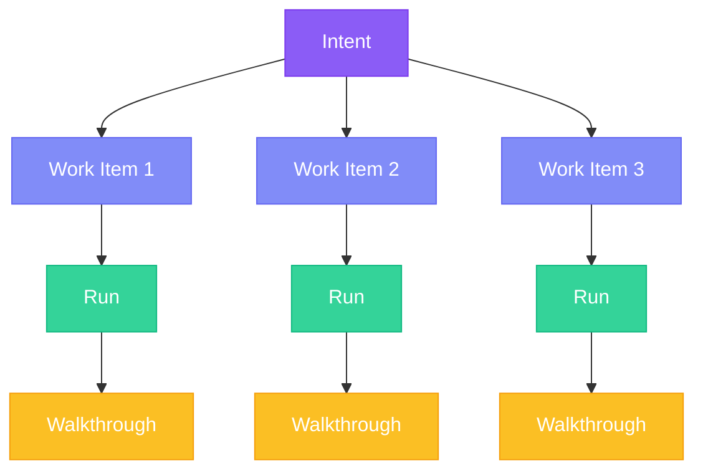
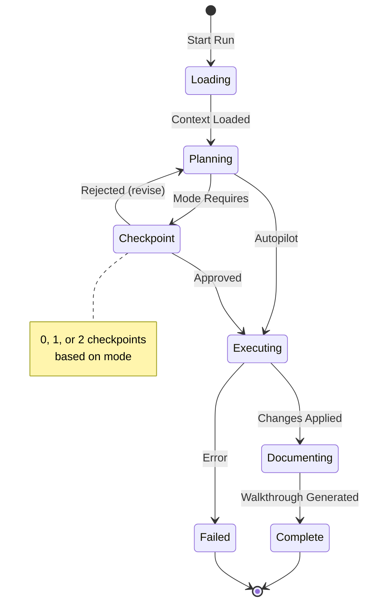

## FIRE Hierarchy

FIRE uses a streamlined hierarchy compared to AI-DLC:



| Level | FIRE | AI-DLC Equivalent |
|-------|------|-------------------|
| Goal | Intent | Intent |
| Work Unit | Work Item | Unit + Story |
| Execution | Run | Bolt |
| Documentation | Walkthrough | Bolt artifacts |

## Intents

An **Intent** is a high-level objective that delivers user value. It's the "what" and "why" of your feature.

### Structure

```yaml
intent:
  id: auth-system
  title: User Authentication System
  description: |
    Enable users to create accounts, log in securely,
    and manage their sessions.
  status: in_progress
  priority: high
  created: 2024-01-15T10:00:00Z
```

### Intent Document

Intents are documented in `.specs-fire/intents/{id}/brief.md`:

```markdown
# User Authentication System

## Objective
Enable users to create accounts, log in securely, and manage sessions.

## Context
- New greenfield project
- Expected 10k users at launch
- Must support social login in future (not MVP)

## Success Criteria
- Users can register with email/password
- Users can log in and receive session token
- Sessions expire after 24 hours
- Password reset via email works
```

### Intent States

| State | Description |
|-------|-------------|
| `pending` | Captured but not started |
| `in_progress` | Work items being executed |
| `blocked` | Waiting on external dependency |
| `done` | All work items completed |

## Work Items

A **Work Item** is a discrete, executable unit of work. Each work item:
- Has a clear definition of done
- Completes in a single Run
- Has assigned complexity and execution mode
- Can depend on other work items

### Structure

```yaml
work_item:
  id: user-schema
  intent_id: auth-system
  title: Create user database schema
  description: Set up the users table with authentication fields
  complexity: low
  mode: autopilot
  depends_on: []
  status: pending
```

### Work Item Document

Work items are documented in `.specs-fire/intents/{intent-id}/work-items/{id}.md`:

```markdown
# Create User Database Schema

## Definition of Done
- [ ] Migration file created
- [ ] User model with typed fields
- [ ] Indexes on email field
- [ ] Tests for model validation

## Technical Notes
- Use UUID for primary key
- Add soft delete support
- Email must be unique and indexed

## Dependencies
None - first work item
```

### Complexity Levels

| Level | Description | Typical Mode |
|-------|-------------|--------------|
| `low` | < 50 lines, single file, well-defined | Autopilot |
| `medium` | 50-200 lines, 2-5 files, some decisions | Confirm |
| `high` | 200+ lines, 5+ files, architecture impact | Validate |

### Work Item States

| State | Description |
|-------|-------------|
| `pending` | Not yet started |
| `in_progress` | Currently executing |
| `blocked` | Dependency not met |
| `done` | Successfully completed |

### Dependencies

Work items can depend on each other:

```yaml
work_items:
  - id: user-schema
    depends_on: []

  - id: login-endpoint
    depends_on: [user-schema]  # Must complete first

  - id: session-middleware
    depends_on: [login-endpoint]
```

The Builder respects dependencies when selecting the next work item.

## Runs

A **Run** is a single execution cycle for a work item. It's atomic: either completes successfully or rolls back.

### Run Lifecycle



### Run Phases

<Steps>
  <Step title="Loading">
    Load project context, standards, and work item details
  </Step>
  <Step title="Planning">
    Generate execution plan based on context
  </Step>
  <Step title="Checkpoint (if required)">
    Present plan/design for human review
  </Step>
  <Step title="Executing">
    Apply changes to codebase
  </Step>
  <Step title="Documenting">
    Generate walkthrough with all changes
  </Step>
</Steps>

### Run Tracking

Runs are logged in `.specs-fire/runs/{id}.yaml`:

```yaml
run:
  id: 1
  work_item_id: user-schema
  intent_id: auth-system
  mode: autopilot
  started: 2024-01-15T10:30:00Z
  completed: 2024-01-15T10:32:00Z
  status: success
  files:
    created:
      - migrations/20240115_create_users.sql
      - src/models/user.ts
    modified:
      - src/models/index.ts
    deleted: []
  walkthrough: walkthroughs/run-001-user-schema.md
```

## Walkthroughs

A **Walkthrough** is generated after each successful run. It documents what changed and why.

### Structure

```markdown
# Run 001: user-schema

## Summary
Created user database schema with email/password authentication fields.

## Files Changed

### Created
- `migrations/20240115_create_users.sql`
  - Users table with id, email, password_hash, created_at, updated_at
  - Unique index on email
  - Soft delete with deleted_at column

- `src/models/user.ts`
  - User model class with TypeORM decorators
  - Password hashing on save
  - Email validation

### Modified
- `src/models/index.ts`
  - Added User export

## Key Decisions
- Used UUID for user IDs (portable across databases)
- Added soft delete for GDPR compliance
- bcrypt with cost factor 12 for password hashing

## Verification Steps
1. Run `npm run migrate` to apply schema
2. Verify table: `SELECT * FROM information_schema.tables WHERE table_name = 'users'`
3. Run tests: `npm test -- --grep "User model"`

## Test Coverage
- `tests/models/user.test.ts` - 4 tests added
  - Creates user with valid email
  - Rejects duplicate email
  - Hashes password on save
  - Supports soft delete
```

### Why Walkthroughs Matter

<Info>
  Walkthroughs enable **async review**. You don't need to watch AI code in real-time—review the walkthrough when convenient.
</Info>

Benefits:
- Complete audit trail of all changes
- Easy to review without reading every line
- Verification steps for QA
- Context for future developers

## State Management

All state is tracked in `.specs-fire/state.yaml`:

```yaml
project:
  name: my-project
  created: 2024-01-15T09:00:00Z
  framework: fire-v1

workspace:
  type: brownfield
  structure: monolith
  default_mode: confirm

intents:
  - id: auth-system
    title: User Authentication
    status: in_progress
    priority: high
    work_items:
      - id: user-schema
        status: done
        complexity: low
        depends_on: []
        completed_in_run: 1
      - id: login-endpoint
        status: in_progress
        complexity: medium
        depends_on: [user-schema]
        started_in_run: 2
      - id: session-management
        status: pending
        complexity: high
        depends_on: [login-endpoint]

summary:
  total_intents: 1
  intents_done: 0
  total_work_items: 3
  work_items_done: 1

runs:
  last_completed: 1
  active: 2
```

### State Scripts

FIRE uses deterministic scripts for state management:

| Script | Purpose |
|--------|---------|
| `state-read` | Parse state, return JSON |
| `state-update-intent` | Add/update intent |
| `state-update-work-item` | Update work item status |
| `state-recalculate-summary` | Refresh counts |
| `state-set-active-run` | Track active run |

<Info>
  Scripts ensure deterministic state updates. AI calls scripts rather than editing YAML directly.
</Info>

## Best Practices

### Work Item Sizing

<AccordionGroup>
  <Accordion title="Too Small">
    ❌ "Add import statement"
    ❌ "Create empty file"
    ❌ "Add one test case"

    These are implementation details, not work items.
  </Accordion>
  <Accordion title="Just Right">
    ✅ "Create user database schema"
    ✅ "Implement login endpoint"
    ✅ "Add session management"

    Each delivers value and has clear completion criteria.
  </Accordion>
  <Accordion title="Too Large">
    ❌ "Build authentication system"
    ❌ "Implement entire API"

    These are Intents, not work items. Decompose them.
  </Accordion>
</AccordionGroup>

### Dependency Management

- Keep dependencies minimal
- Avoid circular dependencies
- Use `blocked` status when waiting
- Builder auto-selects based on dependencies

### Walkthrough Review

- Review walkthroughs after each run
- Flag issues before moving to next work item
- Use walkthroughs for code review context
