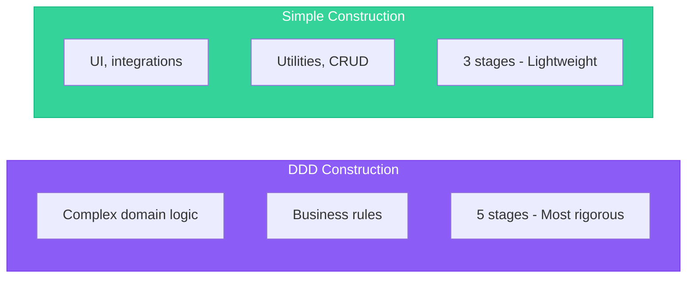

## Overview

The AI-DLC flow in specs.md provides two bolt types, each optimized for different types of work. Choosing the right bolt type ensures you have the appropriate level of rigor and structure for your task.

## Quick Decision Guide

<Steps>
  <Step title="Does it involve complex business logic or domain rules?">
    **Yes** → Use **DDD Construction Bolt**

    **No** → Continue to next question
  </Step>
  <Step title="Is it UI, integration, utility, or straightforward CRUD?">
    **Yes** → Use **Simple Construction Bolt**
  </Step>
</Steps>

---

## DDD Construction Bolt

<Card title="When to Use" icon="bullseye">
  Complex domain logic requiring careful modeling and design decisions.
</Card>

### Best For

- Core business logic with complex rules
- Domain models with aggregates, entities, and value objects
- Services that encode business knowledge
- Features where incorrect logic has significant consequences
- Bounded contexts with rich domain models

### Stages

| Stage | Purpose | Output |
|-------|---------|--------|
| **1. Domain Model** | Model business logic using DDD principles | Domain model document |
| **2. Technical Design** | Apply patterns, define interfaces | Technical design document |
| **3. ADR Analysis** | Document significant decisions | Architecture Decision Record |
| **4. Code** | Generate production code | Implementation |
| **5. Test** | Verify correctness | Test suite |

### Example Use Cases

<AccordionGroup>
  <Accordion title="E-commerce Order Processing">
    Orders involve complex state transitions, pricing rules, inventory checks, and payment processing. DDD helps model these business rules explicitly.
  </Accordion>
  <Accordion title="Financial Calculations">
    Interest calculations, fee structures, and compliance rules require careful domain modeling to ensure correctness.
  </Accordion>
  <Accordion title="Booking Systems">
    Availability rules, conflict detection, and reservation logic benefit from explicit domain modeling.
  </Accordion>
  <Accordion title="Workflow Engines">
    State machines, transition rules, and approval chains require careful design.
  </Accordion>
</AccordionGroup>

---

## Simple Construction Bolt

<Card title="When to Use" icon="feather">
  Straightforward implementations that don't require extensive domain modeling.
</Card>

### Best For

- Frontend pages and components
- Simple CRUD endpoints
- External API integrations
- Utilities and helper modules
- CLI commands and scripts
- Configuration and setup code

### Stages

| Stage | Purpose | Output |
|-------|---------|--------|
| **1. Spec** | Define what to build | Specification document |
| **2. Implement** | Write the code | Implementation |
| **3. Test** | Verify the implementation | Test suite |

### Example Use Cases

<AccordionGroup>
  <Accordion title="User Profile Page">
    A React component displaying user information with edit capabilities. Clear requirements, no complex business logic.
  </Accordion>
  <Accordion title="REST API Integration">
    Connecting to a third-party API with well-documented endpoints. Focus on correct integration, not domain modeling.
  </Accordion>
  <Accordion title="Admin Dashboard">
    Data display and basic filtering. CRUD operations with straightforward UI.
  </Accordion>
  <Accordion title="CLI Tool">
    A command-line utility for common operations. Clear inputs and outputs.
  </Accordion>
</AccordionGroup>

---

## Comparison Table

| Aspect | DDD Construction | Simple Construction |
|--------|------------------|---------------------|
| **Stages** | 5 | 3 |
| **Duration** | Hours to days | Hours |
| **Documentation** | Extensive | Light |
| **Design Rigor** | High | Low |
| **Output** | Production code + artifacts | Production code |
| **Human Reviews** | 5 gate reviews | 3 gate reviews |

## Common Mistakes

<Warning>
  Choosing the wrong bolt type leads to either over-engineering simple tasks or under-designing complex ones.
</Warning>

### Over-Engineering (DDD for Simple Tasks)

**Symptom**: Using DDD Construction for a simple settings page.

**Problem**: Excessive ceremony for straightforward work. Domain modeling for CRUD operations wastes time without adding value.

**Solution**: Use Simple Construction for UI, utilities, and integrations.

### Under-Engineering (Simple for Complex Tasks)

**Symptom**: Using Simple Construction for complex pricing logic.

**Problem**: Skipping domain modeling leads to implicit business rules scattered in code. Bugs emerge as edge cases are missed.

**Solution**: Use DDD Construction when business logic is non-trivial.

## Next Steps

<CardGroup cols={2}>
  <Card
    title="Bolts Overview"
    icon="arrow-right"
    href="/core-concepts/bolts"
  >
    Core concepts and bolt mechanics
  </Card>
  <Card
    title="Construction Agent"
    icon="hammer"
    href="/agents/construction-agent"
  >
    Learn how the agent executes bolts
  </Card>
</CardGroup>
