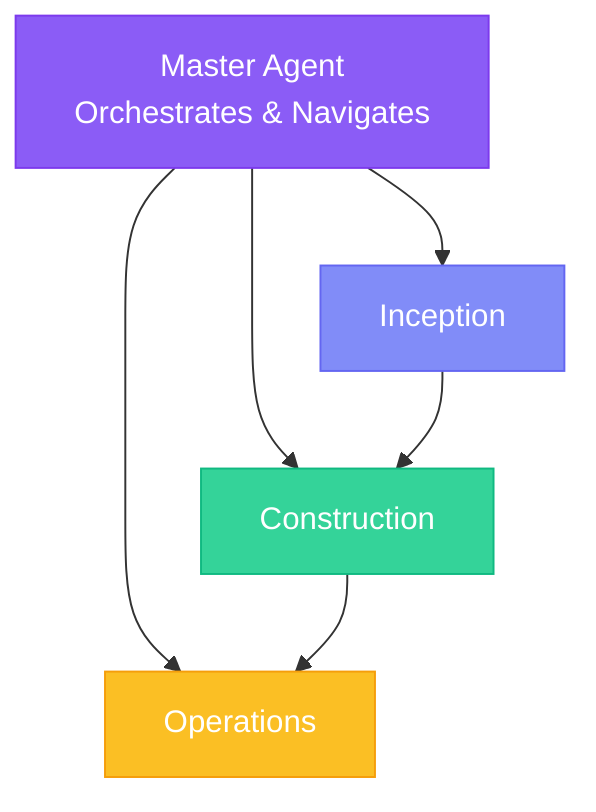

## Overview

AI-DLC organizes development into three distinct phases, each with specialized agents and clear outputs.

## Phase 1: Inception

<Card title="Inception Agent" icon="lightbulb">
  Captures intents, elaborates requirements, and decomposes work into manageable units.
</Card>

### Purpose

Transform high-level goals into well-defined, implementable work items.

### Activities

<Steps>
  <Step title="Intent Capture">
    Gather the high-level goal: "User authentication system"
  </Step>
  <Step title="Requirement Elaboration">
    AI asks clarifying questions, generates user stories and NFRs
  </Step>
  <Step title="System Context">
    Define boundaries, interfaces, and constraints
  </Step>
  <Step title="Unit Decomposition">
    Break intent into loosely-coupled, independently developable units
  </Step>
  <Step title="Bolt Planning">
    Plan the bolts needed to implement each story
  </Step>
</Steps>

### Key Outputs

| Artifact | Description |
|----------|-------------|
| `requirements.md` | User stories, acceptance criteria, NFRs |
| `system-context.md` | Boundaries, interfaces, constraints |
| `units.md` | Unit definitions with dependencies |
| Bolt Plans | Ordered list of bolts per unit |

---

## Phase 2: Construction

<Card title="Construction Agent" icon="hammer">
  Executes bolts through validated stages, producing tested, production-ready code.
</Card>

### Purpose

Transform specifications into working, tested code through disciplined stages.

### Bolt Stages

Each bolt progresses through validated stages:

<AccordionGroup>
  <Accordion title="1. Domain Model">
    Model the business logic using DDD principles:
    - Identify aggregates, entities, value objects
    - Define domain events and commands
    - Establish ubiquitous language
  </Accordion>
  <Accordion title="2. Technical Design">
    Apply patterns and make architecture decisions:
    - Choose implementation patterns
    - Define interfaces and contracts
    - Plan data structures
  </Accordion>
  <Accordion title="3. ADR Analysis (Optional)">
    Document significant architectural decisions:
    - Context and problem statement
    - Options considered
    - Decision and rationale
    - Consequences
  </Accordion>
  <Accordion title="4. Implement">
    Generate production code:
    - Follow coding standards
    - Apply design patterns
    - Write clean, maintainable code
  </Accordion>
  <Accordion title="5. Test">
    Verify correctness:
    - Unit tests for domain logic
    - Integration tests for interfaces
    - Acceptance tests for stories
  </Accordion>
</AccordionGroup>

### Stage Gates

<Warning>
  Human validation happens at each stage gate. The AI proposes, the human approves or requests changes. This prevents errors from cascading downstream.
</Warning>

### Bolt Types

| Type | Best For | Stages |
|------|----------|--------|
| **DDD Construction** | Complex domain logic, business rules | Model → Design → ADR → Code → Test |
| **Simple Construction** | UI, integrations, utilities | Spec → Implement → Test |

---

## Phase 3: Operations

<Card title="Operations Agent" icon="server">
  Deploys, verifies, and monitors the system in production.
</Card>

### Purpose

Take constructed features to production and ensure they run reliably.

### Activities

<Steps>
  <Step title="Build">
    Compile, bundle, and prepare deployment artifacts
  </Step>
  <Step title="Deploy">
    Deploy to target environment (staging, production)
  </Step>
  <Step title="Verify">
    Run smoke tests, health checks, and validation
  </Step>
  <Step title="Monitor">
    Set up logging, metrics, and alerting
  </Step>
</Steps>

### Key Outputs

| Artifact | Description |
|----------|-------------|
| Deployment Units | Containerized or packaged applications |
| Runbooks | Operational procedures |
| Monitoring Config | Dashboards and alerts |

---

## Phase Transitions

### Inception → Construction

When moving from Inception to Construction:

1. All units are defined with clear boundaries
2. Stories have acceptance criteria
3. Bolt plans are approved
4. Dependencies are mapped

### Construction → Operations

When moving from Construction to Operations:

1. All bolts are completed and validated
2. Tests are passing
3. Code review is complete
4. Documentation is updated

## Master Agent Role

The Master Agent orchestrates across phases:

- **Routing**: Directs to the appropriate agent
- **Context**: Maintains awareness of project state
- **Guidance**: Helps navigate the methodology
- **Standards**: Enforces project conventions
