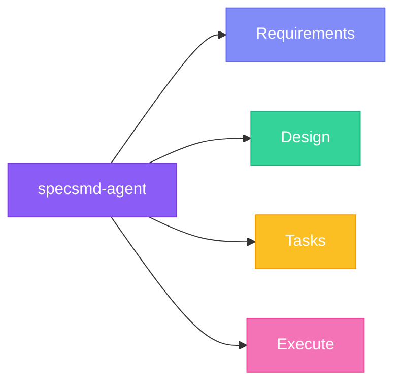

## Overview

Simple Flow uses a single agent (`/specsmd-agent`) that guides you through all three phases: Requirements, Design, and Tasks.



## Invoking the Agent

<Warning>
  **These are NOT command-line commands.** These are prompts you type in your AI coding tool's chat interface.
</Warning>

<Tabs>
  <Tab title="Claude Code">
    ```
    /specsmd-agent
    ```
  </Tab>
  <Tab title="Cursor">
    ```
    /specsmd-agent
    ```
    Or use the `@` prefix:
    ```
    @specsmd-agent
    ```
  </Tab>
  <Tab title="GitHub Copilot">
    ```
    @specsmd-agent
    ```
  </Tab>
</Tabs>

## Agent Capabilities

The Simple Flow agent handles:

<CardGroup cols={2}>
  <Card title="Spec Creation" icon="file-plus">
    Generate requirements, design, and task documents from a feature idea
  </Card>
  <Card title="Phase Navigation" icon="arrows-left-right">
    Move through Requirements → Design → Tasks with explicit approval gates
  </Card>
  <Card title="Task Execution" icon="play">
    Execute implementation tasks one at a time with review
  </Card>
  <Card title="Context Loading" icon="folder-open">
    Resume work on existing specs by reading saved documents
  </Card>
</CardGroup>

## Commands

| Command | Description | Example |
|---------|-------------|---------|
| Create new spec | Start a new feature spec | `/specsmd-agent Create a todo app` |
| Continue work | Resume existing spec | `/specsmd-agent` |
| Resume specific | Work on named spec | `/specsmd-agent --spec="todo-app"` |
| Next task | Ask what to do next | `/specsmd-agent What's the next task?` |
| Execute task | Run specific task | `/specsmd-agent Execute task 2.1` |

## Workflow

### 1. Create a Spec

```
/specsmd-agent Create a user dashboard with analytics
```

The agent:
1. Derives a feature name (`user-dashboard`)
2. Generates `requirements.md`
3. Waits for approval

### 2. Approve or Revise

**To approve:** Say "yes", "approved", or "looks good"

**To revise:** Provide specific feedback like "Add a requirement for export functionality"

### 3. Progress Through Phases

After approving requirements:
- Agent generates `design.md`
- Wait for approval
- Agent generates `tasks.md`
- Wait for approval

### 4. Execute Tasks

```
/specsmd-agent What's the next task?
```

The agent executes one task, then waits for review before continuing.

## Agent Session Lifecycle

<Steps>
  <Step title="Context Loading">
    Agent reads existing spec files from `specs/{feature-name}/`
  </Step>
  <Step title="Phase Detection">
    Agent determines current phase based on which files exist and their status
  </Step>
  <Step title="Generation or Execution">
    Agent generates the next document or executes the next task
  </Step>
  <Step title="Approval Gate">
    Agent waits for explicit approval before proceeding
  </Step>
</Steps>

<Warning>
  The agent is stateless. It reads spec files at startup. Ensure documents are saved after each step.
</Warning>

## Best Practices

<AccordionGroup>
  <Accordion title="Be specific with feature ideas">
    **Good**: "User auth with email/password and session management"

    **Too vague**: "Login feature"

    The more specific you are, the better the generated specs.
  </Accordion>
  <Accordion title="Review each phase carefully">
    Don't rush through approvals. The design phase influences task generation, and tasks influence implementation quality.
  </Accordion>
  <Accordion title="One task at a time (default)">
    The agent pauses after each task for review. If you're confident, say "continue until done" or "go yolo".
  </Accordion>
  <Accordion title="Use checkpoints">
    Checkpoint tasks run the test suite. Don't skip them—they catch issues early.
  </Accordion>
</AccordionGroup>

## Comparison with Other Flows

| Aspect | Simple (1 agent) | FIRE (3 agents) | AI-DLC (4 agents) |
|--------|------------------|-----------------|-------------------|
| **Complexity** | Single agent handles all | Specialized agents | Highly specialized |
| **Phases** | Req → Design → Tasks | Plan → Execute | Inception → Construction → Operations |
| **Overhead** | Minimal | Adaptive | Comprehensive |
| **Best for** | Quick specs, prototypes | Production work | Complex domains |
