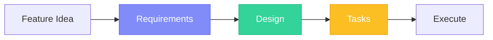
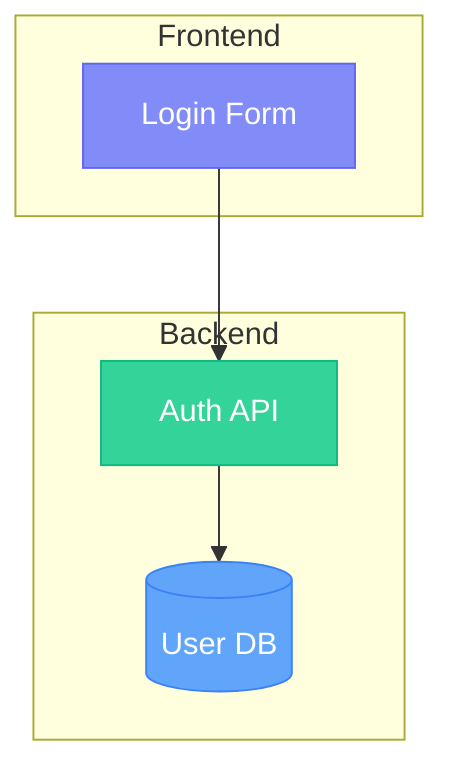

## Overview

Simple Flow guides you through three sequential phases, each producing a markdown document:



Each phase requires explicit approval before proceeding to the next.

---

## Phase 1: Requirements

Define **what** to build with user stories and acceptance criteria.

### Output

`specs/{feature}/requirements.md`

### Contents

- **Introduction** - 2-3 sentence feature summary
- **Glossary** - Domain terms used consistently throughout
- **Requirements** - User stories with EARS acceptance criteria

### EARS Format

Requirements use EARS (Easy Approach to Requirements Syntax):

| Pattern | Format | Example |
|---------|--------|---------|
| **Event-driven** | WHEN [trigger], THE [system] SHALL [response] | WHEN user submits login, THE Auth_System SHALL validate credentials |
| **State-driven** | WHILE [condition], THE [system] SHALL [response] | WHILE session active, THE Auth_System SHALL refresh tokens |
| **Unwanted** | IF [condition], THEN THE [system] SHALL [response] | IF password invalid, THEN THE Auth_System SHALL display error |
| **Optional** | WHERE [option], THE [system] SHALL [response] | WHERE MFA enabled, THE Auth_System SHALL require second factor |

### Example

```markdown
## Requirements

### Requirement 1

**User Story:** As a user, I want to log in with my email and password,
so that I can access my account.

#### Acceptance Criteria

1. WHEN user submits valid credentials, THE Auth_System SHALL create a session
2. IF password is invalid, THEN THE Auth_System SHALL display error message
3. WHILE session is active, THE Auth_System SHALL maintain authentication state
```

### Approval Prompt

> "Do the requirements look good? If so, we can move on to the design."

---

## Phase 2: Design

Define **how** to build it with technical architecture.

### Output

`specs/{feature}/design.md`

### Contents

- **Overview** - Solution approach and key decisions
- **Architecture** - Mermaid diagrams showing system structure
- **Components** - Interfaces and responsibilities
- **Data Models** - TypeScript interfaces with validation rules
- **Error Handling** - Error types and recovery strategies
- **Testing Strategy** - Test categories and coverage

### Mermaid Diagrams

All visual diagrams use Mermaid syntax:



### Example Data Model

```typescript
interface User {
  id: string;           // UUID, required
  email: string;        // Valid email format
  passwordHash: string; // Bcrypt hash
  createdAt: Date;
  lastLogin?: Date;
}
```

### Approval Prompt

> "Does the design look good? If so, we can move on to the implementation plan."

---

## Phase 3: Tasks

Generate a **step-by-step** implementation plan.

### Output

`specs/{feature}/tasks.md`

### Contents

- **Numbered checkbox list** - Incremental coding steps
- **Requirement references** - Traceability to requirements
- **Checkpoint tasks** - Verification points (run tests)

### Task Format

```markdown
## Tasks

- [ ] 1. Set up authentication module structure
  _Requirements: 1.1_

- [ ] 2. Implement user data model
  - [ ] 2.1 Create User interface
  - [ ] 2.2 Add validation rules
  - [ ] 2.3 Write unit tests
  _Requirements: 1.2, 1.3_

- [ ] 3. Checkpoint - Verify all tests pass

- [ ] 4. Implement login endpoint
  _Requirements: 1.1, 1.4_
```

### Task Rules

| Rule | Description |
|------|-------------|
| **Coding tasks only** | No deployment, documentation, or manual testing |
| **Incremental** | Each task builds on previous |
| **Checkpoints** | Run tests every 2-3 tasks |
| **Traceability** | Reference requirements with `_Requirements: X.Y_` |
| **Max 2 levels** | Top-level (1, 2, 3) and sub-tasks (2.1, 2.2) |

### Approval Prompt

> "Do the tasks look good?"

---

## Phase Transitions

### Forward Flow

```
Requirements ──approved──> Design ──approved──> Tasks ──approved──> Execute
```

### Backward Flow (Phase Regression)

If gaps are found, the agent suggests returning to a previous phase:

| Current | Trigger | Action |
|---------|---------|--------|
| Design | Requirement ambiguous | "Should we update requirements?" |
| Tasks | Design gap found | "Should we update design?" |
| Execute | Task blocked | "Should we add a task?" |

---

## Execution

After all three documents are approved, execute tasks one at a time:

```
/specsmd-agent What's the next task?
```

Or specify a task:

```
/specsmd-agent Execute task 2.1
```

The agent:
1. Reads all three spec files
2. Executes the task
3. Marks it complete `[x]`
4. Recommends the next task
5. **Stops and waits for review**

---

## Summary

| Phase | Question | Output | Approval |
|-------|----------|--------|----------|
| Requirements | What to build? | `requirements.md` | "looks good" |
| Design | How to build? | `design.md` | "approved" |
| Tasks | Step by step? | `tasks.md` | "yes" |
| Execute | Build it | Code + `[x]` checkmarks | Per task |
