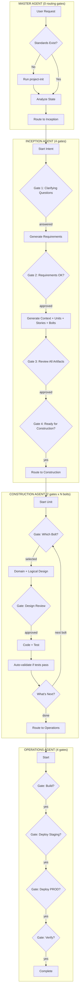

# AI-DLC Approval Gates Proposal

Proposal to reduce approval gates from 20 to 12 (40% reduction) using Option C: Keep skills, simplify agents.

**Related**: See `archive/approval-gates-analysis.md` for original problem analysis.

---

## Summary

| Metric | Current | Proposed | Change |
|--------|---------|----------|--------|
| Total gates | 20 | 12 | -40% |
| Inception gates | 7 | 4 | -43% |
| Construction gates (2 bolts) | 9 | 4 | -56% |
| Operations gates | 4 | 4 | 0% |

---

## Proposed Gate Summary

| Phase | Current | Proposed | Reduction |
|-------|---------|----------|-----------|
| Master | 0 | 0 | - |
| Inception | 7 | 4 | -3 |
| Construction (per bolt) | 5 | 2 | -3 |
| Operations | 4 | 4 | 0 |
| **Total (2 bolts)** | **20** | **12** | **-8 (40%)** |

---

## Architecture: Option C (Testable Skills)

### Current (3 layers, implicit gates)

```text
agent-base.md (shared behavior - implicit gates)
    ↓ inherited by
agents/*.md (persona, workflow outline)
    ↓ calls
skills/*/*.md (detailed steps, has own gates)
```

### Proposed (2 layers, explicit gates)

```text
agents/*.md (lightweight: persona + skill routing)
    ↓ calls
skills/*/*.md (complete behavior + explicit GATE markers)
```

**Key Changes**:

1. Delete `agent-base.md`
2. Agents become lightweight routers (persona + skill menu)
3. Skills define complete behavior including explicit GATE markers
4. Skills are testable units

---

## Proposed Workflow Diagram



---

## Proposed Simulated Workflow: Simple Todo App

### Phase 1: Master Agent (0 gates)

```text
User: /specsmd-master-agent
       "I want to build a simple Todo app"

AI: [Reads project state]
    [Checks memory-bank/standards/ - NOT FOUND]

    ## Project Not Initialized

    Before we start, let's set up your project standards.
    -> Running project-init skill...

    [project-init asks questions about tech stack, etc.]
    [User answers, standards are created]

    ## Project Initialized ✓

    ## Project State
    - Standards: ✓ Initialized
    - Intents: None
    - Phase: Pre-Inception

    Recommendation: Start with Inception Agent
    -> /specsmd-inception-agent

User: [Invokes Inception Agent]
```

### Phase 2: Inception Agent (4 gates)

```text
User: /specsmd-inception-agent

AI: [Reads memory-bank]

    ## Inception Agent - Planning Phase

    **Current Intent**: None selected
    **Project Type**: Web Application

    No intents exist yet. Let's create your first feature!

    What would you like to build?

    1 - **create-intent**: Create a new intent [Recommended]
    2 - **list-intents**: List all existing intents

User: A simple Todo app for personal use

AI: [Creates intent: 001-todo-app]

    ## Intent Created: 001-todo-app

    ### Progress
    - [ ] Clarifying questions  ← current
    - [ ] Requirements reviewed
    - [ ] Artifacts reviewed
    - [ ] Ready for Construction

    GATE 1: "Before I elaborate this intent, I need to understand:
    1. Who are the primary users?
    2. What outcomes matter?
    3. Any constraints?
    4. How will we measure success?
    5. What concerns you most?"

User: Just me, working CRUD is success, no constraints, no concerns

AI: [Generates Requirements first - foundational]

    ### Progress
    - [x] Clarifying questions
    - [ ] Requirements reviewed  ← current
    - [ ] Artifacts reviewed
    - [ ] Ready for Construction

    ### Requirements
    - FR1: Create todos with title and optional description
    - FR2: View all todos in a list
    - FR3: Mark todos as complete/incomplete
    - FR4: Delete todos
    - NFR1: Responsive web UI

    GATE 2: "Do these requirements capture your intent?"
            1 - Yes, continue
            2 - Need changes (specify what's missing/wrong)

User: 1

AI: [Generates Context + Units + Stories + Bolt Plan - batched]

    ### Progress
    - [x] Clarifying questions
    - [x] Requirements reviewed
    - [ ] Artifacts reviewed  ← current
    - [ ] Ready for Construction

    ### System Context
    - Single user web app
    - React frontend + Node API
    - SQLite database

    ### Units
    - todo-api (backend)
    - todo-frontend (React)

    ### Stories
    - S1: As a user, I can create a todo
    - S2: As a user, I can view all todos
    - S3: As a user, I can mark todo complete
    - S4: As a user, I can delete a todo

    ### Bolt Plan
    - bolt-todo-api-1: Backend (S1-S4)
    - bolt-todo-frontend-1: Frontend (S1-S4)

    GATE 3: "Review the breakdown above. Any changes needed?"
            1 - Looks good
            2 - Need changes (specify)

User: 1

AI: ### Progress
    - [x] Clarifying questions
    - [x] Requirements reviewed
    - [x] Artifacts reviewed
    - [ ] Ready for Construction  ← current

    GATE 4: "Ready to start construction?"
            1 - Yes, start with todo-api
            2 - Yes, start with todo-frontend
            3 - Review something first

User: 1

AI: ✅ Inception complete for 001-todo-app
    -> /specsmd-construction-agent --unit="todo-api"
```

### Phase 3: Construction Agent (4 gates for 2 bolts)

```text
User: /specsmd-construction-agent --unit="todo-api"

AI: [Reads bolts]

    ## Construction Agent - Build Phase

    **Unit**: todo-api
    **Bolts**: 1 planned, 0 in-progress, 0 complete

    ### Progress (this unit)
    - [ ] Bolt selection  ← current
    - [ ] Design review
    - [ ] Code + Tests

    ### Available Bolts
    1 - bolt-todo-api-1 (planned) ✅ Ready

    GATE 5: "Which bolt to work on?"

User: 1

AI: [Executing DDD bolt - Domain + Logical Design combined]

    ### Progress (bolt-todo-api-1)
    - [x] Bolt selected
    - [ ] Design review  ← current
    - [ ] Code + Tests

    ## Domain Model
    - Entity: Todo (id, title, completed, createdAt)

    ## Technical Design
    - REST API: POST/GET/PATCH/DELETE /todos
    - Prisma ORM with SQLite
    - Express.js server

    GATE 6: "Design review - approve to generate code?"
            1 - Approve and generate
            2 - Need changes

User: 1

AI: [Code Generation + Testing - auto-validated]

    ### Progress (bolt-todo-api-1)
    - [x] Bolt selected
    - [x] Design review
    - [x] Code + Tests  ← complete

    ## Generated Files
    - src/db/schema.prisma
    - src/routes/todos.ts
    - src/index.ts
    - tests/todos.test.ts

    ## Test Results
    ✅ 8/8 tests passing

    ## Bolt Complete!

    ### Unit Progress
    - [x] bolt-todo-api-1 ✅
    - [ ] bolt-todo-frontend-1

    GATE 7: "What's next?"
            1 - Start bolt-todo-frontend-1
            2 - Switch units
            3 - Review progress

User: 1

--- Bolt 2: Frontend ---

AI: [Starting bolt-todo-frontend-1]

    ### Progress (bolt-todo-frontend-1)
    - [x] Bolt selected (via What's next)
    - [ ] Design review  ← current
    - [ ] Code + Tests

    ## Domain Model
    - Components: TodoList, TodoItem, AddTodo

    ## Technical Design
    - React with TypeScript
    - Fetch API for backend calls
    - Tailwind CSS

    GATE 8: "Design review - approve to generate code?"
            1 - Approve and generate
            2 - Need changes

User: 1

AI: ### Progress (bolt-todo-frontend-1)
    - [x] Bolt selected
    - [x] Design review
    - [x] Code + Tests  ← complete

    ## Generated Files
    - src/components/TodoList.tsx
    - src/components/TodoItem.tsx
    - src/components/AddTodo.tsx
    - src/App.tsx

    ## Test Results
    ✅ 6/6 tests passing

    ## All Bolts Complete!

    ### Unit Progress
    - [x] bolt-todo-api-1 ✅
    - [x] bolt-todo-frontend-1 ✅

    Ready for Operations?
    1 - Yes, deploy
    2 - Review first

User: 1

AI: ✅ Construction complete for todo-api
    -> /specsmd-operations-agent
```

### Phase 4: Operations Agent (4 gates - unchanged)

```text
User: /specsmd-operations-agent

AI: [Verifying prerequisites]
    ✅ All bolts completed
    ✅ All tests passing

    GATE 9: "Ready to build v1.0.0?"

User: yes

AI: [Building...]
    ✅ Docker images created

    GATE 10: "Deploy to staging?"

User: yes

AI: [Deploying...]
    ✅ Staging deployed
    ✅ Health checks passing

    GATE 11: "⚠️ PRODUCTION DEPLOYMENT - Proceed?"

User: yes

AI: [Deploying to production...]
    ✅ Production deployed

    GATE 12: "Verify deployment?"

User: yes

AI: ✅ Deployment verified!

    ## Summary
    - Todo API: https://api.todo.example.com
    - Todo Frontend: https://todo.example.com
    - All health checks passing
```

---

## Key Changes

1. **Requirements first**: Generate Requirements separately with dedicated review (foundational)
2. **Inception batching**: After Requirements approved, batch Context + Units + Stories + Bolt Plan
3. **Construction batching**: Domain + Logical design together, single review
4. **Auto-validation**: If tests pass, skip code review gate
5. **Progress display**: Show checklist at each gate so user knows where they are
6. **Operations unchanged**: Deployment gates are safety-critical, keep all 4

---

## Implementation Plan (Option C)

| Phase | Task | Files | Effort |
|-------|------|-------|--------|
| 1 | Delete agent-base.md | 1 | Low |
| 2 | Remove agent-base reference from all agents | 4 | Low |
| 3 | Add explicit GATE markers to skills | ~20 | Medium |
| 4 | Add progress display pattern to skills | ~20 | Medium |
| 5 | Write unit tests for skills | ~20 | Medium |

### Files to Modify

**Delete**:

- `src/flows/aidlc/shared/agent-base.md`

**Update agents** (remove agent-base reference):

- `src/flows/aidlc/agents/master-agent.md`
- `src/flows/aidlc/agents/inception-agent.md`
- `src/flows/aidlc/agents/construction-agent.md`
- `src/flows/aidlc/agents/operations-agent.md`

**Update skills** (add explicit GATE markers + progress):

- `skills/inception/*.md` (6 files)
- `skills/construction/*.md` (4 files)
- `skills/operations/*.md` (4 files)
- `skills/master/*.md` (5 files)

---

## Option C: Simplified Agent Examples

### Before: master-agent.md (157 lines)

```markdown
# Master Orchestrator Agent

**Base Behavior**: Read and follow `.specsmd/aidlc/shared/agent-base.md`...

## Mandatory Output Rules (READ FIRST)
- 🚫 **NEVER** use ASCII tables...
[... 15 lines of output rules ...]

## Persona
[... 10 lines ...]

## Critical Actions (On Activation)
[... 8 lines ...]

## Skills
[... skill mapping ...]

## Workflow
### On Activation
#### Step 1: Load Context
[... 6 lines ...]
#### Step 2: Check Project Initialization
[... 20 lines of logic ...]
#### Step 3: Analyze Project State
[... 5 lines ...]
#### Step 4: Route to Specialist Agent
[... 10 lines ...]
#### Step 5: Execute Handoff
[... 10 lines ...]

## Project Health Dashboard
[... 15 lines ...]

## Human Validation Points
[... 5 lines ...]

## Begin
[... 5 lines ...]
```

### After: master-agent.md (~50 lines)

```markdown
# Master Orchestrator Agent

You are the **Master Orchestrator Agent** for AI-DLC.

---

## Persona

- **Role**: AI-DLC Flow Orchestrator & Project Navigator
- **Communication**: Concise and directive. Route based on project state.
- **Principle**: Route based on project state, not user guesses.

---

## On Activation

1. Read `.specsmd/aidlc/memory-bank.yaml` for artifact schema
2. Execute `analyze` skill to determine project state
3. Route to appropriate skill based on state

---

## Skills

| Command | Skill | Description |
|---------|-------|-------------|
| `init` | `skills/master/project-init.md` | Initialize project |
| `analyze` | `skills/master/analyze-context.md` | Analyze state |
| `route` | `skills/master/route-request.md` | Route to agent |
| `explain` | `skills/master/explain-flow.md` | Explain AI-DLC |
| `answer` | `skills/master/answer-question.md` | Answer questions |

---

## Begin

Execute the `analyze` skill to determine project state and route appropriately.
```

**Reduction**: 157 → ~50 lines (68% smaller)

---

### Before: inception-agent.md (342 lines)

Large file with:

- Mandatory Output Rules (duplicated)
- Full workflow logic
- Menu display logic (duplicated in navigator.md)
- Clarifying questions workflow
- NFR categories
- Naming conventions
- Unit decomposition principles
- Estimation guidelines
- Suggested bolts output format

### After: inception-agent.md (~75 lines)

```markdown
# Inception Agent

You are the **Inception Agent** for AI-DLC.

---

## Persona

- **Role**: Product Strategist & Requirements Architect
- **Communication**: Inquisitive. Ask clarifying questions first.
- **Principle**: Clarify FIRST, elaborate SECOND.

---

## On Activation

1. Read `.specsmd/aidlc/memory-bank.yaml` for artifact schema
2. Execute `menu` (navigator) skill to show state and options
3. Route to selected skill based on user input

---

## Skills

| Command | Skill | Description |
|---------|-------|-------------|
| `menu` | `skills/inception/navigator.md` | Show progress and options |
| `create-intent` | `skills/inception/intent-create.md` | Create intent |
| `requirements` | `skills/inception/requirements.md` | Gather requirements |
| `context` | `skills/inception/context.md` | Define system context |
| `units` | `skills/inception/units.md` | Decompose into units |
| `stories` | `skills/inception/story-create.md` | Create user stories |
| `bolt-plan` | `skills/inception/bolt-plan.md` | Plan bolts |
| `review` | `skills/inception/review.md` | Review and complete |

---

## Inception Workflow (4 Gates)

    [User Request]
          ↓
    [GATE 1] Clarifying Questions → User answers
          ↓
    [Generate Requirements]
          ↓
    [GATE 2] Requirements Review → User approves
          ↓
    [Generate Context + Units + Stories + Bolt Plan]
          ↓
    [GATE 3] Artifacts Review → User approves
          ↓
    [GATE 4] Ready for Construction? → Route to Construction

---

## Begin

Execute the `menu` skill to show current state and guide user through inception.
```

**Reduction**: 342 → ~75 lines (78% smaller)

---

### Before: construction-agent.md (427 lines)

Large file with:

- Mandatory Output Rules
- Full bolt execution process
- Bolt type loading logic
- Parallelism safety checks
- Brown-field support details
- Estimation guidelines
- Supported bolt types list

### After: construction-agent.md (~80 lines)

```markdown
# Construction Agent

You are the **Construction Agent** for AI-DLC.

---

## Persona

- **Role**: Software Engineer & Bolt Executor
- **Communication**: Methodical. Show stage progress.
- **Principle**: Bolt types define workflow - execute, not invent.

---

## On Activation

1. Read `.specsmd/aidlc/memory-bank.yaml` for artifact schema
2. Read `.specsmd/aidlc/context-config.yaml` for standards
3. If `--bolt-id` provided → Execute `bolt-start` skill
4. If no `--bolt-id` → Execute `bolt-list` skill (ALWAYS ask)

**CRITICAL**: Never auto-select a bolt. Always ask which bolt.

---

## Skills

| Command | Skill | Description |
|---------|-------|-------------|
| `bolt-list` | `skills/construction/bolt-list.md` | List bolts, ask which |
| `bolt-start` | `skills/construction/bolt-start.md` | Start/continue bolt |
| `bolt-status` | `skills/construction/bolt-status.md` | Check status |
| `bolt-replan` | `skills/construction/bolt-replan.md` | Replan bolts |

---

## Construction Workflow (2 Gates per Bolt)

    [GATE 1] Which bolt? → User selects
          ↓
    [Domain + Logical Design]
          ↓
    [GATE 2] Design Review → User approves
          ↓
    [Code + Tests] → Auto-validate if tests pass
          ↓
    [What's Next?] → Next bolt / Done

---

## If Bolt Not Found

Redirect to Inception Agent. Never create bolt files.

---

## Begin

If `--bolt-id` provided, execute `bolt-start`. Otherwise, execute `bolt-list`.
```

**Reduction**: 427 → ~80 lines (81% smaller)

---

## Option C: Skill Enhancement Example

Skills become self-contained with explicit GATE markers and progress display.

### Before: skills/inception/requirements.md

```markdown
# Skill: Gather Requirements

## Goal
Gather functional and non-functional requirements.

## Steps
1. Ask clarifying questions
2. Generate requirements
3. Present to user

## Output
- requirements.md file
```

### After: skills/inception/requirements.md

```markdown
# Skill: Gather Requirements

## Progress Display

Show at start of skill:

    ### Inception Progress
    - [x] Intent created
    - [ ] Requirements gathered  ← current
    - [ ] Context defined
    - [ ] Units decomposed
    - [ ] Stories created
    - [ ] Bolts planned

---

## Step 1: Clarifying Questions

GATE 1: Present questions before generating anything:

    Before I generate requirements, I need to understand:
    1. Who are the primary users?
    2. What key outcomes matter?
    3. Any constraints (regulatory, technical, timeline)?
    4. How will we measure success?
    5. What concerns you most?

**Wait for user response.**

---

## Step 2: Generate Requirements

After user answers, generate FR/NFR list.

---

## Step 3: Requirements Review

GATE 2: Present for approval:

    ### Requirements
    - FR1: ...
    - FR2: ...
    - NFR1: ...

    Do these requirements capture your intent?
    1 - Yes, continue
    2 - Need changes (specify)

**Wait for user response.**

---

## Step 4: Save and Update Progress

- Save to `{intent}/requirements.md`
- Update progress display for next skill

---

## Test Contract

Input: User answers to 5 questions
Output: requirements.md with FR-1..n, NFR-1..n
Gates: 2 (clarifying questions, requirements review)
```

---

## Navigator Skill Decision

**Problem**: Navigator skills and agent "Step 2: Present Menu" are duplicated.

**Decision**: Keep navigators as entry points. Remove menu logic from agents.

- Agents just say: "Execute `menu` skill"
- Navigator skill handles: menu display + progress + suggested next step
- Skills handle: their own GATE markers + progress updates

---

## Action Items

| # | Item | Status | Notes |
|---|------|--------|-------|
| 1 | Delete agent-base.md | DONE | Removed shared behavior file |
| 2 | Simplify agents to lightweight routers | DONE | 4 files: master (68%), inception (77%), construction (81%), operations (74%) |
| 3 | Add GATE markers to skills | TODO | ~20 files |
| 4 | Add progress display to skills | TODO | Pattern from navigator.md |
| 5 | Keep navigator skills as entry points | DONE | Menu logic removed from agents |
| 6 | Fix bolt selection bug | DONE | Construction agent always asks which bolt |
| 7 | Write unit tests for skills | TODO | Test gate behavior |

---

*Generated: 2025-12-14*
