# AI-DLC Approval Gates Analysis

Analysis of current human confirmation gates across the AI-DLC agent workflow.

---

## Summary of Current Gates Per Agent

| Agent | Gate Count | Gate Types |
|-------|------------|------------|
| **Master** | 0-1 | Routing recommendation (no approval required) |
| **Inception** | 7+ | Clarifying questions, Requirements, Context, Units, Stories, Bolt Plan, Final review |
| **Construction** | 3-4 per bolt | Bolt selection, Each stage completion, What's next |
| **Operations** | 4 | Build, Deploy staging, Deploy prod, Verify |

> **Note**: Master Agent was simplified - Level 1 Plan generation removed (only needed for brownfield, see intent 006).

---

## Current Workflow: Simple Todo App (20 gates)

### Phase 1: Master Agent (0 gates for greenfield)

```text
User: /specsmd-master-agent
       "I want to build a simple Todo app"

AI: [Reads project state]
    [Checks: No standards? -> redirect to project-init]
    [Checks: No intents? -> recommend Inception]

    ## Project State Analysis
    - Phase: Pre-Inception
    - Intents: None
    - Recommendation: Start with Inception Agent

    Based on your project state, I recommend:
    -> /specsmd-inception-agent

User: [Invokes Inception Agent]
```

### Phase 2: Inception Agent (7 gates)

```text
User: /specsmd-inception-agent

AI: [Reads memory-bank]
    No intents exist. Let's create one.

    GATE 1: "Before I elaborate this intent, I need to understand:
    1. Who are the primary users?
    2. What key business outcomes?
    3. Any constraints (GDPR, tech requirements)?
    4. How will we measure success?
    5. What are you most worried about?"

User: Personal use, just me, no constraints, success = working CRUD

AI: ## Requirements Generated
    GATE 2: "Do these requirements capture your intent? (yes/no)"

User: yes

AI: ## System Context Generated
    GATE 3: "Are these boundaries correct? (yes/no)"

User: yes

AI: ## Units Decomposed
    GATE 4: "Do these units make sense? (yes/no)"

User: yes

AI: ## Stories Created
    GATE 5: "Are these stories complete? (yes/no)"

User: yes

AI: ## Bolt Plan Created
    GATE 6: "Does this execution plan work? (yes/no)"

User: yes

AI: ## Inception Complete
    GATE 7: "Ready to start construction? (yes/no)"

User: yes

AI: -> /specsmd-construction-agent --unit="todo-api"
```

### Phase 3: Construction Agent (5 gates per bolt)

```text
User: /specsmd-construction-agent --unit="todo-api"

AI: GATE 8: "Which bolt would you like to work on?"

User: 1

AI: [Stage 1: Domain Design]
    GATE 9: "Does this domain model look correct?"

User: 1

AI: [Stage 2: Logical Design]
    GATE 10: "Are these architectural decisions correct?"

User: 1

AI: [Stage 3: Code Generation]
    GATE 11: "Does this code implement the design?"

User: 1

AI: [Stage 4: Testing]
    GATE 12: "What's next?"

User: 1

--- Repeat GATES 13-16 for frontend bolt ---
```

### Phase 4: Operations Agent (4 gates)

```text
User: /specsmd-operations-agent

AI: GATE 17: "Ready to build v1.0.0? (yes/no)"

User: yes

AI: GATE 18: "Ready to deploy to staging? (yes/no)"

User: yes

AI: GATE 19: "PRODUCTION DEPLOYMENT. Proceed? (yes/no)"

User: yes

AI: GATE 20: "Verify deployment success? (yes/no)"

User: yes
```

---

## Current Workflow Diagram

```mermaid
flowchart TD
    subgraph Master["MASTER AGENT (0 gates for greenfield)"]
        M1[User Request] --> M2[Analyze Project State]
        M2 --> M3[Recommend Next Agent]
        M3 --> M4[Route to Inception]
    end

    subgraph Inception["INCEPTION AGENT (7 gates)"]
        I1[Start Intent] --> I2{Gate 1: Clarifying Questions}
        I2 -->|answered| I3[Generate Requirements]
        I3 --> I4{Gate 2: Requirements OK?}
        I4 -->|yes| I5[Generate Context]
        I5 --> I6{Gate 3: Context OK?}
        I6 -->|yes| I7[Decompose Units]
        I7 --> I8{Gate 4: Units OK?}
        I8 -->|yes| I9[Create Stories]
        I9 --> I10{Gate 5: Stories OK?}
        I10 -->|yes| I11[Plan Bolts]
        I11 --> I12{Gate 6: Bolt Plan OK?}
        I12 -->|yes| I13{Gate 7: Ready for Construction?}
        I13 -->|yes| I14[Route to Construction]
    end

    subgraph Construction["CONSTRUCTION AGENT (5 gates x N bolts)"]
        C1[Start Unit] --> C2{Gate: Which Bolt?}
        C2 -->|selected| C3[Domain Design]
        C3 --> C4{Gate: Design OK?}
        C4 -->|yes| C5[Logical Design]
        C5 --> C6{Gate: Architecture OK?}
        C6 -->|yes| C7[Code Generation]
        C7 --> C8{Gate: Code OK?}
        C8 -->|yes| C9[Testing]
        C9 --> C10{Gate: What's Next?}
        C10 -->|next bolt| C2
        C10 -->|done| C11[Route to Operations]
    end

    subgraph Operations["OPERATIONS AGENT (4 gates)"]
        O1[Start Deploy] --> O2{Gate: Build?}
        O2 -->|yes| O3[Build Artifact]
        O3 --> O4{Gate: Deploy Staging?}
        O4 -->|yes| O5[Deploy Staging]
        O5 --> O6{Gate: Deploy PROD?}
        O6 -->|yes| O7[Deploy Production]
        O7 --> O8{Gate: Verify?}
        O8 -->|yes| O9[Complete]
    end

    M4 --> I1
    I14 --> C1
    C11 --> O1
```



---

## Real Data: Demo Project Log Analysis

Extracted from `~/.claude/projects/-Users-hancengiz-code-specsmd-workspace-specsmd-demo/`

### User Response Patterns

| Response | Count | Type |
|----------|-------|------|
| `1` | 68 | Menu selection |
| `2` | 20 | Menu selection |
| `yes` | 13 | Confirmation |
| `good` | 10 | Approval |
| `3` | 7 | Menu selection |
| `lgtm` | 3 | Approval |
| `5` | 2 | Menu selection |
| **Total Approvals** | **123** | |
| **Total Messages** | **242** | |

### Key Finding

**51% of user messages were approval/selection responses** (123/242)

The user spent more time typing "1", "2", "yes", "good" than providing actual requirements or making real decisions.

This is strong evidence of **over-gating**.

---

## Agent Invocation Reality

| Agent | Simulated | Actual | Notes |
|-------|-----------|--------|-------|
| **Master** | 1-2x | **14x** | Heavy re-routing |
| **Inception** | 1x | 7x | Including project-init |
| **Construction** | 1-2x | 7x | Multiple bolt sessions |
| **Operations** | 1x | **0x** | Never reached |

### User Responses Per Agent Session

| Agent | Sessions | Avg Responses/Session |
|-------|----------|----------------------|
| Master | 14 | 5.6 |
| Inception | 7 | 8.1 |
| Construction | 7 | 8.7 |

**Construction has the most approvals per session** (8.7) - confirming stage-by-stage gating is excessive.

---

## Problem Areas Identified

### 1. Construction Agent: Bolt Selection Bug

From development notes:
> "construction agent picked up the first bolt instead of asking which one to start"

The agent spec says "ALWAYS ask which bolt to start - NEVER auto-select". This is a **bug**.

### 2. Inception: Too Many Serial Gates

The Inception flow asks 7 separate approvals **one at a time**:

- Requirements -> approval -> Context -> approval -> Units -> approval...

**Problem**: Each artifact validated separately instead of batched.

### 3. Construction: Stage-by-Stage Gates

Every DDD stage (4 stages) asks for approval. For a simple app, this is overkill.

### 4. Root Cause: agent-base.md

```text
agent-base.md (shared)
├── "Validate at Each Step" ← Causes over-gating
├── "NEVER Make Critical Decisions Alone"
├── "Plan Before Execute"
└── "Ask Clarifying Questions FIRST"
```

The "Validate at Each Step" rule causes agents to ask for approval after **every single artifact**.

---

## Current Architecture (3 layers)

```text
agent-base.md (shared behavior - implicit gates)
    ↓ inherited by
agents/*.md (persona, workflow outline)
    ↓ calls
skills/*/*.md (detailed steps, has own gates)
```

**Problem**: Gates defined in 3 places = confusion + double-gating

---

## Total Gate Count (Current)

| Phase | Gates | AI Work Between Gates |
|-------|-------|----------------------|
| Master | 0 | Routing only |
| Inception | 7 | ~1 artifact each |
| Construction (2 bolts) | 9 | ~1 stage each |
| Operations | 4 | ~1 step each |
| **TOTAL** | **20 gates** | |

---

## Changes Already Made (2025-12-14)

1. **Removed Level 1 Plan from Master Agent** (`master-agent.md`)
   - Level 1 Plan only needed for brownfield (intent 006)
   - Greenfield always follows: Inception -> Construction -> Operations

2. **Created intent 006-brownfield-support**
   - Defines when Level 1 Plan IS needed
   - Adds Elevation phase for existing codebases

---

*See `aidlc-approval-gates-proposal.md` for proposed solution.*

*Generated: 2025-12-14*
