# Units: Testing Strategy

## Unit Decomposition

This intent is decomposed into five implementation units covering six testing layers.

**See**: `memory-bank/research/test_strategy/testing-strategy.md` for detailed pyramid, workflows, and CI/CD integration.

---

## 6-Layer Testing Pyramid

```mermaid
graph TB
    subgraph pyramid [" "]
        direction TB
        L6["🔍 Release Validation<br/><i>Human Review + Grok 4.1 Free</i>"]
        L5["🤖 Agent Behavior<br/><i>Promptfoo + OpenRouter Free</i>"]
        L4["🔄 E2E Workflow<br/><i>Custom Test Harness</i>"]
        L3["⚙️ Integration<br/><i>BATS + Node.js</i>"]
        L2["📋 Schema/Contract<br/><i>JSON Schema + markdownlint</i>"]
        L1["🧪 Unit Tests<br/><i>Vitest</i>"]
    end
    L6 --> L5 --> L4 --> L3 --> L2 --> L1
```



| Layer | Speed | Cost | Determinism | Technology |
|-------|-------|------|-------------|------------|
| Unit Tests | ~ms | Free | 100% | Vitest |
| Schema/Contract | ~ms | Free | 100% | JSON Schema, markdownlint |
| Integration | ~sec | Free | 100% | BATS |
| E2E Workflow | ~min | Free | ~95% | Custom harness |
| Agent Behavior | ~min | Free | ~70-85% | Promptfoo + OpenRouter |
| Release Validation | ~hr | Free | ~70-85% + human | Grok 4.1 Fast |

**Total Cost**: $0 using OpenRouter free tier models.

---

## Unit 1: Specification Contract Testing

### Description

Schema validation and contract enforcement for all markdown-based specifications.

### Responsibilities

- Validate `memory-bank.yaml` against JSON Schema
- Enforce required sections in intent artifacts
- Validate unit brief template compliance
- Enforce bolt template structure
- Run markdown linting for structure consistency

### Components

| Component | File | Description |
|-----------|------|-------------|
| Schema Validator | `__tests__/unit/schema-validation/` | JSON Schema validation |
| Intent Validator | `__tests__/unit/schema-validation/intent-schema.test.ts` | Intent structure checks |
| Unit Validator | `__tests__/unit/schema-validation/unit-schema.test.ts` | Unit brief validation |
| Markdown Linter | `.markdownlint.yaml` | Markdown structure rules |

### Dependencies

- JSON Schema library (Ajv)
- markdownlint
- remark-lint

---

## Unit 2: CLI & Installer Testing

### Description

Traditional testing for deterministic CLI commands and installer operations.

### Responsibilities

- Unit test installer components
- Integration test slash commands
- Snapshot test generated files
- Property-based test Memory Bank operations

### Components

| Component | File | Description |
|-----------|------|-------------|
| Installer Tests | `__tests__/unit/installers/` | Unit tests for installers |
| CLI Integration | `__tests__/integration/cli/` | BATS command tests |
| Snapshot Tests | `__tests__/unit/template-generation/` | Generated file snapshots |
| Memory Bank Tests | `__tests__/integration/memory-bank/` | CRUD operation tests |

### Dependencies

- Jest/Vitest
- BATS (Bash Automated Testing System)
- Mock filesystem library

---

## Unit 3: Agent Behavior Evaluation

### Description

Non-deterministic testing for LLM-driven agent outputs using multiple evaluation strategies.

**See**: `memory-bank/research/test_strategy/promptfoo-tutorial.md` for Promptfoo configuration and assertions.

### Responsibilities

- Mock LLM responses for deterministic CI runs
- Evaluate outputs via LLM-as-judge
- Compute semantic similarity against golden examples
- Assert behavioral properties (not exact matches)
- Handle test flakiness from non-determinism

### Components

| Component | File | Description |
|-----------|------|-------------|
| **Promptfoo Config** | `promptfoo.yaml` | Declarative test configuration |
| Mock Responses | `__tests__/fixtures/mock-responses/` | Recorded LLM outputs |
| LLM Judge Rubrics | `__tests__/evaluation/rubrics/` | Evaluation criteria |
| Semantic Similarity | `__tests__/evaluation/` | Embedding comparison |
| Behavioral Assertions | `__tests__/e2e/` | Property-based checks |

### Dependencies

- **Promptfoo** (primary evaluation framework)
- **OpenRouter** (LLM-as-judge provider, free tier)
  - `x-ai/grok-4.1-fast:free` - Coding agents (2M context)
  - `qwen/qwen3-coder:free` - Code-specialized
- vcrpy/responses for mocking

### Evaluation Rubrics

| Rubric | File | Criteria |
|--------|------|----------|
| Intent Quality | `rubrics/intent-quality.yaml` | Completeness, clarity, testability |
| Unit Completeness | `rubrics/unit-completeness.yaml` | Required sections, dependencies |
| Bolt Validity | `rubrics/bolt-validity.yaml` | Stage definitions, acceptance criteria |

---

## Unit 4: Golden Dataset Management

### Description

Curated test cases with known-good outputs for regression testing.

**See**: `memory-bank/research/test_strategy/promptfoo-specsmd-tutorial.md` for detailed golden dataset and fixture guide.

### Responsibilities

- Maintain input/output examples per agent
- Track baseline quality scores
- Detect regressions from baseline
- Version golden datasets with code
- Manage pre-configured memory bank fixtures

### Components

| Component | File | Description |
|-----------|------|-------------|
| Inception Dataset | `__tests__/evaluation/golden-datasets/inception/` | Inception agent examples |
| Construction Dataset | `__tests__/evaluation/golden-datasets/construction/` | Construction agent examples |
| Operations Dataset | `__tests__/evaluation/golden-datasets/operations/` | Operations agent examples |
| Master Dataset | `__tests__/evaluation/golden-datasets/master/` | Routing examples |
| Baselines | `__tests__/evaluation/regression/baselines/` | Historical scores |
| **Test Fixtures** | `__tests__/fixtures/memory-bank-states/` | Pre-configured memory bank states |

### Dataset Structure

```text
golden-datasets/
├── inception/
│   ├── inputs/
│   │   ├── 001-simple-feature.txt
│   │   ├── 002-complex-system.txt
│   │   └── ...
│   └── outputs/
│       ├── 001-simple-feature-intent.md
│       ├── 002-complex-system-intent.md
│       └── ...
├── construction/
│   ├── inputs/
│   └── outputs/
└── ...
```

### Test Fixtures (Memory Bank States)

Pre-configured memory bank states for reproducible testing:

| Fixture | Description | Tests |
|---------|-------------|-------|
| `01-empty-project/` | Fresh project, no specsmd init | Project initialization |
| `02-initialized-project/` | After `specsmd install` | Agent routing, context loading |
| `03-inception-started/` | Intent created, no units | Unit decomposition, requirements |
| `04-inception-complete/` | Full intent with units and stories | Transition to construction |
| `05-construction-in-progress/` | Bolts planned, stage 2 active | Bolt execution, stage advancement |
| `06-construction-complete/` | All bolts completed | Transition to operations |

**Structure**:

```text
__tests__/fixtures/memory-bank-states/
├── 01-empty-project/
│   └── (empty)
├── 02-initialized-project/
│   └── .specsmd/
│       ├── memory-bank.yaml
│       └── context-config.yaml
├── 03-inception-started/
│   └── .specsmd/
│       ├── memory-bank.yaml
│       └── memory-bank/
│           └── intents/
│               └── user-auth/
│                   └── requirements.md
...
```

### Minimum Coverage

| Agent | Minimum Examples | Target Coverage |
|-------|-----------------|-----------------|
| Master Agent | 20 | 100+ |
| Inception Agent | 10 | 50+ |
| Construction Agent | 10 | 50+ |
| Operations Agent | 5 | 25+ |

---

## Unit 5: CI/CD Integration

### Description

Pipeline automation for test execution and quality gate enforcement.

### Responsibilities

- Trigger tests on PR and merge events
- Enforce quality thresholds
- Report results to PRs
- Block releases on failures
- Support human approval gates

### Components

| Component | File | Description |
|-----------|------|-------------|
| PR Workflow | `.github/workflows/pr-tests.yml` | Fast deterministic tests |
| Main Workflow | `.github/workflows/main-tests.yml` | Agent evaluation on merge |
| Nightly Workflow | `.github/workflows/nightly-eval.yml` | Full golden dataset |
| Quality Gates | `.github/workflows/quality-gates.yml` | Threshold enforcement |

### Pipeline Tiers

| Tier | Trigger | Tests | Duration |
|------|---------|-------|----------|
| Tier 1 | Every PR | Schema, CLI, Snapshots | ~2 min |
| Tier 2 | Merge to main | + Quick agent eval | ~5 min |
| Tier 3 | Nightly | Full golden dataset | ~30 min |
| Tier 4 | Release | Full suite + human review | ~1 hour |

### Quality Thresholds

| Metric | Target | Alert |
|--------|--------|-------|
| Schema Validation | 100% | < 100% |
| CLI Test Pass Rate | 100% | < 100% |
| Agent Quality Score | > 0.85 | < 0.80 |
| Semantic Similarity | > 0.90 | < 0.85 |
| Regression from Baseline | 0% | > 5% |

---

## Unit Dependency Graph

```text
┌─────────────────────────────────────────────────────────────┐
│                    CI/CD Integration                        │
│                       (Unit 5)                              │
│                    Orchestrates all                         │
└───────────────────────────┬─────────────────────────────────┘
                            │ triggers
        ┌───────────────────┼───────────────────┐
        │                   │                   │
        ▼                   ▼                   ▼
┌───────────────┐  ┌───────────────┐  ┌───────────────────────┐
│ Specification │  │ CLI/Installer │  │ Agent Behavior        │
│ Contract      │  │ Testing       │  │ Evaluation            │
│ Testing       │  │ (Unit 2)      │  │ (Unit 3)              │
│ (Unit 1)      │  │               │  │                       │
│               │  │ - Unit tests  │  │ - Mock responses      │
│ - Schema      │  │ - Integration │  │ - LLM-as-judge        │
│ - Linting     │  │ - Snapshots   │  │ - Semantic similarity │
└───────────────┘  └───────────────┘  └───────────┬───────────┘
                                                  │ uses
                                                  ▼
                                      ┌───────────────────────┐
                                      │ Golden Dataset        │
                                      │ Management            │
                                      │ (Unit 4)              │
                                      │                       │
                                      │ - Test cases          │
                                      │ - Baselines           │
                                      │ - Regression tracking │
                                      └───────────────────────┘
```

---

## Implementation Order & Status

| # | Unit | Status | Notes |
|---|------|--------|-------|
| 1 | Specification Contract Testing | ✅ Complete | 7 tests, YAML + MD validators |
| 2 | CLI/Installer Testing | ⏳ Pending | Next priority |
| 3 | Golden Dataset Management | ⏳ Pending | Required for Unit 4 |
| 4 | Agent Behavior Evaluation | ⏳ Pending | Depends on golden datasets |
| 5 | CI/CD Integration | 🚧 In Progress | GitHub Action created |

### Completed Work (Unit 1)

- ✅ `src/lib/yaml-validator.ts` - YAML config validation
- ✅ `src/lib/markdown-validator.ts` - Markdown template validation
- ✅ `src/__tests__/schemas/` - 5 YAML schema definitions
- ✅ `src/__tests__/unit/schema-validation/` - 7 passing tests
- ✅ `.markdownlint.yaml` - Markdown linting rules
- ✅ `.github/workflows/test.yml` - CI workflow (pending commit)
