# Testing Strategy for MD-Based Agentic Systems

Research document outlining a comprehensive testing strategy for specsmd, addressing the unique challenges of testing CLI tools combined with markdown-based agentic workflows.

---

## Testing Pyramid for AI Agents

Traditional testing pyramids don't account for LLM non-determinism. specsmd uses an **adapted testing pyramid** designed for AI-native systems:

```mermaid
%%{init: {'theme': 'base', 'themeVariables': { 'fontSize': '14px'}}}%%
graph TB
    subgraph pyramid [" "]
        direction TB
        L6["🔍 Release Validation<br/><i>Human Review + Grok 4.1 Free</i>"]
        L5["🤖 Agent Behavior<br/><i>Promptfoo + OpenRouter Free</i>"]
        L4["🔄 E2E Workflow<br/><i>Custom Test Harness</i>"]
        L3["⚙️ Integration<br/><i>BATS + Node.js</i>"]
        L2["📋 Schema/Contract<br/><i>JSON Schema + markdownlint</i>"]
        L1["🧪 Unit Tests<br/><i>Vitest/Jest</i>"]
    end

    L6 --> L5
    L5 --> L4
    L4 --> L3
    L3 --> L2
    L2 --> L1

    style L6 fill:#ff6b6b,stroke:#333,color:#fff
    style L5 fill:#feca57,stroke:#333,color:#333
    style L4 fill:#48dbfb,stroke:#333,color:#333
    style L3 fill:#1dd1a1,stroke:#333,color:#333
    style L2 fill:#5f27cd,stroke:#333,color:#fff
    style L1 fill:#576574,stroke:#333,color:#fff
```



### Technology Stack by Layer

| Layer | Technology | Why This Tool |
|-------|------------|---------------|
| **Unit Tests** | **Vitest** | Fast, TypeScript-native, Jest-compatible |
| **Schema/Contract** | **JSON Schema (Ajv)** + **markdownlint** | Validates YAML/MD structure without LLM |
| **Integration** | **BATS** (Bash Automated Testing) | Tests CLI commands in real shell |
| **E2E Workflow** | **Custom Node.js harness** | Orchestrates multi-agent flows |
| **Agent Behavior** | **Promptfoo** + **OpenRouter** | Declarative LLM testing, free models |
| **Release Validation** | **Grok 4.1 Fast** + **Human** | High-quality eval + manual approval |

### Characteristics by Layer

As you move UP the pyramid, tests become slower, more expensive, less deterministic, and run less frequently:

| Layer | Speed | Cost | Determinism | Volume |
|-------|-------|------|-------------|--------|
| **Unit Tests** | ~ms | Free | 100% deterministic | 100s of tests |
| **Schema/Contract** | ~ms | Free | 100% deterministic | 10s of tests |
| **Integration** | ~sec | Free | 100% deterministic | 10s of tests |
| **E2E Workflow** | ~min | Free | ~95% deterministic | 5-10 tests |
| **Agent Behavior** | ~min | Free* | ~70-85% deterministic | 50+ tests |
| **Release Validation** | ~hr | Free* | ~70-85% + human | 5-10 tests |

*100% free using OpenRouter free tier models

---

## Layer Summary

| Layer | What It Tests | Tools | Frequency | Cost | Pass Threshold |
|-------|---------------|-------|-----------|------|----------------|
| **Unit** | Installers, utilities, pure functions | Jest/Vitest | Every PR | Free | 100% |
| **Schema/Contract** | Markdown structure, YAML validity | JSON Schema, markdownlint | Every PR | Free | 100% |
| **Integration** | CLI commands, file operations | BATS, filesystem mocks | Every PR | Free | 100% |
| **E2E Workflow** | Full Inception→Construction flow | Custom harness | On main merge | Free | 100% |
| **Agent Behavior** | LLM output quality, rubric scoring | Promptfoo + OpenRouter free | Nightly | Free* | ≥85% |
| **Release Validation** | Gold standard comparison, human review | Promptfoo + Grok 4.1 Free | Weekly/Release | Free* | ≥90% + Human approval |

*100% free using OpenRouter free tier models

---

## Frequency & Triggers

```text
┌─────────────────────────────────────────────────────────────────────────┐
│                          TEST EXECUTION SCHEDULE                        │
├─────────────────────────────────────────────────────────────────────────┤
│                                                                         │
│  EVERY PR / PUSH (~2 min)                                              │
│  ├── Unit Tests                    ✓ Must pass to merge                │
│  ├── Schema/Contract Tests         ✓ Must pass to merge                │
│  └── Integration Tests             ✓ Must pass to merge                │
│                                                                         │
│  ON MERGE TO MAIN (~5 min)                                             │
│  ├── All PR tests                  ✓ Re-run for safety                 │
│  ├── E2E Workflow Tests            ✓ Full flow validation              │
│  └── Quick Agent Eval (5 samples)  ✓ Smoke test with free model        │
│                                                                         │
│  NIGHTLY AT 2 AM (~30 min)                                             │
│  ├── Full Golden Dataset           ✓ 50+ test cases                    │
│  ├── Regression Check              ✓ Compare to baseline               │
│  └── Generate Quality Report       ✓ Track trends                      │
│                                                                         │
│  WEEKLY / PRE-RELEASE (~1 hr)                                          │
│  ├── Comprehensive Evaluation      ✓ 3x runs, averaged                 │
│  ├── Grok 4.1 Fast Validation      ✓ Free high-quality judge           │
│  └── Human Review Gate             ✓ Manual approval required          │
│                                                                         │
└─────────────────────────────────────────────────────────────────────────┘
```

---

## Developer Workflow

### Workflow 1: Adding a New Feature

When implementing a new capability (e.g., new skill, new agent behavior):

```text
┌─────────────────────────────────────────────────────────────────────────┐
│                    ADDING A NEW FEATURE                                 │
└─────────────────────────────────────────────────────────────────────────┘

1. WRITE SPECIFICATION
   └── Create intent/unit/stories in memory-bank/
   └── Schema tests will validate structure automatically

2. IMPLEMENT FEATURE
   └── Add skill files, agent updates, etc.
   └── Write unit tests for any new utilities

3. ADD GOLDEN EXAMPLE
   └── Create input/output pair in __tests__/golden-datasets/
   └── This becomes your regression baseline

4. ADD ASSERTIONS (promptfoo.yaml)
   └── Add test case with:
       - vars: your input
       - assert: structure checks + llm-rubric for quality

5. RUN LOCALLY
   └── `npm run test`        # Unit + schema + integration
   └── `promptfoo eval`      # Agent behavior tests
   └── `promptfoo view`      # Review results in UI

6. OPEN PR
   └── CI runs: Unit → Schema → Integration
   └── Must pass 100%

7. MERGE TO MAIN
   └── CI runs: E2E + Quick Agent Eval
   └── Feature is live

8. NIGHTLY
   └── Full golden dataset runs
   └── Your new test is part of regression suite
```

**Checklist for New Features**:

- [ ] Spec files follow schema (`memory-bank/intents/.../`)
- [ ] Unit tests for new utilities
- [ ] Golden dataset input/output pair added
- [ ] Promptfoo test case with assertions
- [ ] Local tests pass
- [ ] PR tests pass

---

### Workflow 2: Changing Agent Behavior

When modifying how an agent responds (e.g., changing prompt, output format):

```text
┌─────────────────────────────────────────────────────────────────────────┐
│                    CHANGING AGENT BEHAVIOR                              │
└─────────────────────────────────────────────────────────────────────────┘

1. IDENTIFY IMPACT
   └── Which golden dataset examples will be affected?
   └── Which assertions might break?

2. RUN BASELINE
   └── `promptfoo eval --output baseline.json`
   └── Save current scores for comparison

3. MAKE CHANGES
   └── Update agent/skill markdown files
   └── Update prompt templates

4. RUN COMPARISON
   └── `promptfoo eval --output after.json`
   └── Compare scores: Are they better/same/worse?

5. UPDATE GOLDEN DATASET (if intentional change)
   └── Review outputs manually
   └── If new behavior is correct, update golden outputs
   └── Update assertions if output format changed

6. UPDATE ASSERTIONS (if needed)
   └── Adjust rubrics for new expected behavior
   └── Update structural assertions

7. DOCUMENT CHANGE
   └── Add to CHANGELOG
   └── Note in PR: "Intentional behavior change"

8. RUN FULL EVAL
   └── `npm run eval:full`
   └── Ensure no unexpected regressions

9. OPEN PR
   └── Include before/after comparison
   └── Note which tests were updated and why
```

**Checklist for Behavior Changes**:

- [ ] Baseline captured before changes
- [ ] After scores compared to baseline
- [ ] Golden outputs updated (if intentional)
- [ ] Assertions updated (if format changed)
- [ ] No unexpected regressions
- [ ] Change documented in PR

---

### Workflow 3: Fixing a Bug

When fixing incorrect agent behavior:

```text
┌─────────────────────────────────────────────────────────────────────────┐
│                         FIXING A BUG                                    │
└─────────────────────────────────────────────────────────────────────────┘

1. REPRODUCE BUG
   └── Create test case that demonstrates the bug
   └── Add to promptfoo.yaml with `assert` that fails

2. WRITE FAILING TEST FIRST
   └── Test should fail with current code
   └── `promptfoo eval` → See failure

3. FIX THE BUG
   └── Update agent/skill files

4. VERIFY FIX
   └── `promptfoo eval` → Test now passes
   └── No regressions in other tests

5. ADD TO GOLDEN DATASET
   └── Bug reproduction case becomes regression test
   └── Prevents bug from returning

6. OPEN PR
   └── Include: Bug description, test case, fix
```

**Checklist for Bug Fixes**:

- [ ] Failing test created first
- [ ] Fix makes test pass
- [ ] No regressions
- [ ] Test added to golden dataset

---

### Workflow 4: Updating Golden Dataset

When golden examples need refresh:

```text
┌─────────────────────────────────────────────────────────────────────────┐
│                    UPDATING GOLDEN DATASET                              │
└─────────────────────────────────────────────────────────────────────────┘

1. IDENTIFY STALE EXAMPLES
   └── Run full eval, check similarity scores
   └── Examples with <0.7 similarity may be outdated

2. REGENERATE OUTPUTS
   └── Run agent with same inputs
   └── Capture new outputs

3. HUMAN REVIEW
   └── Compare old vs new outputs
   └── Is new output actually better?
   └── Get second opinion if unsure

4. UPDATE GOLDEN FILE
   └── Replace __tests__/golden-datasets/.../output.md
   └── Update timestamp in file

5. RE-RUN EVAL
   └── `promptfoo eval`
   └── Similarity should now be high

6. COMMIT WITH JUSTIFICATION
   └── PR message: Why golden was updated
   └── Include diff of old vs new
```

---

## Quick Commands Reference

```bash
# Development
npm run test              # Unit + Schema + Integration (fast)
npm run test:watch        # Watch mode for TDD

# Agent Evaluation
promptfoo eval            # Run agent tests
promptfoo eval --cache    # Use cached results (faster)
promptfoo view            # Open web UI to review

# CI/CD Simulation
npm run test:ci           # Full PR test suite
npm run eval:agents       # Quick agent eval (5 samples)
npm run eval:full         # Full golden dataset

# Comparison
promptfoo eval --output before.json
# make changes
promptfoo eval --output after.json
# compare in UI

# Debugging
promptfoo eval --verbose  # See full outputs
promptfoo eval --filter "intent"  # Run specific tests
```

---

## Executive Summary

specsmd presents a unique testing challenge with three distinct layers:

1. **CLI Tool Layer** (deterministic) - Commands, installers, file operations
2. **Markdown Specification Layer** (semi-deterministic) - Schema validation, structure compliance
3. **Agent Behavior Layer** (non-deterministic) - LLM-driven outputs and decisions

Traditional testing approaches fail for agent behaviors due to LLM non-determinism. This document proposes a multi-layer strategy combining specification-driven testing, behavioral assertions, and LLM-as-judge evaluation.

---

## Industry Context

### Current State of AI Agent Testing (2024-2025)

- **70% of enterprises** projected to adopt Agentic AI in testing by 2025 ([Gartner](https://www.gartner.com/en/newsroom/press-releases/2024-10-21-gartner-predicts-70-percent-of-enterprises-will-implement-ai-driven-testing-by-2027))
- **72% of QA teams** exploring AI-driven testing workflows ([Test Guild 2025](https://testguild.com/state-of-testing-2025/))
- **Terminal-Bench** (Stanford/Laude Institute, May 2025) - Evaluates agents in real CLI environments ([Terminal-Bench](https://ainativedev.io/news/8-benchmarks-shaping-the-next-generation-of-ai-agents))
- **SWT-Bench** (LogicStar AI, October 2024) - Evaluates agent test suite generation ([SWT-Bench Paper](https://arxiv.org/abs/2410.03859))
- **Specification-Driven Development (SDD)** emerging as key methodology for AI-native development ([GitHub Blog](https://github.blog/ai-and-ml/generative-ai/spec-driven-development-using-markdown-as-a-programming-language-when-building-with-ai/))

### Key Insight

> "There remains a fundamental superiority of specifications over tests: you can derive tests from a specification, but not the other way around."
> — Contract-Driven Development Research

This makes specsmd's specification-first approach inherently testable.

---

## Testing Layers

### Layer 1: Specification Contract Testing

**Priority: Highest**

Since specsmd is specification-driven, markdown specs serve as contracts:

```text
memory-bank/
├── intents/          → Contract: Each intent follows schema
├── units/            → Contract: Each unit has required fields
├── standards/        → Contract: Standards follow template
└── memory-bank.yaml  → Contract: Schema definition
```

#### Implementation

| Component | Validation Method |
|-----------|------------------|
| `memory-bank.yaml` | JSON Schema validation |
| Intent artifacts | Required fields check |
| Unit briefs | Template compliance |
| Bolt templates | Structure validation |

#### Tools

- **JSON Schema / Ajv** - YAML/JSON schema validation
- **markdownlint** - Markdown structure enforcement
- **remark-lint** - Markdown AST validation
- **Custom validators** - specsmd-specific schema checks

#### Example Test

```javascript
describe('Intent Specification Contract', () => {
  it('should contain required sections', () => {
    const intent = loadMarkdown('memory-bank/intents/001-multi-agent/requirements.md');

    expect(intent).toHaveSection('## Problem Statement');
    expect(intent).toHaveSection('## Success Criteria');
    expect(intent).toHaveSection('## Acceptance Criteria');
  });
});
```

---

### Layer 2: CLI & Installer Testing

**Priority: High**

Traditional testing works well for deterministic CLI operations.

#### Components to Test

| Component | Testing Approach |
|-----------|------------------|
| Installers | Unit tests with mocked filesystem |
| Slash commands | Integration tests with BATS |
| File operations | Snapshot tests for generated files |
| Memory Bank CRUD | Property-based tests for schema compliance |

#### Tools

- **BATS** (Bash Automated Testing System) - CLI interaction testing
- **Jest/Vitest** - Snapshot testing for generated files
- **cram** - CLI output comparison
- **pytest** with `click.testing.CliRunner` - Python CLI testing

#### Example BATS Test

```bash
#!/usr/bin/env bats

@test "install command creates .specsmd directory" {
  run npx specsmd install
  [ "$status" -eq 0 ]
  [ -d ".specsmd" ]
  [ -f ".specsmd/memory-bank.yaml" ]
}

@test "inception agent creates intent directory" {
  run /inception intent-create --name="test-intent"
  [ "$status" -eq 0 ]
  [ -d "memory-bank/intents/test-intent" ]
}
```

---

### Layer 3: Agent Behavior Testing

**Priority: Critical (Most Complex)**

LLM outputs are non-deterministic. Traditional exact-match testing fails.

#### The Non-Determinism Challenge

> "Feed the same input to an LLM multiple times, and you might get different outputs each time. This non-determinism makes traditional unit testing approaches ineffective."

#### Tiered Approach

**Tier A: Mock LLM Responses for CI/CD**

Record and replay known-good LLM responses:

```text
__tests__/fixtures/mock-responses/
├── inception-agent/
│   ├── intent-create-success.json
│   ├── requirements-elicitation.json
│   └── unit-generation.json
├── construction-agent/
│   ├── bolt-plan-generation.json
│   └── story-breakdown.json
└── master-agent/
    └── request-routing.json
```

Tools: `vcrpy`, `responses`, `nock`, `msw`

**Tier B: LLM-as-Judge Evaluation**

Use an LLM to evaluate agent outputs against rubrics:

```yaml
# rubrics/inception-agent-quality.yaml
evaluations:
  - name: "Intent Completeness"
    criteria: "Does the generated intent contain problem statement, goals, and success criteria?"
    threshold: 0.8

  - name: "Requirement Clarity"
    criteria: "Are requirements specific, measurable, and testable?"
    threshold: 0.75
```

Tools: **DeepEval**, **Promptfoo**, **LangWatch**

**LLM-as-Judge Provider Options**:

| Provider | Model | Cost | Best For |
|----------|-------|------|----------|
| **OpenRouter Free** | `x-ai/grok-4.1-fast:free` | $0 | **Coding agents**, agentic tasks (2M context) |
| **OpenRouter Free** | `qwen/qwen3-coder:free` | $0 | **Code-specialized** evaluation |
| **OpenRouter Free** | `meta-llama/llama-3.3-70b-instruct:free` | $0 | High-quality reasoning |
| **OpenRouter Free** | `meta-llama/llama-4-maverick:free` | $0 | General + coding (1M context) |
| **OpenRouter Free** | `google/gemma-3-27b-it:free` | $0 | Fast, good quality |
| **Claude Code** | Claude Opus 4 / Sonnet 4 | Subscription | Release validation (gold standard) |

**Recommended**: Use free OpenRouter models for CI/CD, Claude Code for final release validation

**Tier C: Semantic Similarity Tests**

Compare outputs to reference examples using embeddings:

```python
def test_intent_semantic_similarity():
    generated = inception_agent.create_intent(prompt)
    reference = load_golden_intent("user-auth-intent.md")

    similarity = cosine_similarity(embed(generated), embed(reference))
    assert similarity > 0.85, f"Semantic similarity {similarity} below threshold"
```

**Tier D: Behavioral Assertions**

Test for properties, not exact matches:

```python
def test_agent_output_structure():
    output = agent.execute(prompt)

    # Structure assertions
    assert "## Problem Statement" in output
    assert len(output) < 5000  # Reasonable length
    assert not contains_code_injection(output)

    # Semantic assertions
    assert_contains_concept(output, "authentication")
    assert_professional_tone(output)
```

---

### Layer 4: End-to-End Workflow Testing

**Priority: High**

Test complete AI-DLC flows across phases:

```text
Inception → Construction → Operations
```

#### Test Scenarios

| Scenario | Steps | Validation |
|----------|-------|------------|
| Happy Path | Prompt → Intent → Units → Bolts → Code | All artifacts created correctly |
| Partial Completion | Start inception, interrupt, resume | State persisted, resumable |
| Error Recovery | Invalid input → Error → Retry | Graceful degradation |
| Multi-Agent Coordination | Master routes → Inception executes | Correct agent selection |

#### Implementation

```python
class TestAIDLCWorkflow:

    def test_full_inception_to_construction_flow(self, memory_bank):
        # Inception Phase
        result = master_agent.route("/inception intent-create --name='user-auth'")
        assert result.phase == "inception"
        assert memory_bank.has_intent("user-auth")

        # Unit elaboration
        result = inception_agent.execute("/inception units")
        assert memory_bank.intent("user-auth").has_units()

        # Transition to Construction
        result = master_agent.route("/construction bolt-plan")
        assert result.phase == "construction"
        assert memory_bank.has_bolts()
```

---

## Golden Dataset Strategy

### What is a Golden Dataset?

A curated collection of inputs and their ideal outputs for regression testing.

### Building the Dataset

| Phase | Minimum Examples | Ideal Coverage |
|-------|-----------------|----------------|
| Inception Agent | 10 | 50+ |
| Construction Agent | 10 | 50+ |
| Operations Agent | 5 | 25+ |
| Master Agent (Routing) | 20 | 100+ |

### Structure

```text
__tests__/golden-datasets/
├── inception/
│   ├── inputs/
│   │   ├── 001-simple-feature.txt
│   │   ├── 002-complex-system.txt
│   │   └── 003-refactoring-request.txt
│   └── outputs/
│       ├── 001-simple-feature-intent.md
│       ├── 002-complex-system-intent.md
│       └── 003-refactoring-request-intent.md
├── construction/
│   ├── inputs/
│   └── outputs/
└── evaluation-rubrics/
    ├── intent-quality.yaml
    ├── unit-completeness.yaml
    └── bolt-validity.yaml
```

### Regression Testing Workflow


---

## CI/CD Integration

### Pipeline Structure

```yaml
# .github/workflows/test.yml
name: Test Suite

on:
  push:
    branches: [main, develop]
  pull_request:
  schedule:
    - cron: '0 2 * * *'    # Nightly at 2 AM
    - cron: '0 14 * * 0'   # Weekly comprehensive (Sunday 2 PM)

jobs:
  # FAST: Every PR/Push (~2 min)
  deterministic-tests:
    name: Schema & CLI Tests
    runs-on: ubuntu-latest
    steps:
      - uses: actions/checkout@v4
      - name: Schema Validation
        run: npm run test:schema
      - name: CLI Tests
        run: npm run test:cli
      - name: Snapshot Tests
        run: npm run test:snapshots

  # MEDIUM: On merge to main (~5 min) - Uses FREE OpenRouter models
  agent-evaluation:
    name: Agent Behavior Evaluation
    runs-on: ubuntu-latest
    needs: deterministic-tests
    if: github.event_name == 'push' && github.ref == 'refs/heads/main'
    steps:
      - uses: actions/checkout@v4
      - name: Run Golden Dataset Evaluation
        run: npm run eval:agents
        env:
          OPENROUTER_API_KEY: ${{ secrets.OPENROUTER_API_KEY }}
          EVAL_MODEL: meta-llama/llama-3.1-8b-instruct:free
      - name: Check Regression Threshold
        run: npm run eval:regression-check

  # SLOW: Nightly (~30 min) - Uses FREE OpenRouter models
  nightly-evaluation:
    name: Comprehensive Agent Evaluation
    runs-on: ubuntu-latest
    if: github.event_name == 'schedule' && github.event.schedule == '0 2 * * *'
    steps:
      - uses: actions/checkout@v4
      - name: Full Golden Dataset Suite
        run: npm run eval:full
        env:
          OPENROUTER_API_KEY: ${{ secrets.OPENROUTER_API_KEY }}
          EVAL_MODEL: google/gemma-2-9b-it:free
      - name: Generate Evaluation Report
        run: npm run eval:report

  # COMPREHENSIVE: Weekly (~1 hr) - Uses Grok 4.1 Fast (free, 2M context)
  weekly-comprehensive:
    name: Weekly Comprehensive Evaluation
    runs-on: ubuntu-latest
    if: github.event_name == 'schedule' && github.event.schedule == '0 14 * * 0'
    steps:
      - uses: actions/checkout@v4
      - name: Full Suite with Multi-Run Averaging
        run: npm run eval:comprehensive --runs=3
        env:
          OPENROUTER_API_KEY: ${{ secrets.OPENROUTER_API_KEY }}
          EVAL_MODEL: x-ai/grok-4.1-fast:free
      - name: Generate Weekly Report
        run: npm run eval:weekly-report
```

### Test Categories by Trigger

| Trigger | Tests Run | Duration |
|---------|-----------|----------|
| Every PR | Schema, CLI, Snapshots | ~2 min |
| Merge to main | + Quick agent eval | ~5 min |
| Nightly | Full golden dataset | ~30 min |
| Release | Full suite + human review | ~1 hour |

---

## Recommended Test Directory Structure

```text
specsmd/
├── __tests__/
│   ├── unit/
│   │   ├── installers/
│   │   │   ├── claude-code-installer.test.ts
│   │   │   ├── cursor-installer.test.ts
│   │   │   └── copilot-installer.test.ts
│   │   ├── schema-validation/
│   │   │   ├── memory-bank-schema.test.ts
│   │   │   ├── intent-schema.test.ts
│   │   │   └── unit-schema.test.ts
│   │   └── template-generation/
│   │       ├── bolt-template.test.ts
│   │       └── artifact-templates.test.ts
│   │
│   ├── integration/
│   │   ├── cli/
│   │   │   ├── install.bats
│   │   │   ├── inception-commands.bats
│   │   │   └── construction-commands.bats
│   │   └── memory-bank/
│   │       ├── crud-operations.test.ts
│   │       └── file-system-state.test.ts
│   │
│   ├── e2e/
│   │   ├── workflows/
│   │   │   ├── full-aidlc-flow.test.ts
│   │   │   ├── inception-phase.test.ts
│   │   │   └── construction-phase.test.ts
│   │   └── agent-chains/
│   │       └── multi-agent-coordination.test.ts
│   │
│   ├── evaluation/
│   │   ├── golden-datasets/
│   │   │   ├── inception/
│   │   │   ├── construction/
│   │   │   └── operations/
│   │   ├── rubrics/
│   │   │   ├── intent-quality.yaml
│   │   │   ├── unit-completeness.yaml
│   │   │   └── bolt-validity.yaml
│   │   └── regression/
│   │       ├── baselines/
│   │       └── reports/
│   │
│   └── fixtures/
│       ├── mock-responses/
│       │   ├── inception-agent/
│       │   ├── construction-agent/
│       │   └── master-agent/
│       └── memory-bank-states/
│           ├── empty-project/
│           ├── inception-complete/
│           └── construction-in-progress/
│
├── jest.config.js
├── vitest.config.ts
└── promptfoo.yaml
```

---

## Tools Summary

| Layer | Tools | Purpose |
|-------|-------|---------|
| Schema Validation | JSON Schema, Ajv, Zod | Validate YAML/JSON structures |
| Markdown Linting | markdownlint, remark-lint | Enforce markdown structure |
| CLI Testing | BATS, pytest, cram | Test command-line interactions |
| Snapshot Testing | Jest, Vitest | Verify generated file content |
| LLM Mocking | vcrpy, responses, nock, msw | Record/replay LLM responses |
| LLM Evaluation | DeepEval, Promptfoo, LangWatch | Evaluate agent output quality |
| Regression Testing | Evidently AI, Giskard, custom | Detect quality degradation |
| E2E Agent Testing | Checksum, custom harness | Full workflow validation |

---

## LLM-as-Judge Implementation

### Provider Strategy

Use different providers based on context and cost requirements:

```yaml
# evaluation-config.yaml
providers:
  pr_checks:
    type: openrouter
    model: x-ai/grok-4.1-fast:free
    temperature: 0
    # Free, fast, optimized for agentic coding (2M context)

  code_review:
    type: openrouter
    model: qwen/qwen3-coder:free
    temperature: 0
    # Free, code-specialized evaluation

  nightly:
    type: openrouter
    model: meta-llama/llama-3.3-70b-instruct:free
    temperature: 0
    # Free, high-quality reasoning for comprehensive eval

  release:
    type: openrouter
    model: x-ai/grok-4.1-fast:free
    temperature: 0
    runs: 3  # Multi-run averaging
    # Best free model: 2M context, excellent for agentic/coding evaluation
```

### OpenRouter Integration (Recommended for CI/CD)

OpenRouter provides OpenAI-compatible API with free model access:

```python
# tests/evaluation/judge.py
from openai import OpenAI
import os

class OpenRouterJudge:
    def __init__(self, model: str = "meta-llama/llama-3.1-8b-instruct:free"):
        self.client = OpenAI(
            base_url="https://openrouter.ai/api/v1",
            api_key=os.getenv("OPENROUTER_API_KEY"),
            default_headers={"HTTP-Referer": "https://specs.md"}
        )
        self.model = model

    def evaluate(self, output: str, rubric: str) -> dict:
        response = self.client.chat.completions.create(
            model=self.model,
            messages=[{
                "role": "user",
                "content": f"""Evaluate this agent output against the rubric.

Output:
{output}

Rubric:
{rubric}

Return JSON: {{"score": 0.0-1.0, "pass": true/false, "reasoning": "..."}}"""
            }],
            temperature=0,
            response_format={"type": "json_object"}
        )
        return json.loads(response.choices[0].message.content)
```

### Promptfoo Configuration with OpenRouter

```yaml
# promptfoo.yaml
providers:
  - id: openrouter:meta-llama/llama-3.1-8b-instruct:free
    config:
      temperature: 0

defaultTest:
  assert:
    - type: llm-rubric
      value: |
        Evaluate if the output:
        1. Contains required sections (problem, goals, criteria)
        2. Uses professional language
        3. Is actionable and specific
        Return PASS if score >= 0.8

tests:
  - description: "Intent creation quality"
    vars:
      prompt: "Create an intent for user authentication"
    assert:
      - type: llm-rubric
        provider: openrouter:meta-llama/llama-3.1-8b-instruct:free
        value: "Does this intent have clear requirements?"
```

### Cost Comparison

| Provider | Model | Cost/1M tokens | Rate Limit | Best For |
|----------|-------|----------------|------------|----------|
| OpenRouter | Grok 4.1 Fast (free) | $0 | ~20 req/min | **Coding agents** |
| OpenRouter | Qwen3 Coder (free) | $0 | ~20 req/min | **Code evaluation** |
| OpenRouter | Llama 3.3 70B (free) | $0 | ~20 req/min | Reasoning |
| OpenRouter | Llama 4 Maverick (free) | $0 | ~20 req/min | General (1M ctx) |
| OpenRouter | Gemma 3 27B (free) | $0 | ~20 req/min | Fast fallback |
| OpenRouter | **Grok 4.1 Fast (free)** | $0 | ~20 req/min | **Releases** (2M ctx) |

**Recommendation**: Use `grok-4.1-fast:free` for everything - coding agents, release validation (2M context handles full evaluation). Use `qwen3-coder:free` for code-specific assertions. **Entire testing stack is $0.**

---

## Handling Non-Determinism

### Strategies

1. **Set Temperature to 0** for tests requiring deterministic outputs
2. **Use Semantic Similarity** instead of exact match (threshold: 0.85+)
3. **Run Multiple Evaluations** and average scores for critical tests
4. **LLM-as-Judge** for subjective quality criteria
5. **Behavioral Assertions** that check properties, not strings

### Example: Handling Flaky Tests

```python
@pytest.mark.flaky(max_runs=3, min_passes=2)
def test_agent_generates_valid_intent():
    """
    Run 3 times, pass if 2+ succeed.
    Accounts for LLM non-determinism.
    """
    output = inception_agent.create_intent(prompt)

    # Semantic check, not exact match
    assert semantic_similarity(output, reference) > 0.85
    assert has_required_sections(output)
```

---

## Human-in-the-Loop Validation

### When Human Review is Required

| Scenario | Trigger | Review Type |
|----------|---------|-------------|
| Phase Transition | Inception → Construction | Approval gate |
| Operations Deployment | Before production deploy | Manual verification |
| Golden Dataset Updates | New baseline proposed | Quality review |
| Regression Detected | Score drop > 10% | Investigation |

### Implementation

```yaml
# In CI/CD workflow
- name: Human Approval Gate
  if: steps.eval.outputs.phase_transition == 'true'
  uses: trstringer/manual-approval@v1
  with:
    approvers: team-leads
    message: "Review inception artifacts before construction phase"
```

---

## Metrics and Monitoring

### Key Metrics to Track

| Metric | Target | Alert Threshold |
|--------|--------|-----------------|
| Schema Validation Pass Rate | 100% | < 100% |
| CLI Test Pass Rate | 100% | < 100% |
| Agent Output Quality Score | > 0.85 | < 0.80 |
| Semantic Similarity (avg) | > 0.90 | < 0.85 |
| Regression from Baseline | 0% | > 5% |
| Test Execution Time | < 5 min (PR) | > 10 min |

### Dashboard

Track over time:

- Quality scores per agent
- Regression trends
- Test flakiness rate
- Coverage of golden dataset

---

## Implementation Roadmap

### Phase 1: Foundation (Week 1-2)

- [ ] Set up test directory structure
- [ ] Implement schema validation for `memory-bank.yaml`
- [ ] Add markdownlint configuration
- [ ] Create first BATS tests for CLI commands

### Phase 2: Golden Dataset (Week 3-4)

- [ ] Create 10 golden examples per agent
- [ ] Implement semantic similarity testing
- [ ] Set up Promptfoo or DeepEval
- [ ] Define evaluation rubrics

### Phase 3: CI/CD Integration (Week 5-6)

- [ ] Configure GitHub Actions workflow
- [ ] Set up regression baseline tracking
- [ ] Implement human approval gates
- [ ] Create evaluation dashboards

### Phase 4: Expansion (Ongoing)

- [ ] Expand golden dataset to 50+ examples
- [ ] Add property-based testing
- [ ] Implement continuous monitoring
- [ ] Refine rubrics based on production data

---

## References

- [Specification-Driven Development - GitHub Blog](https://github.blog/ai-and-ml/generative-ai/spec-driven-development-using-markdown-as-a-programming-language-when-building-with-ai/)
- [LLM Regression Testing Tutorial - Evidently AI](https://www.evidentlyai.com/blog/llm-regression-testing-tutorial)
- [DeepEval Documentation](https://deepeval.com/docs)
- [Promptfoo - LLM Testing Framework](https://github.com/promptfoo/promptfoo)
- [Building Effective Agents - Anthropic](https://www.anthropic.com/engineering/building-effective-agents)
- [Terminal-Bench - Stanford/Laude Institute](https://ainativedev.io/news/8-benchmarks-shaping-the-next-generation-of-ai-agents)
- [Contract-Driven Development Research](https://link.springer.com/chapter/10.1007/978-3-540-71289-3_2)

---

*Document created: 2025-12-09*
*Last updated: 2025-12-10*
*Status: Research / Draft*
