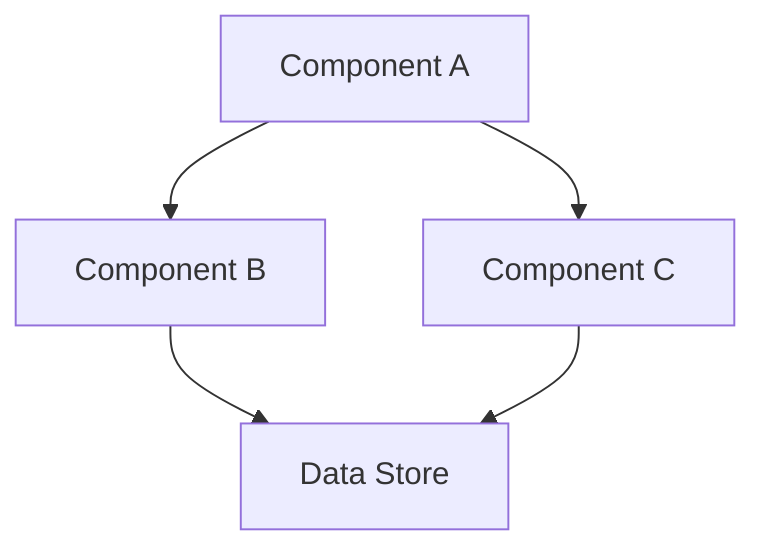

# Design Template

Use this template when generating design.md for a feature spec.

---

```markdown
# [Feature Name] Design Document

## Overview

[3-5 sentences describing the solution approach. Include:
- What technology stack will be used?
- What architectural style/pattern?
- Key design decisions and rationale
- How does this integrate with existing systems?]

## Architecture

[Include a diagram showing system components and their relationships]



**Key Architectural Principles:**
- [Principle 1: e.g., "Single responsibility per module"]
- [Principle 2: e.g., "Event-driven for loose coupling"]
- [Principle 3: e.g., "Immediate persistence on state change"]

## Components and Interfaces

### [ComponentName] Class/Module

[Brief description of component responsibility]

**Key Methods:**
- `methodName(param1: Type, param2: Type): ReturnType` - [Description]
- `methodName2(): ReturnType` - [Description]

### [InterfaceName] Interface

```typescript
interface InterfaceName {
  field1: string;
  field2: number;
  field3: boolean;
  method1(param: Type): ReturnType;
}
```

### [Additional components...]

## Data Models

### [EntityName] Entity

[Description of the entity and its role in the system]

```typescript
interface EntityName {
  id: string;           // Unique identifier - [generation strategy]
  field1: string;       // [Constraints: e.g., "non-empty, max 500 chars"]
  field2: number;       // [Constraints: e.g., "positive integer"]
  field3: boolean;      // [Default value and meaning]
  createdAt: number;    // [Timestamp format]
}
```

**Validation Rules:**
- `id`: [Validation rule]
- `field1`: [Validation rule]
- `field2`: [Validation rule]

### Storage Format

[Describe how data is persisted - database schema, localStorage format, API payloads, etc.]

## Error Handling

### [Error Category 1]

| Error Type | Condition | Recovery Strategy |
|------------|-----------|-------------------|
| [ErrorName] | [When it occurs] | [How to handle] |
| [ErrorName2] | [When it occurs] | [How to handle] |

### [Error Category 2]

[Continue for each error category: Storage, Validation, Network, etc.]

### Recovery Strategies

- **Automatic Retry**: [When and how to retry]
- **Fallback State**: [Default safe state]
- **User Notification**: [What to tell the user]

## Testing Strategy

### Unit Tests

[What to test at unit level]
- [Component 1]: [What to verify]
- [Component 2]: [What to verify]

### Integration Tests

[What to test at integration level]
- [Flow 1]: [End-to-end scenario]
- [Flow 2]: [End-to-end scenario]

### Test Organization

- Test file naming: `*.test.ts` or `*.spec.ts`
- Location: [Co-located with source / separate test directory]
- Framework: [Jest / Vitest / Mocha / etc.]

```

---

## Guidelines

1. **Reference requirements** - Design should address ALL requirements from Phase 1
2. **Use Mermaid diagrams** - Visual architecture aids understanding
3. **TypeScript-style interfaces** - Even for non-TS projects, the syntax is clear
4. **Include validation rules** - Be explicit about data constraints
5. **Error handling is mandatory** - Every design needs error recovery strategy
6. **Testing is part of design** - Define testing approach upfront
